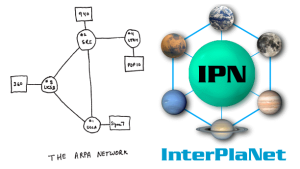

---
hide:
  - navigation
  - toc
---

# Courses

Courses taught at BITS, Pilani -- KK Birla Goa Campus, India (2012–2018), and RVR & JC College
of Engineering, India (2005–2012).

## Internetworking Technologies (CS F413)

[II-Semester, 2017-18](courses/inet/2017-18/index.md) | [II-Semester, 2015-16](courses/inet/2015-16/index.md) | [II-Semester, 2014-15](courses/inet/2014-15/index.md)

Internetworking Technologies is an advanced elective designed as a finishing course for
final-year undergraduate students with a strong interest in data networks and systems
engineering. The course was rebuilt from the ground up upon joining BITS Pilani – Goa
Campus in 2012 to reflect the depth and practical orientation expected of a senior-level
offering. Topics span the full network stack: Ethernet and LAN switching, IP addressing
and subnetting, routing protocols (RIP, OSPF, and BGP), VLAN design, network address
translation, transport-layer congestion control, and application-layer protocols
including DNS, DHCP, and HTTP. Upper-layer concerns such as network security fundamentals,
quality of service, and software-defined networking are woven into the later parts of the
course to give students a forward-looking perspective on modern network architectures.

The course is structured around lectures, a wiki-based reading programme, a substantial
semester project, lab sessions (in the 2015–16 and 2016–17 editions), and two written
tests. Students are expected to engage with primary sources — RFC standards, research
papers, and textbook chapters — and produce both written analyses and working
implementations. The project component, which grows from a design exercise in earlier
semesters to a full implementation challenge in later ones, requires teams to apply
routing, addressing, and protocol concepts in a realistic network scenario.

**Testimonials from students:**

- "[Internetworking Technologies is] One of the best courses I've ever taken. The efforts the instructor takes to make the course engaging are unparalleled. The projects were very interesting."
- "Internetworking Technologies is the best course I have taken at BITS, Pilani - KK Birla Goa Campus by far. The best part was that I got to learn a variety of interesting and practical things in this course. Everything about this course is almost perfect."
- "I took Internetworking Technologies as an elective in 4-1 (semester-7). Apart from an interesting course structure, the course was handled really professionally. The best thing about the course was its stress on various upcoming technologies and data center architectures. There was a lot of emphasis on applying the theory learnt in practical scenarios, through interactive assignments. The course also involved study of research papers in contemporary field, which in itself was a learning experience. All in all, it was a great course, though it requires a certain amount of effort by the student."

## Object Oriented Programming (CS F213)

[I-Semester, 2017-18](courses/oop/2017-18/index.md) | [I-Semester, 2016-17](courses/oop/2016-17/index.md) | [I-Semester, 2015-16](courses/oop/2015-16/index.md)

Object Oriented Programming (OOP) is one of the flagship second-year courses in the
computer science curriculum at BITS Pilani – Goa Campus, consistently enrolling around
220 students per semester. The course establishes the conceptual and practical
foundations of object-oriented design using Java: classes and objects, encapsulation,
inheritance, polymorphism, abstract classes, and interfaces. Beyond language mechanics,
the syllabus was substantially expanded to include software engineering practices
directly relevant to industry: version control workflows, unit and integration testing,
design patterns (creational, structural, and behavioural), refactoring techniques, and
an introduction to agile development practices. Lecture content is reinforced through
weekly lab sessions, quizzes, a wiki, and a discussion forum, ensuring that conceptual
material is promptly translated into working code.

A defining feature of the course is its project component, in which student teams plan,
build, review, and deliver a functional software system under realistic engineering
constraints. To support fair and scalable automated evaluation of lab and project
submissions across the large cohort, the course motivated the development of
[AutolabJS](https://autolabjs.github.io), an open-source automated grading platform
created together with final-year project students and still in active use after the
instructor's departure. Teaching methods emphasise active learning: pair programming
during lab sessions, code reviews modelled on professional practice, and structured peer
discussion.

## Advanced UNIX Programming

[Lecture notes](https://www.dropbox.com/s/289crghpjziklas/AUP_lectures.pdf?dl=1) (I-Semester, 2011-12) | [Lab manual](https://www.dropbox.com/s/bvhfk33i1awg5mk/UNIX_manual.pdf?dl=1) | [Code Snippets](https://www.dropbox.com/s/a6diug5youatxx2/Class_Exercises.tar.gz?dl=1)

Advanced UNIX Programming is a systems programming course aimed at students who already
have a basic familiarity with the C language and wish to develop professional-grade
skills in UNIX/Linux systems development. Lecture notes and a comprehensive lab manual
were developed from scratch for this offering and are publicly available for download.

The course is built around a hands-on laboratory component where students write and
debug systems programs under time pressure, mirroring the conditions of professional
software development. Weekly lab exercises progress in complexity from basic file
manipulation to multi-threaded network servers, ensuring that students build both
breadth and depth in systems programming.

## Computer Networks

Offered 2007 to 2012 (once a year), 2010-11.

Computer Networks is a core undergraduate course covering the principles and practice of
computer communication systems. The syllabus follows the layered architecture of the
Internet. Course delivery combines lectures, a Moodle-based online component for
assignments and supplementary readings, and a companion laboratory in which students
configure routers and switches, capture and analyse packets with Wireshark, and
implement simple socket programs. Assessments include written mid-semester and
end-semester examinations that test both conceptual understanding and quantitative
problem-solving skills.

## Labs

Computer Networks Lab (2013-14)  
Computer Architecture Lab (2012-13)  
[Advanced UNIX Programming Lab](https://www.dropbox.com/s/bvhfk33i1awg5mk/UNIX_manual.pdf?dl=1) (2011-12)
