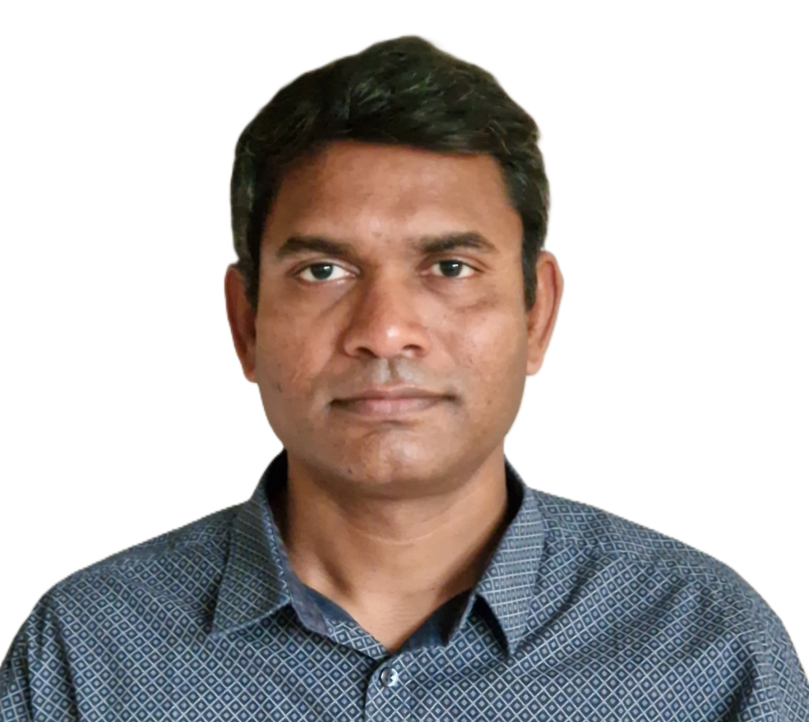

---
hide:
  - navigation
  - toc
---

# About Me

I am a Researcher and Software Developer in [Software Engineering and Computing Systems](https://ece.au.dk/en/research/key-areas-in-research-and-development/software-engineering-computing-systems) section, Department of ECE, Aarhus University. My research work is in the areas of digital twin platforms, cyber-physical systems, and distributed simulation —
turning models and operational data into deployable systems used by researchers
and industrial partners across Denmark, Italy, Germany, Spain, and Norway.
I am actively involved in [SWiM](https://ece.au.dk/forskning/eksempler-paa-forsknings-og-udviklingsprojekter/bevillinger-paa-ece/sustainable-water-based-cooling-in-megacities-swim),
[CP-SENS](https://digit.au.dk/research-projects/cp-sens), [Secure Collaboration on DTaaS](https://digit.au.dk/research-projects/secure4dtaas), and have previously worked on IoT data storage and generalized deduplication (2018–2020).
I was also a Researcher and Assistant Professor at BITS Pilani –
KK Birla Goa Campus (2012 to 2018), where I taught [courses](courses.md) on computer networks and programming languages.

Detailed [Research](research.md) and [Publications](publications.md) are available on their respective pages. Teaching materials are under [Courses](courses.md) and [Writings](writings.md).
I am a big proponent of open-source software and my contributions are listed on the [Software](software.md) page. See [Contact](contact.md) page for professional collaboration and (if you are a former acquaintance) catchup.

A snapshot of my professional life is available as a [brief resume](resume_brief.md) and a [detailed resume](resume_complete.md).
