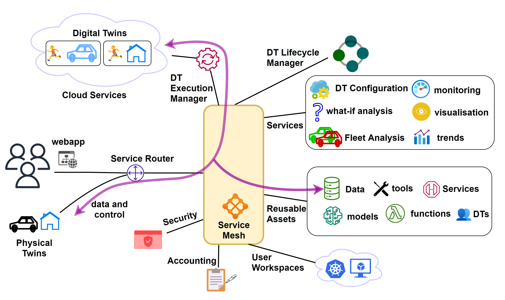
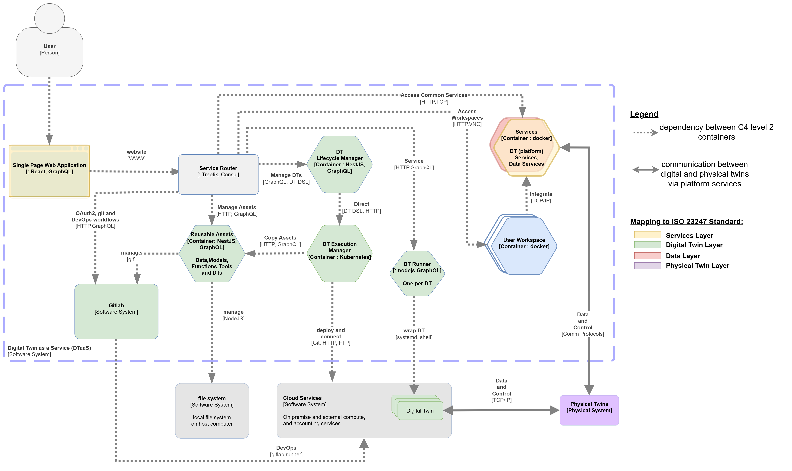
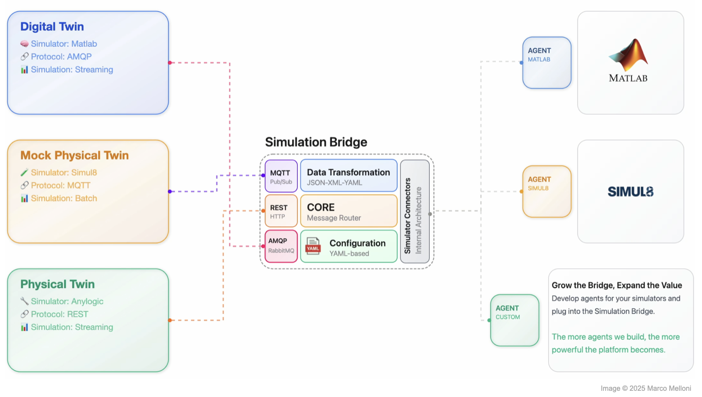
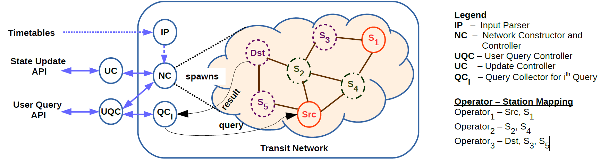

---
hide:
  - navigation
  - toc
---

# Project Portfolio

A closer look at the architecture and technology stack behind the software listed on the
[Software](software.md) page.

---

## Digital Twin as a Service (October 2020 – Present)

Digital Twin as a Service is a multi-tenant platform for cyber-physical systems, digital twins,
and Internet of Things systems. It is implemented with TypeScript, React, Node.js, and Python.

**System Architecture Block Diagram:**

**C4 Level-2 Diagram:**

**Technology Stack:**

| Category | Details |
|---|---|
| Architectures | Microservices, multi-component platform, scenario-based deployment |
| Languages | TypeScript, JavaScript, Python, Bash |
| Frameworks | React, NestJS, Redux Toolkit, MkDocs Material |
| Infrastructure | Docker, Docker Compose, Traefik |
| Testing | Jest, Playwright, pytest |
| Security | OIDC, Keycloak, TLS |

---

## Simulation Bridge (May 2025 – Present)

Simulation Bridge is a Python-based middleware for distributed simulation of digital twins and
IoT systems. It provides interfaces to MATLAB and Simul8 and can also serve as a backend for
Manufacturing-as-a-Service platforms. The system follows a plug-in-based protocol adapter
architecture, enabling seamless future integration of additional protocols. It currently
supports MQTT, RabbitMQ, and RESTful interfaces, allowing external clients to communicate with
the simulation bridge through these channels. All system components follow an event-driven
architecture.

**System Architecture Block Diagram:**

**Technology Stack:**

| Category | Details |
|---|---|
| Architectures | Distributed simulation middleware, plug-in protocol adapters, bidirectional routing |
| Languages | Python, MATLAB |
| Protocols | REST, MQTT, RabbitMQ, in-memory API |
| Frameworks | FastAPI, Quart, Hypercorn, Uvicorn, Pydantic |
| Tooling | Poetry, pytest, pylint, performance metrics |
| Security | TLS, JWT, structured error handling |

---

## P.I Games (December 2025 – Present)

P.I Games is a browser-based game platform that ships with **Mini Royale** and **The Argonauts**
as two distinct experiences built on different rendering and gameplay stacks. The platform
supports telemetry, player-vs-player play, and saving of game state.

- **Mini Royale.** A Clash Royale-inspired 3D card battle game with strategic deck building and
  real-time AI opponents. The browser client combines Three.js rendering, event-driven match
  logic, wallet and leaderboard flows, and optional PvP synchronisation over WebSockets.
- **The Argonauts.** Navigate the seas of Greek mythology in this epic text adventure where
  legend and strategy collide. The game layers PixiJS-rendered scenes with chapter progression,
  riddles, inventory, metrics, and local save-management systems.

**System Architecture:**

Browsers reach both games through a shared games portal, which is served by a NestJS backend
handling authentication, admin, leaderboard, storage, chat, PvP, and monitoring. Mini Royale
(Three.js, ECS, wallet, leaderboard, PvP) and The Argonauts (Pixi scenes, chapters, inventory,
riddles) each save progression and metrics to browser `localStorage`, while the NestJS server
persists users, wallets, telemetry, and match progress to SQLite via TypeORM. An admin module
built on a `distilbert-base` language model also talks to the server over HTTP.

**Technology Stack:**

| Category | Details |
|---|---|
| Architecture | Entity Component System, MVC, full-stack |
| Languages | TypeScript, JavaScript, HTML, CSS |
| Mini Royale | Vite, Three.js, ECS-style gameplay modules, Web Audio, service worker support |
| The Argonauts | PixiJS, scene and chapter managers, inventory and riddle systems, localStorage-backed saves and metrics |
| Backend | NestJS, PassportJS, TypeORM, ExpressJS |
| Networking and Data | REST, WebSocket, telemetry, SQLite |
| Testing and Tooling | Vitest, Playwright, Supertest, ESLint, Prettier, Nest CLI |

*Please note that this game has been developed by my son (12 years) and me using LLM agent
workflows over three weeks. Only the architectural and game feature requirements were provided
as prompts to the LLMs.*

**Effort Estimate** (based on 68,504 physical source lines of code; estimated calendar time is
18.8 months):

| Estimation Model | Effort (PM) | Cost (DKK) |
|---|---:|---:|
| COCOMO Organic | 203.1 | 8,124,057 |
| Walston-Felix | 243.5 | 9,740,132 |
| Bailey-Basili | 103.8 | 4,153,810 |
| Industry Average | 124.6 | 4,982,109 |
| Function Points | 62.3 | 2,491,055 |
| **Average** | **147.5** | **5,898,232** |

---

## Transport Scheduler (August 2015 – May 2018)

Transport Scheduler provides search services for travellers using multimodal transit networks.
It uses Elixir's actor framework to implement the transit search algorithms within a
quasi-neural network model. The application is implemented in Elixir, a functional, concurrent
programming language. Elixir, together with the Erlang Open Telecom Platform, made it possible
to implement station entities using the actor concurrency model.

**System Architecture Block Diagram:**

**Technology Stack:**

| Category | Details |
|---|---|
| Architectures and Design | Actor-based concurrency, finite state machines |
| Languages | Elixir |
| Runtime | Erlang OTP, GenStateMachine, ExActor |
| API | Maru REST API, JSON-based queries, user preference filters |
| Libraries | HTTPoison, CSVLixir |
| Tooling | Distillery, EDeliver, ExDoc, ExCoveralls, Credo |

---

## AutolabJS (January 2015 – December 2018)

AutolabJS is distributed evaluation software for programming projects and assignments. It
supports C, C++, Java, and Python submissions through a modular microservice platform with
GitLab-backed repositories, live result updates, and persistent scoreboards. In the LLM
agentic landscape, this project is equivalent to a platform for in-depth test harnesses on
which code competitions could be held.

**System Architecture:**

A web browser submits code to the frontend, which dispatches evaluation jobs to a load
balancer. The load balancer forwards jobs to a pool of execution nodes and maintains a
best-commit cache, while the frontend reads configuration from and the execution nodes clone
labs and commits from GitLab. Both the frontend and load balancer read from and write scores to
a MySQL database of labs and scoreboards.

**Technology Stack:**

| Category | Details |
|---|---|
| Architecture | Microservices, MVC, distributed caching |
| Languages | JavaScript, Bash, C, C++, Java, Python |
| Backend | Node.js, Express |
| Protocols | Socket.IO, HTTPS |
| Data and VCS | MySQL, GitLab, Git |
| Deployment | Docker, Ansible, Vagrant, VirtualBox |
| Testing and Quality | Mocha, Chai, Sinon, Nock, NYC/Istanbul, ESLint, Codecov, Travis CI |

---

## IRCLogParser (January 2016 – April 2018)

IRCLogParser analyses and visualises real-time online chat communities such as IRC channels. It
uses analytical models from statistics, network science, and data mining to derive local and
global communication patterns from multi-channel log data.

**System Architecture:**

IRC channel logs (Ubuntu, Slack) feed into a parser, which passes structured data to an
analysis core made up of network, channel, user, and community modules. The analysis core
produces derived metrics and graphs and statistics (CSV, NET, JS) for output, communities for
visualisation (matplotlib, Plotly, PyGraphviz), and model parameters for a validation and
profiling stage; output artefacts also feed the visualisation stage.

**Technology Stack:**

| Category | Details |
|---|---|
| Architecture and Design | Pipes and filters, SOLID principles |
| Languages | Python, Shell |
| Parsing and Data Prep | BeautifulSoup |
| Analytics | NetworkX, scikit-learn, pandas, NLTK |
| Visualisation | matplotlib, Plotly, PyGraphviz, Protovis |
| Docs and Quality | Sphinx, Travis CI, Codecov, Code Climate |
