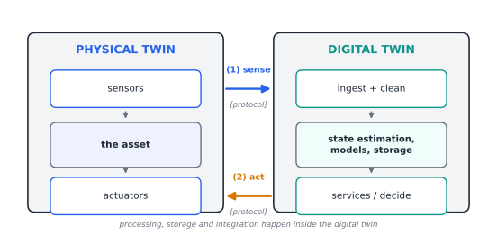
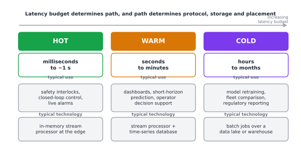
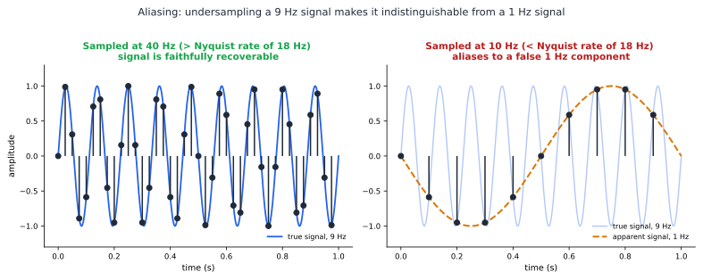
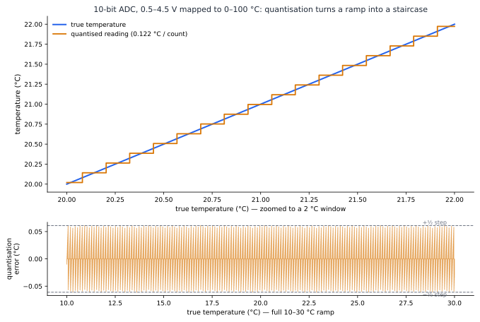
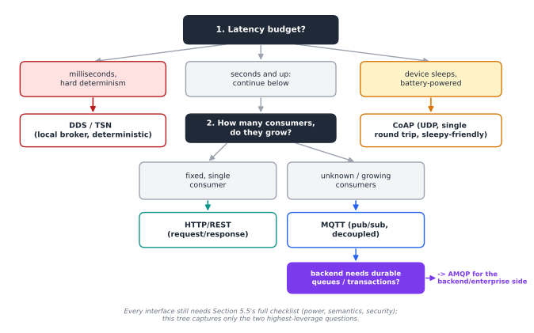
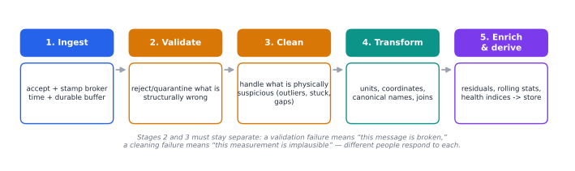
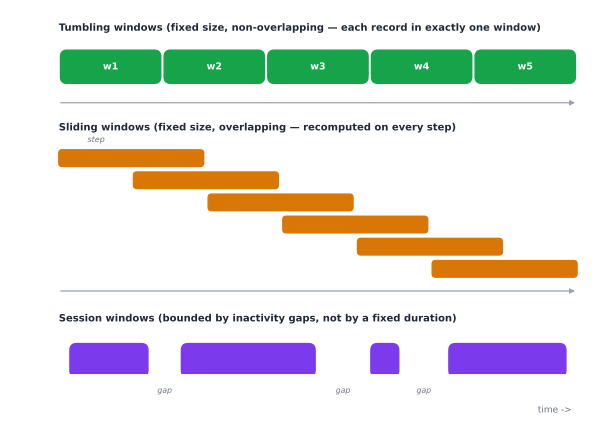
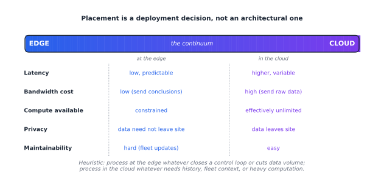
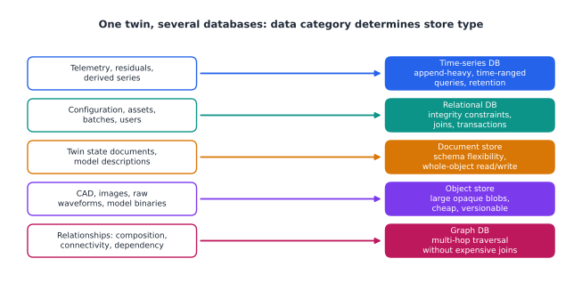
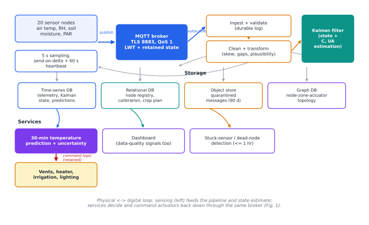

---
hide:
  - navigation
  - toc
---

# Data for Digital Twins: Protocols, Processing, Storage and Integration

**A tutorial chapter for undergraduate students in software, computer and control engineering.**

**Disclaimer:** This article has been generated using
[chitragupta](https://prasad.talasila.in/chitragupta).
Despite some potential for hallucination, the ideas communicated in this
tutorial are accurate. Please send your corrections and suggestions to
<prasad.talasila@gmail.com>

## 1. Learning Objectives

By the end of this chapter, you will be able to:

1. **Classify** the data that flows through a digital twin -- by origin (sensed, simulated, derived, configured), by lifecycle phase, and by timeliness requirement -- and explain why a digital twin is defined by its *data connection* to a physical asset rather than by the sophistication of its model.
2. **Analyse the sensing boundary**: given a physical phenomenon and a measurement requirement, choose a sampling rate and quantisation resolution, and explain the specific ways in which sampling, quantisation, clock error and network delay corrupt the twin's picture of reality.
3. **Select and justify an IoT communication protocol** (MQTT, CoAP, AMQP, HTTP, OPC UA, DDS, and their variants) for a given twin, using message overhead, transport, delivery semantics, discovery and security as explicit decision criteria -- and state precisely what a protocol's "quality of service" level does and does not guarantee.
4. **Design a data processing pipeline** for a twin, distinguishing stream from batch processing, choosing between edge and cloud placement, and applying windowing, filtering and state estimation correctly.
5. **Design a storage schema** for twin data across time-series, relational, document, object and graph stores, and reason quantitatively about retention, downsampling and compression.
6. **Integrate heterogeneous data sources** using an information model (Asset Administration Shell, DTDL, W3C Thing Description, NGSI-LD), and explain what "semantic interoperability" buys you that a shared file format does not.

You will need: basic programming (Python is used for examples), an understanding of TCP/IP networking to the level of "what a socket is", elementary probability, and no prior exposure to digital twins.

---

## 2. Why Data Is the Hard Part of a Digital Twin

### 2.1 A tempting misconception

When students first meet the phrase *digital twin*, they usually picture a beautiful 3D model of a jet engine spinning on a screen. That picture is not wrong, but it puts the emphasis in exactly the wrong place. A rotating CAD model is a *drawing*. What makes something a twin is that it is **wired to a real thing that is running right now**, and that the wire carries data in both directions.

The most widely used classification in the field makes this precise by grading twins on how their data connection works. A *digital model* has no automatic data exchange at all -- someone updates it by hand. A *digital shadow* has an automatic one-way flow from the physical object to the digital object. Only when the flow is automatic in *both* directions does the term *digital twin* apply [@kritzinger_digital_2018]. Notice that this taxonomy says nothing about geometry, physics, fidelity or machine learning. It is a taxonomy about **data plumbing**. When surveys of manufacturing applications apply it, they consistently find that a large fraction of published "digital twins" are, by this definition, shadows or models: they have a virtual representation but the integration with the physical side is partial or one-directional [@bottjer_review_2023-1].

This should reframe how you think about the engineering effort. In a typical twin project, the modelling is done by a domain expert who already knows the physics. The part that eats the schedule is: getting a sensor to produce a trustworthy number, getting that number across an unreliable network with a usable timestamp, storing it so that it can still be found in three years, and making it mean the same thing to the six different tools that need to read it.

### 2.2 What goes wrong, concretely

Consider a small, real-scale example: a temperature-controlled incubator used to ferment a food product. It has a heating element, a fan, two temperature sensors (one in the air, one on the product), and a controller. A digital twin of it would monitor the current state, predict the temperature trajectory, warn when the batch will miss its target, and possibly retune the controller. Such incubator twins are used precisely because they are small enough to build in a semester yet contain every hard problem in miniature [@gomes_digital_2025].

Now enumerate the data problems in that one box:

- The thermistor does not measure temperature. It measures resistance, which is converted to a voltage, which is converted by an analog-to-digital converter (ADC) into an integer, which a lookup table converts to degrees Celsius. Every one of those steps injects error.
- The controller samples at 10 Hz, but the fan's thermal effect has a time constant of two minutes. Ninety-nine percent of the samples are redundant; the one percent that matter arrive during transients.
- The device timestamps a reading using its own clock. That clock drifts. If the twin's simulation is fed samples whose timestamps are wrong by 400 ms, the twin's estimate of the *rate of change* -- the thing the controller actually cares about -- is wrong.
- The Wi-Fi link drops for eleven seconds. What should the twin do with a gap? Interpolate? Freeze? Declare itself stale?
- A year later somebody wants to compare this batch with a batch from a different incubator running different firmware, where the same field was called `temp_c` instead of `airTemperature` and was reported in Fahrenheit.

Every one of these is a data engineering problem, and not one of them is solved by a better thermodynamic model. Reviews of digital twin enabling technologies place data acquisition, fusion and computation alongside modelling as first-class pillars, precisely because they are where implementations fail in practice [@wu_comprehensive_2023].

### 2.3 The twinning loop

It helps to hold one picture in your head for the whole chapter. A digital twin is a loop:



**Figure 1.** The twinning loop. The physical twin's sensors feed leg (1), *sense*, into the digital twin's ingest, state-estimation and storage stages; the digital twin's services decide and act back on the physical twin's actuators through leg (2), *act*. Everything between the two legs -- processing, storage and integration -- is the subject of this chapter.

Leg (1) is the *sensing and communication* problem. Leg (2) is the *actuation* problem, which has the same shape but much harsher safety requirements. In between sits everything this chapter is about: processing, storage and integration. Reference architectures for twins differ in vocabulary but essentially all decompose into this loop plus a set of services hanging off the digital side [@pfeiffer_towards_2025].

One more term you will meet: **synchronisation**. The ISO 23247 framework for manufacturing digital twins defines a digital twin as a "fit for purpose digital representation of an observable manufacturing element with synchronization between the element and its digital representation" [@shao_analysis_2023]. Two ideas are packed in there. *Fit for purpose* means there is no such thing as a "complete" twin -- you build only what the intended service needs. *Synchronisation* means the twin is kept in step with reality at some defined rate, and that rate is a design parameter you must choose, not a property you get for free.

---

## 3. A Vocabulary for Digital Twin Data

Before designing anything, you need to be able to say precisely which data you mean. Three orthogonal classifications will carry you a long way.

### 3.1 By origin

**Sensed data** comes from the physical twin: temperatures, currents, vibration spectra, camera frames, GPS fixes. It is the only category with a direct causal link to reality, and therefore the only category that can falsify your model. It is also noisy, gappy and expensive to obtain.

**Simulated data** is produced by the twin's own models: the predicted temperature at t+60 s, the stress field of a finite-element solve, the output of a co-simulation. It is clean, dense, cheap and *possibly wrong*.

**Derived data** is computed from the other two: a residual (measured minus simulated), a rolling mean, a health index, an anomaly score, a remaining-useful-life estimate. Derived data is where most of the twin's business value lives, and it is the category students most often forget to store, on the theory that it "can always be recomputed" -- which is false the moment the code that computed it changes.

**Descriptive/configuration data** is everything static or slow-moving: serial numbers, material properties, calibration coefficients, CAD geometry, controller gains, maintenance history. It is small, it changes rarely, and losing it is catastrophic because it is usually the only thing that makes the other three interpretable.

Multi-dimensional twin models make this decomposition explicit: the classic five-dimension formulation treats the physical entity, the virtual entity, services, connections, and **data** as five separately-engineered elements, with the data element explicitly holding the fusion of physical, virtual, service and domain-knowledge data rather than being a by-product of the other four [@tao_five-dimension_2019].

### 3.2 By timeliness

Not all data needs to arrive quickly, and pretending it does is the single most common way to overspend on a twin architecture. A useful three-way split, which appears in industrial data analytics reference architectures under the names *hot*, *warm* and *cold* path, is:

| Path | Latency budget | Typical use | Typical technology |
|---|---|---|---|
| Hot | milliseconds to ~1 s | safety interlocks, closed-loop control, live alarms | in-memory stream processor at the edge |
| Warm | seconds to minutes | dashboards, short-horizon prediction, operator decision support | stream processor plus time-series database |
| Cold | hours to months | model retraining, fleet comparison, regulatory reporting | batch jobs over a data lake or warehouse |

The warm path applies more detailed processing at the cost of larger delay, and the cold path is batch processing at long intervals [@marosi_interoperable_2022]. Assigning each of your twin's services to a path early is the highest-leverage architectural decision you will make, because it determines protocol choice, storage choice and deployment location all at once.



**Figure 2.** The hot/warm/cold split as a spectrum of increasing latency budget. Notice how the choice of path pre-determines the technology column beneath it -- this is why the hot/warm/cold decision is made once, early, rather than negotiated service by service.

### 3.3 By lifecycle phase

A twin outlives any single deployment of it. Data accrues across design (requirements, CAD, simulation results), manufacturing (process parameters, quality inspections), operation (the telemetry stream), and end-of-life (disposal, recycling, material recovery). The thread that links a given physical instance's data across all of these is often called the **digital thread**. Interoperability frameworks stress that this information has its own lifecycle -- origination, transport, storage, retrieval, use -- and that the thread must preserve fidelity and governance across the whole of it [@budiardjo_digital_2021].

The practical consequence for a student project is modest but real: even in a semester project, record *which version of which model and which firmware* produced each data set. That single habit converts an unreproducible pile of CSVs into an asset.

---

## 4. From Physical Quantity to Number: The Sensing Boundary

This section is about leg (1) of the loop, before any network is involved. If you get this wrong, no amount of downstream cleverness recovers the information.

### 4.1 Sampling and the Nyquist limit

Sampling reduces a continuous-time signal to a discrete-time sequence. The Nyquist-Shannon sampling theorem states that a signal containing no frequency component above $f_{max}$ can be perfectly reconstructed from uniform samples taken at a rate greater than $2 f_{max}$. Sampling below that rate causes **aliasing**: high-frequency components masquerade as low-frequency ones in the sampled data, and no processing can undo it [@gomes_sensing_2024].

Aliasing is worth dwelling on because it is *silent*. A twin fed aliased data does not crash, does not report an error, and produces a plausible-looking curve that is simply a lie. The classic demonstration is a wheel filmed at 24 frames per second appearing to rotate backwards.

Two practical rules:

- **Anti-alias in hardware.** Put an analog low-pass filter before the ADC with a cutoff below half your sampling rate. Filtering after sampling is too late; the damage is already in the samples.
- **Oversample when cheap.** Sampling above the Nyquist rate does not harm the signal -- it costs bandwidth and storage, which are usually cheaper than a missed fault. A 5x to 10x margin over the highest frequency of interest is a common engineering choice.



**Figure 3.** The same 9 Hz signal sampled two ways. Left: sampled at 40 Hz, well above the 18 Hz Nyquist rate, the samples trace the true waveform. Right: sampled at only 10 Hz, below Nyquist, the *identical* samples are also exactly consistent with a slow 1 Hz wave -- the high-frequency information is not degraded, it is gone, replaced by a plausible-looking lie. This is why anti-aliasing has to happen in hardware, before the samples are taken.

Sampling below Nyquist with perfect recovery is still possible under extra assumptions, for instance if the signal is known to be sparse in some basis (the domain of compressed sensing), but this requires you to *know* that structure in advance.

### 4.2 Event-based sampling

Uniform sampling is not the only option. **Event-based** (or send-on-delta) sampling transmits only when the signal changes by more than a threshold. For the incubator's temperature -- flat for minutes, then a ramp -- this can cut message volume by an order of magnitude. The price is that you no longer have a guarantee of perfect reconstruction, and that your receiving code must handle irregular timestamps [@gomes_sensing_2024].

A hybrid that works well in practice: send on delta, *plus* a mandatory heartbeat every N seconds even if nothing changed. The heartbeat lets the consumer distinguish "the value is stable" from "the sensor is dead", which a pure send-on-delta scheme cannot.

### 4.3 Quantisation

Quantisation maps a continuous range onto a finite set of levels. An n-bit ADC over a range R has a step size of $R / 2^n$ and a maximum quantisation error of half a step. For a 10-bit ADC over 0 to 5 V, the step is about 4.9 mV.

The question to ask is not "how many bits does my ADC have" but **"what is the smallest change I need to detect, and does one quantisation step fit inside it?"** If your incubator control law reacts to changes of 0.1 degrees C and your sensing chain resolves 0.35 degrees C per step, your controller is chattering on quantisation noise, not on temperature.

A worked calculation. A thermistor circuit maps 0 to 100 degrees C onto 0.5 to 4.5 V. With a 10-bit ADC over 0 to 5 V:

- Volts per count: $5 / 1024 = 4.88$ mV.
- Volts per degree C: $(4.5 - 0.5) / 100 = 40$ mV.
- Degrees C per count: $4.88 / 40 = 0.122$ degrees C.
- Worst-case quantisation error: about $\pm 0.061$ degrees C.

That is adequate for a 0.1 degrees C control band, but only just, and it leaves nothing for sensor tolerance or self-heating. A 12-bit ADC would give 0.03 degrees C per count and comfortable margin. This is the kind of five-line calculation you should do *before* writing any twin code.



**Figure 4.** The worked calculation, plotted. Top: a 2 degC window of the true temperature ramp (blue) against the quantised reading (orange) -- every 0.122 degC of true change, the reading jumps by exactly one count. Bottom: the resulting error is a sawtooth bounded at +/-0.061 degC, the "worst-case quantisation error" from the calculation above, shown here across the full 10-30 degC ramp.

### 4.4 Time: the most under-rated data field

Every sample needs a timestamp, and where that timestamp comes from matters enormously.

- **Device time** is stamped by the sensor node at acquisition. Most accurate relative to the physical event, but subject to clock drift and to devices that boot with the clock at 1 January 1970.
- **Broker/gateway time** is stamped on arrival at the message broker. Robust, monotonic, but includes all the network delay.
- **Ingestion time** is stamped by the database. Worst of all for physics, best for auditing.

Serious twins carry at least two of these, because the difference between them *is itself a measurement* -- of network health, of clock drift, of queue backlog. Experimental work on twin security has used exactly this: comparing sensor timestamps, broker log times and twin state-update times to compute deviation metrics that act as early indicators of an incident, without needing to inspect payloads [@picone_assessing_2026].

There is a deeper issue than stamping, which is that the physical and digital sides run on *different notions of time altogether*. A simulation advances in solver steps; the physical system advances in wall-clock time; the network delivers messages in an order that respects neither. When the co-simulation step size and the sensor sampling interval are mismatched, messages get dropped or retained essentially at random with respect to their importance -- sometimes the message announcing an obstacle survives, sometimes it does not [@frasheri_addressing_2023]. Designing the twin so that its step size, the sampling interval and the transport latency are consciously related, rather than accidentally related, is a genuine engineering task.

### 4.5 What "fidelity" means at runtime

Given all this corruption, how do you know the twin is still a faithful representation? One operational answer is to compare the two systems over *sliding windows*: align snapshots of the physical and digital states over a fixed interval -- say the last 2 seconds at a 0.1 s snapshot period -- and score the divergence, rather than asking for pointwise equality that noise makes impossible [@munoz_towards_2024]. Treating fidelity as a continuously-monitored, windowed quantity, rather than a property established once at commissioning, is the modern view.

---

## 5. Moving the Data: IoT Protocols for Digital Twins

### 5.1 The stack, briefly

IoT communication is layered like any other network communication, and confusion in this area almost always comes from comparing protocols that live at different layers. A survey structured around a generic IoT stack is useful here precisely because it separates concerns: physical/link technologies (Bluetooth Low Energy, Zigbee, LoRaWAN, 802.11, 802.15.4), adaptation and network layers (6LoWPAN, IPv6, RPL), transport (TCP, UDP, and the security layers TLS and DTLS), and the application layer where MQTT, CoAP, AMQP and HTTP live [@tournier_survey_2021].

For twin work, the decisions you actually make are usually at two places: the **link technology** (dictated by physics -- range, power budget, whether you can run a cable) and the **application protocol** (dictated by software architecture). This section concentrates on the second.

### 5.2 The four workhorses

Four application-layer protocols dominate IoT messaging: **MQTT**, **CoAP**, **AMQP** and **HTTP**. A direct comparative study of the four gives the following characteristics [@naik_choice_2017]:

| | MQTT | CoAP | AMQP | HTTP |
|---|---|---|---|---|
| Pattern | publish/subscribe | request/response (REST-like) | pub/sub and queues | request/response |
| Transport | TCP (MQTT-SN can use UDP) | UDP, SCTP | TCP, SCTP | TCP |
| Header size | 2 bytes | 4 bytes | 8 bytes | undefined (verbose) |
| Message size | small, undefined limit | small, undefined | negotiable, undefined | large, undefined |
| Security | TLS/SSL | DTLS, IPsec | TLS/SSL, IPsec, SASL | TLS/SSL |
| Default ports | 1883, 8883 (TLS) | 5683, 5684 (DTLS) | 5672, 5671 (TLS) | 80, 443 (TLS) |

Read the table with care, because the raw header sizes are misleading on their own. MQTT has the smallest header at 2 bytes, but its requirement of a TCP connection adds connection-establishment overhead, so its *total* cost per exchange is higher than the header suggests. CoAP runs over UDP and therefore avoids connection overheads entirely, which makes it the lowest-overhead option for occasional small exchanges. AMQP is still lightweight but pays for its richer provisioning and interoperability features. HTTP, designed for a completely different job, is the most verbose of the four [@naik_choice_2017].

A second consequence of the transport choice concerns latency under poor networks. TCP opens its congestion window gradually, so it does not use the available bandwidth in the first few round trips of a connection -- which matters a great deal if your device connects, sends one reading, and disconnects to save power. A CoAP exchange over UDP requires only a single round trip [@naik_choice_2017].

**When to reach for which, in a twin context:**

- **MQTT** is the default for telemetry ingestion. Its pub/sub decoupling means you can add a new consumer (a dashboard, an anomaly detector, a second twin) without touching the devices. It has become dominant enough in machine-to-machine and IoT research that its growth visibly outpaces the alternatives [@mishra_use_2020].
- **CoAP** is for severely constrained, battery-powered, often sleepy devices, and for cases where the RESTful resource model maps naturally onto the device (`GET /sensors/temp`).
- **AMQP** is for the enterprise side of the twin -- where you need durable queues, transactions, routing rules and delivery guarantees between backend services rather than to sensors.
- **HTTP/REST** is for the twin's own outward-facing API: configuration, queries, model uploads, anything a human or a web application talks to. Almost every twin platform exposes an HTTP API even when its data plane is MQTT.

Real twin platforms mix them deliberately. Eclipse Ditto handles twins by centralising communication and exposing synchronous and asynchronous APIs over HTTP, MQTT, AMQP and WebSockets simultaneously [@picone_flexible_2023]. A serverless Kubernetes-based twin platform routes HTTPS requests to an event broker ingress while forwarding AMQP and MQTT connections directly to the broker, with in-broker rules fanning events out to the right queues [@wermann_ktwin_2024]. The lesson is that "choose a protocol" is really "choose a protocol per interface".

### 5.3 Quality of service: what it does and does not promise

MQTT offers three delivery levels, and misunderstanding them is a rich source of bugs.

- **QoS 0 -- at most once.** Fire and forget. The message may be lost. No acknowledgement.
- **QoS 1 -- at least once.** Acknowledged; the publisher retransmits until acknowledged. **Duplicates are possible.**
- **QoS 2 -- exactly once.** A four-part handshake ensures single delivery. Highest latency and overhead.

Three things students routinely get wrong:

1. **QoS is hop-by-hop, not end-to-end.** MQTT QoS governs publisher-to-broker and broker-to-subscriber separately. A message published at QoS 2 and subscribed at QoS 0 can be lost on the second hop. The effective level is the *minimum* of the two.
2. **QoS 1 means your consumer must be idempotent.** If a duplicate temperature reading increments a counter twice, that is your bug, not the broker's.
3. **QoS 2 is rarely the right answer for telemetry.** For a sensor that reports every second, losing one sample is usually harmless and the next sample supersedes it. Reserve QoS 2 for commands and for events that are not naturally repeated -- "batch complete", "alarm acknowledged", "set the setpoint to 37".

A related and frequently-missed MQTT feature is the **Last Will and Testament**: a message the broker publishes automatically if a client disconnects ungracefully. For a twin this is how you detect a dead physical asset without polling. Pair it with a **retained message** on the same topic so a newly-connected consumer immediately learns the current state instead of waiting for the next publish.

### 5.4 Beyond the basics: Sparkplug, OPC UA, DDS, LwM2M

Raw MQTT deliberately says nothing about payload format or topic structure -- it moves opaque bytes. That flexibility becomes a liability at scale, when twenty teams invent twenty topic conventions. **Sparkplug** is a specification layered on MQTT that fixes this: it defines a topic namespace, a binary payload encoding, and a session-state model built on *birth* and *death* certificates (`NBIRTH` for a node coming online, `DBIRTH` for each device it hosts) plus per-message sequence numbers so a consumer can detect gaps and reordering. The specification is explicit that what to do about out-of-order messages is an application decision -- a time-series database might insert everything regardless of order, while a rules engine might need strict ordering to preserve causality [@noauthor_sparkplug_nodate]. That distinction maps directly onto the hot/warm/cold split of Section 3.2.

**OPC UA** occupies a different niche. It is not just a transport but a combined communication *and information modelling* standard for industrial automation, which is exactly why it recurs in twin work: it carries not only values but a typed, browsable address space describing what those values mean. Its role as the reference standard for interoperable information exchange in Industry 4.0 is why researchers have worked out systematic mappings from twin modelling languages onto it -- for instance from Microsoft's Digital Twins Definition Language into OPC UA address spaces [@cavalieri_proposal_2023]. If your twin talks to programmable logic controllers, you will meet OPC UA whether you planned to or not.

**DDS** (Data Distribution Service) is a decentralised, broker-less publish/subscribe middleware with very fine-grained QoS policies (deadline, latency budget, durability, liveliness), used where real-time determinism matters -- robotics, defence, vehicles. It is one of the three most common pub/sub protocols in IoT domains alongside MQTT and AMQP [@badolato_psmark_2026].

**LwM2M** adds device management -- firmware update, remote configuration, bootstrapping -- on top of CoAP. Telemetry protocols do not manage devices; if your twin has to keep a thousand field devices patched, you need something in this class.

For the deterministic end of the spectrum, twin architectures increasingly assume link-layer support as well: long-range wide-area networks (LoRaWAN) for sparse, low-power, wide-area sensing, and Time-Sensitive Networking (TSN) or cellular for bounded-latency industrial traffic, with each layer of the architecture distinguished by how much processing of the data it performs [@alcaraz_digital_2022].

### 5.5 How to actually choose

Do not choose by popularity. Work through this checklist:

1. **What is the latency budget?** (From Section 3.2.) Milliseconds pushes you to DDS or a local broker; seconds admits anything.
2. **Who initiates?** If the device sleeps and wakes, it must initiate -- that rules out anything requiring the server to reach in. If the twin must query on demand, you need request/response or a broker that retains state.
3. **How many consumers, and do they change?** One fixed consumer: request/response is fine. Unknown and growing: pub/sub, and the decoupling pays for itself immediately.
4. **What is the power and bandwidth budget?** A coin-cell device on LoRaWAN with a few hundred bytes per day cannot run TLS handshakes over TCP.
5. **What are the delivery semantics of the *application*?** Idempotent telemetry: QoS 0 or 1. Non-repeating commands: QoS 2 or an application-level acknowledgement.
6. **What must the payload mean to other systems?** If the answer is "several teams and a regulator", you need an information model (Section 8), not just a transport.
7. **What is the security posture?** Note from the table that every one of the four workhorses has a standard security binding; there is never a good reason to run one unencrypted "because it is only a test".



**Figure 5.** The two highest-leverage questions from the checklist, as a decision tree. Latency budget (question 1) separates out the hard-real-time and sleepy-device cases immediately; for everything else, the number and growth of consumers (question 2) is usually what decides between request/response and pub/sub. The remaining questions in the checklist (power, delivery semantics, payload meaning, security) still have to be answered for whichever branch you land on -- this tree narrows the search, it does not replace the checklist.

A caution on benchmarking. Published protocol comparisons are usually made under static, homogeneous workloads that do not model realistic IoT device behaviour, which is dynamic and heterogeneous; benchmarks designed specifically to stress publish/subscribe systems under domain-based, multi-protocol workloads exist for exactly this reason [@badolato_psmark_2026]. And when latency genuinely matters, measure it on your own infrastructure: round-trip times of 1 ms or less are achievable in a properly configured production factory, but that is a property of the deployment, not of the protocol [@iorio_when_2021].

---

## 6. Data Processing: Turning Streams into State

Raw messages are not twin state. Something must convert a stream of noisy, irregular, occasionally duplicated readings into a coherent estimate of what the asset is doing. That is data processing.

### 6.1 The ingestion pipeline

A conventional pipeline has five stages, and it is worth naming them because students tend to collapse them into one function that becomes unmaintainable:

1. **Ingest.** Accept the message, stamp it with broker time, write it to a durable buffer. Nothing else. The buffer (typically a log-structured broker such as Kafka, or a queue) exists so that a slow or crashed consumer never causes data loss and never applies back-pressure to the sensor.
2. **Validate.** Reject or quarantine what is structurally wrong: missing fields, wrong types, values outside physically possible ranges, timestamps in the future. Crucially, *quarantine rather than discard* -- a burst of invalid data is itself a diagnostic signal.
3. **Clean.** Handle what is structurally fine but physically suspicious: outliers, stuck values (the same reading twelve times running from a sensor that should be noisy), gaps.
4. **Transform.** Unit conversion, coordinate transforms, renaming to the canonical vocabulary, joining with configuration data.
5. **Enrich and derive.** Compute residuals against the model, rolling statistics, health indices. Then store, and publish onward.



**Figure 6.** The five stages as a pipeline. Each stage has a distinct responsibility and a distinct failure mode -- collapsing any two of them into one function, which is the natural thing to do under time pressure, is exactly what makes the resulting code unmaintainable.

Stage 1 must never be skipped, and stages 2 and 3 must never be merged, because they have different failure semantics: validation failure means "this message is broken", cleaning failure means "this measurement is implausible", and those go to different people.

### 6.2 Stream versus batch

**Stream processing** handles each record (or micro-batch) as it arrives, maintaining state incrementally. **Batch processing** runs periodically over a bounded, stored data set.

They are not competitors; a twin needs both, on the hot/warm and cold paths respectively. The canonical mapping is: a streaming source ingests device data; the stream processor computes the low-latency views; the same data lands in durable storage where batch jobs later compute the expensive things -- model retraining, fleet-wide comparison, monthly reports [@marosi_interoperable_2022]. Capability breakdowns of twin data services in practice list acquisition and ingestion, streaming, transformation and contextualisation as separate sub-capabilities with distinct tooling for each [@aghaabbasi_digital_2024].

A rule of thumb for deciding: **if the answer changes the physical system's behaviour within its own time constant, it belongs on the stream. Otherwise it belongs in a batch.**

### 6.3 Windows

Streams are infinite; aggregates are not. A **window** bounds a stream so that "the average" becomes computable.

- **Tumbling windows** are fixed-size and non-overlapping (every 10 s). Each record belongs to exactly one window. Use for periodic reporting.
- **Sliding windows** are fixed-size and overlapping (the last 10 s, recomputed every 1 s). Use for smooth monitoring, and for fidelity scoring of the kind described in Section 4.5, where a window is defined by a time interval or by a number of events [@munoz_towards_2024].
- **Session windows** are bounded by inactivity gaps. Use when the natural unit is "one production run" or "one trip" rather than a fixed duration.



**Figure 7.** The three window types, drawn on a shared timeline. Tumbling windows partition the stream with no overlap; sliding windows recompute over a moving span, so a single record can fall in several windows at once; session windows have no fixed size at all -- their boundaries are wherever the data goes quiet.

The hard part of windowing is **late data**. A message stamped 12:00:03 arrives at 12:00:11 because the device was offline. If your 12:00:00-12:00:10 window already closed and emitted, what happens? Three legitimate answers: drop it (simple, lossy), hold windows open for a grace period (adds latency), or emit corrections downstream (correct but requires every consumer to handle updates). Choose deliberately and document it; the default in most frameworks is "drop", which will silently eat your reconnection data.

### 6.4 Filtering and state estimation

The distinctive processing step in a *twin*, as opposed to a generic IoT pipeline, is that you have a model of the system, so you can do better than smoothing.

Consider the incubator. You have (a) a noisy temperature measurement, and (b) a thermodynamic model that predicts temperature from heater power. Naive options are to trust the sensor (noisy) or trust the model (drifts). The **Kalman filter** does neither: it maintains a state estimate with an associated uncertainty, propagates both forward through the model, and then corrects using the measurement, weighting the two in inverse proportion to their uncertainties. Applied to twins, this same machinery does double duty -- it estimates the state you cannot measure directly *and* it estimates model parameters, so the twin's models are continuously calibrated against the physical twin rather than only at commissioning [@feng_model-based_2023].

The conceptual step to appreciate is that this is *processing that only a twin can do*. A generic pipeline can compute a moving average; only a system carrying a model of the physics can infer the product core temperature from the air temperature, or notice that the heater's efficiency has dropped 8% because the residual has developed a bias.

More broadly, combining physical observations with virtual models in a rigorous and scalable way is the domain of inverse problems and data assimilation, and calibrating and updating a twin *on actionable timescales* remains an open research area rather than a solved engineering procedure [@committee_on_foundational_research_gaps_and_future_directions_for_digital_twins_foundational_2024]. Uncertainty quantification -- carrying and propagating the uncertainty rather than reporting a bare number -- is treated as a defining capability of a mature twin rather than an optional extra [@thelen_comprehensive_2022-1].

### 6.5 Where to process: edge, fog or cloud

The same computation can run on the sensor node, on a gateway near the asset, or in a data centre. The trade-off:

| | Edge (on/near device) | Cloud |
|---|---|---|
| Latency | low, predictable | higher, variable |
| Bandwidth cost | low (send conclusions) | high (send raw data) |
| Compute available | constrained | effectively unlimited |
| Privacy | data need not leave site | data leaves site |
| Maintainability | hard (fleet updates) | easy |

The industry answer is not "edge" or "cloud" but a **continuum**, in which components are placed to optimise response time and resource use across hierarchical segments, with proximity exploited where it helps [@raza_empowering_2024]. Twin-specific work explores microservices and serverless deployment across cloud-to-edge precisely so that placement becomes a deployment decision rather than an architectural one [@bellavista_exploiting_2024].



**Figure 8.** The trade-offs from the table above, redrawn as a single spectrum. No property is free: every step toward the cloud buys compute and maintainability at the cost of latency, bandwidth and data locality, and every step toward the edge reverses the trade. Placement is chosen per component, not once for the whole twin.

Do not assume edge always wins. Measured analyses of offloading big-data tasks from edge nodes to cloud resources have found completion-time reductions of up to 97%, with the right choice depending on task complexity and wide-area network conditions rather than on a blanket preference [@singh_offload_2022].

A concrete heuristic for twins: **process at the edge whatever is needed to close a control loop or to reduce data volume; process in the cloud whatever needs history, fleet context, or heavy computation.** Anomaly *detection* at the edge, anomaly *diagnosis* in the cloud.

---

## 7. Storing Digital Twin Data

### 7.1 One twin, several databases

Beginners look for "the" database for a twin. There isn't one, because the four data categories of Section 3.1 have irreconcilable access patterns. A workable default mapping:

| Data | Store type | Why |
|---|---|---|
| Telemetry, residuals, derived series | **Time-series database** | append-heavy, time-ranged queries, downsampling, retention policies |
| Configuration, assets, batches, users | **Relational database** | integrity constraints, joins, transactions |
| Twin state documents, model descriptions | **Document store** | schema flexibility, whole-object read/write |
| CAD, images, raw waveforms, model binaries | **Object store** | large opaque blobs, cheap, versionable |
| Relationships: composition, connectivity, dependency | **Graph database** | multi-hop traversal without expensive joins |



**Figure 9.** The mapping redrawn as a diagram rather than a table, to make the one-to-one structure explicit: there is no single database that serves all five categories well, because each has a different dominant access pattern.

This is what production twin systems actually do. A six-dimensional twin platform explicitly proposes a *dual-core* data architecture combining a relational database with a time-series database to optimise storage and access for the twin model, rather than forcing one to do both jobs [@li_six-dimensional_2025]. Open-source twin frameworks combine IoT ingestion with real-time time-series storage of twin states and separate visualisation [@robles_opentwins_2023]. And for relationship-heavy twins, graph databases store nodes *and* the relationships between them, which enables traversal and querying of those relationships with low cost -- the reason they appear whenever a twin must answer "what else is affected if this pump fails?" [@duran_toward_2026].

### 7.2 Time-series storage in more depth

Since telemetry dominates the volume, the time-series store is where design effort pays.

**Schema.** The near-universal model is: a *measurement* name, a set of *tags* (indexed, low-cardinality metadata: device id, site, batch), a set of *fields* (the actual values, not indexed), and a *timestamp*. The single most common beginner mistake is putting a high-cardinality value in a tag -- a UUID per reading, say -- which explodes the index and destroys performance. Rule: **tags are things you filter or group by; fields are things you aggregate.**

**Retention and downsampling.** You cannot keep everything at full resolution forever, and you rarely need to. A standard scheme:

- Raw (1 Hz): keep 7 days.
- 1-minute aggregates (mean, min, max, count, stddev): keep 1 year.
- 1-hour aggregates: keep forever.

Always store `min`, `max` and `count` alongside `mean` when downsampling. A mean alone hides exactly the transients that matter to a twin, and `count` is what lets you distinguish "stable" from "no data".

**Compression.** Time series compress extremely well because successive values are highly correlated. Beyond generic delta-of-delta and columnar encodings, there is a *model-based* approach: fit simple mathematical models (constant, linear, and lossy variants within a user-specified error bound) to segments of the series and store the model parameters instead of the points. ModelarDB does this across edge and cloud, and reports that using models reduces bandwidth, storage *and* computation -- aggregates can be computed directly from the stored segments without reconstructing the points [@jensen_demonstration_2025]. On real high-frequency wind turbine data, a tolerance as small as 0.01% error gave more than twice the compression of a lossless alternative [@abduvakhobov_scalable_2024].

That last point deserves emphasis, because it violates a naive intuition: **accepting a tiny, bounded, explicitly-specified loss can buy more than a factor of two in storage over lossless compression.** For sensor data whose own quantisation error is larger than the tolerance you set, this loss is genuinely free.

### 7.3 Data lakes, warehouses and the cold path

The cold path typically lands in an **object store** holding raw and lightly-processed data in columnar files (Parquet is the usual choice), queried by batch engines. Two design rules:

- **Partition by time, then by asset.** `year=2026/month=08/asset=incubator-03/` lets a query for one asset-month read a handful of files instead of scanning everything.
- **Keep the raw data.** Storage is cheap; the ability to re-derive everything after you discover a bug in your cleaning code is priceless. This is the practical form of the reproducibility point from Section 3.3.

### 7.4 A sizing calculation

Students consistently over- or under-estimate storage by orders of magnitude. Do the arithmetic.

A wind farm twin: 50 turbines, 200 signals each, sampled at 10 Hz, stored as 8-byte doubles with an 8-byte timestamp.

- Values per second: $50 \times 200 \times 10 = 100{,}000$.
- Bytes per second, naive: $100{,}000 \times 16 = 1.6$ MB/s.
- Per day: about 138 GB. Per year: about 50 TB.

Now apply the tools above. Columnar encoding with delta timestamps and typical time-series compression gets perhaps 10x. Model-based compression at a bounded tolerance gets considerably more on smooth channels. Downsampling everything older than a week to 1-minute aggregates cuts the retained volume by roughly $600\times$ for the aggregated tier. The 50 TB/year becomes a few hundred GB of hot data plus a manageable archive -- but only because someone did this calculation at design time rather than discovering it when the disk filled.

---

## 8. Integrating Data: Making Twins Understand Each Other

### 8.1 The problem

Suppose two teams each build a twin of a pump. Team A's twin reports `{"t": 341.2, "u": "K"}`. Team B's reports `{"temperature_f": 154.5}`. Both are valid JSON. Both are parseable. Neither system can use the other's data without a human writing a bespoke translator, and that translator breaks the moment either side adds a field.

This is the distinction between **syntactic** interoperability (we agree on the format -- JSON, XML, Protobuf) and **semantic** interoperability (we agree on the *meaning* -- that this field denotes the fluid temperature at the pump outlet, in kelvin, measured by a sensor of stated accuracy). Syntactic interoperability lets machines exchange data; semantic interoperability ensures meaningful data exchange and improves overall data utilisation [@farahani_kernel_2025]. Only the second scales past two teams.

The industrial cost of getting this wrong is why interoperability frameworks describe their goal as achieving something like USB-style plug-compatibility for connected systems, and note that most systems were designed for specific tasks and do not inherently interoperate with anything outside themselves -- making "system integration" a labour-intensive discipline rather than a configuration step [@budiardjo_digital_2021].

### 8.2 Information models: the main contenders

An **information model** is a machine-readable description of what a twin is and what data it exposes. Four you should know:

**Asset Administration Shell (AAS).** The Industrie 4.0 standard. An AAS is the digital representation of exactly one asset, and its information is split into **submodels**, each covering an aspect (technical data, documentation, operational data, carbon footprint), which are further divided into collections of typed properties and other submodel elements [@noauthor_asset_nodate]. Submodels are the key idea: they let different stakeholders own different parts of the same asset's description without colliding. AAS is defined in three *types* -- roughly, a passive file-based type, a type that retrieves data from the asset at runtime, and a type that additionally sends commands back -- though the community has noted these type definitions are used inconsistently and benefit from a more careful classification [@ellwein_rethinking_2025]. Notice how neatly the three types map onto the model/shadow/twin taxonomy of Section 2.1. A survey of open-source AAS implementations found that all of them support at least a minimal required feature set while none implements the specification in full detail [@jacoby_open-source_2023] -- a useful reality check on standards adoption generally, and a warning to test the specific features you depend on. Analysis of the three AAS types against digital twin engineering needs suggests AAS is a strong foundation but not by itself a complete answer [@zhang_digital_2024].

**Digital Twins Definition Language (DTDL).** Microsoft's JSON-LD-based language, organised around *interfaces* containing telemetry, properties, commands, components and relationships. Its relationship construct makes it natural for building twin graphs.

**W3C Web of Things Thing Description (TD).** A JSON-LD document describing a thing's *interaction affordances* -- properties, actions, events -- and, critically, the concrete **protocol bindings** for each: this property is readable by an HTTP GET at this URL, or subscribable via MQTT on this topic. The Web of Things approach connects to Linked Data so that interrelated datasets enable large-scale integration and reasoning over data rather than isolated device descriptions [@sciullo_survey_2022]. This is the standard to reach for when your twin must span genuinely heterogeneous protocols.

**NGSI-LD.** A context-information model and API standardised for smart cities, with entities, properties and relationships expressed against shared ontologies. Publish/subscribe systems built around it (Orion-LD, Scorpio, Stellio) treat NGSI-LD as the message format itself, with subscriptions expressed over Linked Data [@lazidis_publish-subscribe_2022].

There are also *framework* standards that deliberately do not standardise the information model. ISO 23247 defines eight types of observable manufacturing element and seven attribute types for each, and organises the system into an Observable Manufacturing Domain, a Digital Twin Domain and an interfacing Device Communication Domain with bidirectional links -- but it explicitly is *not* a standard for information models, leaving you to select appropriate ones (MTConnect for data collection, STEP for product representation, and so on) within its framework [@shao_analysis_2023]. Reference architectures at the IoT level, such as ISO/IEC 30141, play a similar structuring role [@iso_isoiec_nodate], as does the Industrial Internet Reference Architecture with its component capability patterns [@noauthor_industrial_nodate].

### 8.3 Mapping between standards

You will inevitably need to bridge two of these. This is a well-trodden path: systematic transformations have been worked out from DTDL to AAS by comparing metamodel structure, data representation and semantic annotation of data element by element [@schmidt_increasing_2023], and from DTDL into OPC UA address spaces [@cavalieri_proposal_2023]. Attempts also exist to define a neutral schema that clients can use to extract values from standardised keys across whichever description format a twin happens to use, so that collaboration does not require every twin to adopt the same format [@mattila_interoperability_2025].

The practical advice for a project: **pick one canonical internal model, and write adapters at the boundary.** Do not let three formats leak into your core code. Which one you pick matters less than the discipline of having exactly one.

### 8.4 Ontologies, linked data and knowledge graphs

An information model tells you the shape of the data. An **ontology** tells you what the terms mean and how they relate -- that a centrifugal pump *is a* pump, that a pump *has part* an impeller, that outlet temperature *is a* temperature measurement whose unit *is* kelvin. Encoding this in RDF/OWL lets a reasoner answer questions no schema can, such as "give me every temperature measurement anywhere in this plant" without anyone having enumerated them.

For ecosystems of twins, the argument for Linked Data is that it addresses discoverability of data and services, deployment management, and data and knowledge integration together, rather than solving each with a separate mechanism [@burattini_towards_2024]. Where twins of individual components must be composed into systems-of-systems that reconfigure at runtime, efficient composition according to dynamic requirements is a prerequisite that ad-hoc field mapping cannot satisfy [@gill_toward_2024]. And the **cognitive digital twin** line of work is essentially about pushing this further: over a long lifecycle many twin models accumulate across domains and phases, and integrating them requires augmenting twins with semantics rather than more data plumbing [@jinzhi_exploring_2022].

Be honest about the cost. Ontologies are expensive to build and easy to over-engineer. For a single twin of a single machine, a well-documented JSON schema is usually the right level. Reach for full semantics when you have many twins, many owners, or a long lifetime -- which is to say, when integration cost is about to dominate everything else.

### 8.5 Crossing organisational boundaries: dataspaces

The hardest integration problem is not technical but organisational: a supplier's twin and a customer's twin need to exchange data, but neither will hand over a database. **Dataspaces** address this by providing an architecture in which data is shared, reused and exchanged in a governed and secure manner -- enabling search, query, aggregation, federation, integration and analysis over geographically distributed and diverse resources while preserving each participant's control [@singh_data-driven_2024]. The organising principle is **data sovereignty**: cross-domain data integration and sharing across edges requires governance of the rights each party retains, not merely a shared API [@singh_navigating_2024]. Work on integration approaches for twins in dataspaces connects this directly to the AAS world [@schmidt_integration_2025].

The takeaway for a student: when data crosses an organisational boundary, the interesting questions become *who may use this data, for what purpose, for how long, and how is that enforced* -- and no message protocol answers them.

---

## 9. Worked Example: An End-to-End Data Path for a Greenhouse Twin

We now build one complete path, small enough to follow, containing every concept above. Follow along and you could implement it.



**Figure 10.** A preview of the complete data path built step by step below: sensing (Section 9.2) publishes over the protocol chosen in Section 9.3; ingestion and processing (Section 9.4) clean the stream and feed the Kalman filter (Section 9.5); four purpose-fitted stores (Section 9.6) each hold one data category; and the services layer (Section 9.7) closes the loop by commanding the actuators back through the same broker -- the twinning loop of Figure 1, now filled in with a real system.

### 9.1 The system and its purpose

A research greenhouse. Twenty sensor nodes, each measuring air temperature, relative humidity, soil moisture and photosynthetically active radiation. Four actuators: vents, a heater, irrigation valves, supplemental lighting.

**Purpose of the twin** (state it before anything else, per "fit for purpose"): predict air temperature 30 minutes ahead so vents open pre-emptively rather than reactively, and detect a failing sensor within one hour.

That purpose immediately fixes the requirements. A 30-minute prediction horizon means the hot path needs at most second-scale latency. Sensor-failure detection within an hour is a warm-path job. Nothing here needs millisecond determinism. Good -- that saves us from DDS and TSN.

### 9.2 Step 1: the sensing decision

Greenhouse air temperature changes on a scale of minutes; the fastest meaningful transient is a vent opening, with a time constant of roughly 60 s. By Nyquist we need better than 1 sample per 30 s. Applying the 5-10x oversampling margin from Section 4.1, we choose **1 sample every 5 s**.

Resolution: the control band is 0.5 degrees C, so we want quantisation error well under 0.1 degrees C. Reusing the calculation of Section 4.3, a 12-bit ADC over a 0-50 degrees C range gives about 0.012 degrees C per count -- ample.

Transmission: at 5 s intervals, 20 nodes and 4 signals, that is 16 messages per second. Trivial. But we apply send-on-delta anyway (threshold 0.1 degrees C) with a 60 s heartbeat, because most nodes are battery-powered and radio time dominates their power budget. Expected reduction: roughly 10x on quiet days.

### 9.3 Step 2: the protocol decision

Run the Section 5.5 checklist:

1. Latency budget: seconds. Anything works.
2. Initiation: devices sleep between transmissions, so devices must initiate. Rules out server-pull.
3. Consumers: currently a dashboard and the predictor; the group already wants to add a research logger. Unknown and growing -> **pub/sub**.
4. Power: battery nodes on Wi-Fi; a persistent TCP connection with keepalives is affordable at 5 s intervals.
5. Semantics: telemetry, naturally repeating. **QoS 1** with idempotent consumers -- we accept duplicates, we do not accept silent loss during reconnection.
6. Meaning to others: one lab, one schema, for now. Documented JSON is sufficient; we note AAS as future work.
7. Security: TLS on port 8883, per-device credentials.

**Decision: MQTT over TLS, QoS 1.** With a Last Will and Testament on `greenhouse/node/+/status` so a dead node is detected in seconds rather than at the next heartbeat.

Topic design (flat, hierarchical, no data in the payload that belongs in the topic):

```
greenhouse/node/<node_id>/telemetry
greenhouse/node/<node_id>/status          # retained; LWT publishes "offline"
greenhouse/actuator/<act_id>/command
greenhouse/actuator/<act_id>/state        # retained
greenhouse/twin/prediction
```

Payload:

```json
{
  "node_id": "n07",
  "ts_device": "2026-08-03T09:14:22.481Z",
  "seq": 148213,
  "readings": {
    "air_temp_c":      {"v": 24.31, "q": "ok"},
    "rel_humidity_pct":{"v": 61.2,  "q": "ok"},
    "soil_moisture_pct":{"v": 33.9, "q": "stale"},
    "par_umol_m2s":    {"v": 812.0, "q": "ok"}
  },
  "fw": "1.4.2"
}
```

Four deliberate choices worth defending. **Units are in the field names**, so no reading can ever be ambiguous. **A per-reading quality flag** lets one bad channel be reported without discarding the message. **A sequence number** lets the consumer detect gaps, the Sparkplug idea from Section 5.4. **The firmware version** travels with the data, which is the reproducibility discipline of Section 3.3 -- when readings from `fw 1.4.1` turn out to have a sign error, you can find exactly which rows to fix.

### 9.4 Step 3: ingestion and processing

```python
# Stage 1-2: ingest and validate. Deliberately does nothing clever.
import json, datetime as dt

PLAUSIBLE = {
    "air_temp_c":       (-20.0, 60.0),
    "rel_humidity_pct": (0.0, 100.0),
    "soil_moisture_pct":(0.0, 100.0),
    "par_umol_m2s":     (0.0, 2500.0),
}

def on_message(client, userdata, msg):
    t_broker = dt.datetime.now(dt.timezone.utc)
    try:
        payload = json.loads(msg.payload)
    except json.JSONDecodeError:
        quarantine(msg.payload, reason="unparseable")
        return

    required = {"node_id", "ts_device", "seq", "readings"}
    if not required.issubset(payload):
        quarantine(payload, reason="missing_fields")
        return

    # Keep BOTH clocks. Their difference is a measurement (Section 4.4).
    payload["ts_broker"] = t_broker.isoformat()
    durable_log.append(payload)          # never process before durably buffering
```

```python
# Stage 3-5: clean, transform, derive. Runs off the durable log.
def process(record, state):
    node = record["node_id"]
    t_dev = dt.datetime.fromisoformat(record["ts_device"])
    t_brk = dt.datetime.fromisoformat(record["ts_broker"])

    # Clock skew as a first-class derived signal.
    skew_s = (t_brk - t_dev).total_seconds()
    if abs(skew_s) > 5.0:
        alert(f"node {node} clock skew {skew_s:.1f}s")

    # Gap detection via the sequence number.
    prev = state.last_seq.get(node)
    if prev is not None and record["seq"] != prev + 1:
        record["gap_before"] = record["seq"] - prev - 1
    state.last_seq[node] = record["seq"]

    out = []
    for name, r in record["readings"].items():
        lo, hi = PLAUSIBLE[name]
        if not (lo <= r["v"] <= hi):
            quarantine(record, reason=f"{name}_out_of_range")
            continue
        if r["q"] != "ok":
            r["v"] = None                # keep the row, mark the value absent
        # Stuck-sensor check: no change at all over a 30-minute window.
        if state.window(node, name, minutes=30).spread() == 0.0:
            alert(f"node {node} sensor {name} appears stuck")
        out.append((name, t_dev, r["v"], node))
    return out
```

Two details worth noticing. Quarantine is used for structural problems and range violations, but a merely *flagged* reading keeps its row with a null value -- so the count of expected-versus-received readings stays correct, which is what the stuck-sensor and dead-node checks depend on. And the stuck-sensor check uses a 30-minute sliding window (Section 6.3): well inside the one-hour detection requirement from Section 9.1, and long enough that genuinely stable conditions on a still night do not trigger it. If they did, we would raise the window rather than remove the check.

### 9.5 Step 4: state estimation

The dashboard could plot raw readings, but the twin's job is prediction, and for that it needs a state estimate, not a sample. The greenhouse air temperature obeys, approximately,

$$ C \frac{dT}{dt} = Q_{heat} + Q_{solar} - UA (T - T_{out}) - \dot{m} c_p (T - T_{out}) $$

with $C$ the thermal capacitance, $UA$ the envelope loss coefficient, and the last term the vent airflow. A Kalman filter over this model, driven by the heater command, the measured solar radiation and the outside temperature, gives a smoothed estimate of $T$ *and* running estimates of $C$ and $UA$ -- which drift as the crop grows and as the plastic ages. This is the dual role from Section 6.4: state estimation and continuous model calibration in one mechanism [@feng_model-based_2023].

The 30-minute prediction is then a forward integration of the same model from the current estimate, using a weather forecast for $T_{out}$ and $Q_{solar}$. Report it with an uncertainty band, not as a single number.

### 9.6 Step 5: storage

| Data | Where | Retention |
|---|---|---|
| Cleaned telemetry, 5 s | time-series DB | raw 14 days; 1-min aggregates (mean/min/max/count) 2 years; 1-hour forever |
| Kalman state and parameter estimates | time-series DB | same policy |
| Predictions and their later realised error | time-series DB | 2 years, never downsampled |
| Node registry, calibration, firmware, crop plan | relational DB | forever, with history |
| Quarantined messages | object store | 90 days |
| Node-to-zone-to-actuator topology | graph DB | forever |

Two justifications. **Predictions are never downsampled** because prediction error is the primary evidence of twin quality, and it is small in volume. **Quarantined messages are kept for 90 days** because "the twin went strange last month" is a question you will be asked, and the quarantine bucket is where the answer is.

Sizing: 20 nodes x 4 signals every 5 s is 16 values/s, about 1.4 million values/day. At 16 bytes raw that is 22 MB/day, roughly 8 GB/year before compression -- comfortable on any machine. Contrast with the wind farm of Section 7.4 and note that the *architecture* is the same; only the numbers, and therefore the compression and downsampling urgency, differ.

### 9.7 Step 6: integration

Six months in, an agronomy group wants to correlate our data with theirs from a different greenhouse running a commercial controller.

The syntactic fix -- a CSV export with an agreed column order -- takes an afternoon and breaks the first time either side adds a sensor. The semantic fix is to describe each node as a W3C Thing Description: interaction affordances for each property, with MQTT protocol bindings giving the topic and the payload schema, and each property annotated against a shared vocabulary for quantity kinds and units. Now their tooling can *discover* that our `air_temp_c` and their `Lufttemperatur` are both air temperature, and convert units without a human in the loop.

This is the moment to reach for semantics: many owners, long lifetime, integration cost about to dominate (Section 8.4). Doing it in month one would have been premature; doing it in year three would be too late to be cheap.

---

## 10. Cross-Cutting Concerns

### 10.1 Data quality

Every twin needs an explicit answer to "how do I know this number is good?". Environmental factors, wear and calibration drift produce faults in multiple sensors, causing data loss, noise and inconsistency, and the twin's usefulness depends directly on detecting them [@savaglio_generative_2025]. Concretely, monitor at minimum:

- **Completeness**: received samples divided by expected samples, per node per hour.
- **Timeliness**: distribution of broker-time minus device-time.
- **Plausibility**: fraction quarantined, by reason.
- **Consistency**: agreement between redundant or physically-related sensors (if the air temperature rises and the product temperature does not, one of them is wrong).
- **Staleness**: age of the most recent update per signal.

Publish these as first-class twin signals, on the same dashboards as the physics. A twin that reports its own data quality is trustworthy in a way that one which silently degrades is not. Assessments of research gaps in the field list assessing data quality, determining how to use all available information, and understanding how data quality affects twin performance among the open problems -- alongside the observation that standards and governance policies are what make quality, accuracy, security and integrity achievable at all [@committee_on_foundational_research_gaps_and_future_directions_for_digital_twins_foundational_2024].

### 10.2 Security

A twin enlarges the attack surface twice over: it adds a network path into an operational system, and it creates a high-fidelity replica of that system which is itself worth stealing. Because data between physical and digital twin is exchanged close to real time and can carry critical signals, cyber security assurance is a requirement rather than a hardening step applied afterwards [@kulik_security_2024]. Comprehensive threat surveys organise the problem around requirements including coexistence of assets, interoperability of protocols and trust in every interacting entity [@alcaraz_digital_2022].

The minimum bar for a student project, all of which the protocols of Section 5 support natively:

- **Transport encryption everywhere.** TLS for MQTT/AMQP/HTTP, DTLS for CoAP. No exceptions for test deployments.
- **Per-device identity**, not a shared password. When one node is compromised, you must be able to revoke exactly one node.
- **Authorisation on topics.** A sensor node may publish to its own telemetry topic and nothing else. In particular, a sensor must never be permitted to publish actuator commands.
- **Treat the actuation leg as safety-critical.** The command path deserves stronger delivery guarantees, authentication and rate limiting than the telemetry path, and needs a physical interlock that the twin cannot override.

Note also the opportunity: the observability a twin already provides can be turned back on the security problem, using deviations in ordinary twin metrics as lightweight runtime indicators of an incident without intrusive inspection [@picone_assessing_2026].

### 10.3 Privacy and governance

If the physical twin involves people -- occupants, drivers, patients, operators -- the data is personal data, and regulation such as the GDPR constrains what the twin may do with it and for what purposes, which is a live concern in twin engineering rather than a legal footnote [@marah_re-engineering_2025]. Two techniques go a long way: aggregate at the edge so that individual-level data never leaves the site (Section 6.5), and set retention deliberately so that data expires by default rather than by neglect.

---

## 11. Common Mistakes

Collected from the sections above, the errors that most often sink student twin projects:

1. **Building the model before the data path.** The model is the part you already know how to do. Prototype the pipeline end to end with a single fake sensor in week one.
2. **Sampling by intuition.** Compute the Nyquist requirement and the quantisation step. It takes five minutes and prevents unrecoverable data loss.
3. **Storing one timestamp.** Keep device time and broker time. Their difference is free diagnostics.
4. **Assuming QoS 2 means exactly-once end to end.** It does not; it is hop-by-hop, and the effective level is the minimum across hops.
5. **Deleting bad data.** Quarantine it. The pattern of failures is a signal.
6. **Putting high-cardinality values in time-series tags.** This destroys database performance in a way that is hard to reverse.
7. **Never storing derived data** on the grounds that it can be recomputed -- until the code changes.
8. **Discovering the semantic problem at integration time.** You do not need an ontology on day one, but you do need to know the day it becomes cheaper than the alternative.
9. **Ignoring the gap.** Decide explicitly what the twin does when data stops arriving. Silent extrapolation is the worst option and the most common default.

---

## 12. Exercises

Difficulty: (*) straightforward, (**) requires reasoning across sections, (***) open-ended design.

**12.1 (*) Sampling.** A vibration sensor monitors a motor whose bearing fault signature appears at 3.2 kHz. (a) What is the minimum sampling rate for the signature to be recoverable? (b) The team samples at 5 kHz. What frequency will the 3.2 kHz component appear at in the sampled data? (c) Name the one hardware component whose absence makes (b) unrecoverable.

**12.2 (*) Quantisation.** A pressure transducer maps 0-10 bar onto 0.5-4.5 V, read by a 10-bit ADC over 0-5 V. Compute bar per count and the worst-case quantisation error. The control requirement is to detect changes of 0.02 bar. Does the chain meet it? If not, what is the minimum ADC width that does?

**12.3 (**) Protocol choice.** For each system, choose an application-layer protocol and justify it against at least four criteria from Section 5.5:
(a) 500 soil-moisture sensors across 40 km of farmland, solar-powered, one reading per hour.
(b) A robot arm cell where a safety controller must react to a light-curtain break within 5 ms.
(c) A twin exposing an API so that three separate research groups can query historical batch results.
(d) A hospital ward with 60 infusion pumps, requiring remote firmware updates and configuration.

**12.4 (**) QoS reasoning.** A publisher sends at QoS 2; a subscriber subscribes at QoS 0. (a) What is the effective delivery guarantee, and why? (b) Give a concrete scenario where a duplicate under QoS 1 causes a wrong twin state, and describe the change that makes the consumer idempotent. (c) For the greenhouse of Section 9, argue for or against upgrading the *actuator command* topic to QoS 2.

**12.5 (**) Windows and late data.** Reading of Section 6.3 required. A node loses connectivity for 8 minutes and, on reconnecting, publishes its 96 buffered readings within 2 seconds. Describe what happens under each of the three late-data policies (drop, grace period, emit corrections) to (a) the 1-minute mean stored in the time-series DB, (b) the completeness metric of Section 10.1, and (c) the Kalman filter state. Which policy would you choose here, and what does it cost?

**12.6 (**) Storage sizing.** A city twin ingests from 12,000 parking bay sensors, each reporting occupancy (a boolean) on change, averaging 40 changes per day, plus a 15-minute heartbeat. (a) Estimate raw events per day. (b) At 40 bytes per stored event, estimate the annual volume. (c) Propose a retention and downsampling policy, stating which aggregates you keep and why. (d) The team proposes lossy model-based compression at 0.5% tolerance. Explain why this is a poor fit for *this* data and name a signal in the same city twin where it would be an excellent fit.

**12.7 (***) Integration design.** Two universities each operate an incubator twin. University A uses MQTT with a bespoke JSON payload; University B uses an OPC UA server exposed by its PLC. They want to run a joint experiment and pool results. (a) Identify three specific semantic mismatches likely to arise beyond units. (b) Propose an integration architecture, naming the canonical information model you would adopt and where the adapters sit. (c) Explain what changes if the two universities are unwilling to expose their raw data to each other.

**12.8 (***) Full design.** Design the complete data path for a twin of an electric bus fleet (200 buses) whose purpose is to predict battery state of health and to schedule charging. Cover: signals and sampling rates with justification, protocol choice per interface, edge-versus-cloud processing placement, storage schema and retention, and the three data-quality metrics you would monitor. State your assumptions. Two to four pages.

---

## 13. Solutions and Hints

Full solutions are given for 12.1, 12.2 and 12.4; hints only for the rest.

**12.1** (a) Strictly greater than 6.4 kHz; in practice 5-10x, so 16-32 kHz. (b) Aliasing folds the component about the Nyquist frequency of 2.5 kHz: the apparent frequency is $|3200 - 5000| = 1800$ Hz. The fault will appear as a spurious 1.8 kHz component, which is both a false signal and a lost true one. (c) An analog anti-aliasing low-pass filter ahead of the ADC. Once sampled, the information is gone and no digital filter recovers it.

**12.2** Volts per count $= 5/1024 = 4.883$ mV. Volts per bar $= 4.0/10 = 400$ mV. Bar per count $= 4.883/400 = 0.0122$ bar; worst-case error $\pm 0.0061$ bar. The requirement to detect 0.02 bar is met, but with under two counts per detectable change -- marginal once sensor tolerance and noise are added. A 12-bit ADC gives 0.00305 bar per count, about 6.5 counts per detectable change, which is comfortable.

**12.4** (a) QoS 0 -- at most once. MQTT applies QoS per hop; the publisher-to-broker hop is QoS 2 but the broker-to-subscriber hop is QoS 0, and the effective end-to-end guarantee is the minimum. (b) A twin counts production units by incrementing on each `unit_complete` message. A QoS 1 duplicate double-counts, and the error is permanent because the counter has no independent source of truth. The fix is to carry a monotonic sequence number or unit id in the payload and have the consumer ignore ids it has already seen -- making the operation idempotent -- or to publish the *absolute* count rather than an increment, so a duplicate is harmless. (c) In favour: commands are non-repeating and a duplicated "open vent" that toggles state would be harmful. Against: QoS 2 adds a four-part handshake and latency, and the same safety is obtained more robustly by making commands *absolute and idempotent* ("vent position = 40%", not "open vent further") and by having the actuator publish a retained state topic the twin can verify against. The stronger design is idempotent commands with acknowledgement, not a higher QoS; QoS 2 papers over a design that should not need it.

**12.3** *Hint.* (a) Range and power dominate: think LoRaWAN at the link layer and CoAP or a LoRaWAN-native application layer above; MQTT's persistent TCP connection is wrong for a solar node reporting hourly. (b) 5 ms with hard determinism rules out anything broker-based over general networking; look at DDS and consider what the *link* layer must guarantee. (c) Request/response over HTTP with an authenticated REST API; the consumers are humans and scripts, not devices. (d) Note the word *management* -- telemetry protocols do not do firmware update.

**12.5** *Hint.* Work out for each policy whether the 1-minute buckets covering the outage are ever written, and whether the completeness metric later reports 100% or 0% for that period -- they can disagree, and that disagreement is the point. For the Kalman filter, consider that feeding 96 readings in 2 seconds while the filter advances on *device* timestamps is different from advancing on arrival order, and that the filter's uncertainty should have grown during the gap.

**12.6** *Hint.* (b) Do not forget the heartbeat, which dominates: 96 heartbeats per day per sensor against 40 changes. (d) Model-based lossy compression fits smooth, continuous, correlated signals; ask what "0.5% tolerance" even means for a boolean, then look for a signal in a city twin that *is* smooth and high-frequency.

**12.7** *Hint.* (a) Look beyond units to sampling semantics (is "temperature" an instantaneous sample or a 1-minute mean?), to state vocabulary (what exactly does "running" mean on each side?), and to time (which clock, which timezone, and is the timestamp the start or the end of the interval?). (b) Section 8.3's advice applies: one canonical model, adapters at the boundary. (c) Section 8.5.

**12.8** *Hint.* Note that buses are mobile and intermittently connected, so the store-and-forward behaviour of your protocol and the late-data policy of Section 6.3 become central rather than peripheral. Battery state of health changes over months, so almost nothing here is genuinely a hot-path problem -- resist over-engineering. Cell-level voltage data is high-volume and smooth, which should point you at Section 7.2.

---

## 14. Further Reading

For the sensing boundary and the physical-to-digital transition, the treatment of sampling, quantisation and communication in [@gomes_sensing_2024] is pitched at almost exactly this level, as is the surrounding textbook [@fitzgerald_engineering_2024-1] for twin engineering generally. For a direct, quantitative comparison of the four workhorse messaging protocols, [@naik_choice_2017] remains the compact reference, with [@tournier_survey_2021] giving the full stack view and the security dimension. For twin platforms and how they actually combine these pieces, [@gil_survey_2024] surveys open-source frameworks through case studies, [@almeida_middleware_2023] maps the middleware landscape, and [@duran_toward_2026] covers architecture and performance metrics for twin-as-a-service platforms. For the industrial data and technology landscape around twins for the industrial IoT, [@xu_survey_2023] is a good entry point, and for enabling technologies including data acquisition and fusion, [@qi_enabling_2021]. For the standards themselves, start with the AAS specification [@noauthor_asset_nodate] and the ISO 23247 analysis in [@shao_analysis_2023]. Finally, for an honest account of what remains unsolved -- particularly around data quality, calibration on actionable timescales, and uncertainty -- see [@committee_on_foundational_research_gaps_and_future_directions_for_digital_twins_foundational_2024] and [@rasheed_digital_2020].

## 15. References

- **abduvakhobov_scalable_2024** -- Scalable Model-Based Management of Massive High Frequency Wind Turbine Data with ModelarDB (2024).
- **aghaabbasi_digital_2024** -- Digital Twins for Assessing the Impact of Autonomous Vehicles on Built-Environment Changes (2024).
- **alcaraz_digital_2022** -- Digital Twin: A Comprehensive Survey of Security Threats (2022).
- **almeida_middleware_2023** -- Middleware for Digital Twins: A Systematic Mapping Study (2023).
- **badolato_psmark_2026** -- PSMark: a distributed IoT benchmark for publish/subscribe under domain-based workloads (2026).
- **bellavista_exploiting_2024** -- Exploiting microservices and serverless for Digital Twins in the cloud-to-edge continuum (2024).
- **bottjer_review_2023-1** -- A review of unit level digital twin applications in the manufacturing industry (2023).
- **budiardjo_digital_2021** -- Digital twin system interoperability framework (2021).
- **burattini_towards_2024** -- Towards Linked Data for Ecosystems of Digital Twins (2024).
- **cavalieri_proposal_2023** -- Proposal of Mapping Digital Twins Definition Language to Open Platform Communications Unified Architecture (2023).
- **committee_on_foundational_research_gaps_and_future_directions_for_digital_twins_foundational_2024** -- Foundational Research Gaps and Future Directions for Digital Twins (2024).
- **duran_toward_2026** -- Toward Digital Twin-as-a-Service (DTaaS) Platforms: A Survey on Architecture, Design Requirements, and Performance Metrics (2026).
- **ellwein_rethinking_2025** -- Rethinking Asset Administration Shell Communication Types: A Systematic Mapping Study and Portfolio-Based Classification (2025).
- **farahani_kernel_2025** -- From Kernel to Cloud: A Concise Comparative Study of Practical IoT Operating Systems (2025).
- **feng_model-based_2023** -- Model-Based Monitoring and State Estimation for Digital Twins: The Kalman Filter (2023).
- **fitzgerald_engineering_2024-1** -- The Engineering of Digital Twins (2024).
- **frasheri_addressing_2023** -- Addressing time discrepancy between digital and physical twins (2023).
- **gil_survey_2024** -- Survey on open‐source digital twin frameworks–A case study approach (2024).
- **gill_toward_2024** -- Toward Automating the Composition of Digital Twins Within System-of-Systems (2024).
- **gomes_digital_2025** -- Digital Twin Tutorial: The Incubator Case Study (2025).
- **gomes_sensing_2024** -- Sensing and Communication of Data from the Physical Twin (2024).
- **iorio_when_2021** -- When latency matters: measurements and lessons learned (2021).
- **iso_isoiec_nodate** -- ISO/IEC 30141: Internet of things (IoT) – Reference architecture (n.d.).
- **jacoby_open-source_2023** -- Open-Source Implementations of the Reactive Asset Administration Shell: A Survey (2023).
- **jensen_demonstration_2025** -- Demonstration of ModelarDB: Model-Based Management of High-Frequency Time Series Across Edge, Cloud, and Client (2025).
- **jinzhi_exploring_2022** -- Exploring the concept of Cognitive Digital Twin from model-based systems engineering perspective (2022).
- **kritzinger_digital_2018** -- Digital Twin in manufacturing: A categorical literature review and classification (2018).
- **kulik_security_2024** -- Security and Privacy-related Issues in a Digital Twin Context (2024).
- **lazidis_publish-subscribe_2022** -- Publish-Subscribe approaches for the IoT and the cloud: Functional and performance evaluation of open-source systems (2022).
- **li_six-dimensional_2025** -- Six-dimensional digital twin modeling and software platform design for complex industrial systems (2025).
- **marah_re-engineering_2025** -- (Re-)Engineering Digital Twins Towards Federation: Vision and Roadmap (2025).
- **marosi_interoperable_2022** -- Interoperable Data Analytics Reference Architectures Empowering Digital-Twin-Aided Manufacturing (2022).
- **mattila_interoperability_2025** -- Interoperability of Digital Twins for Automation With Digital Twin Schema (2025).
- **mishra_use_2020** -- The use of MQTT in M2M and IoT systems: A survey (2020).
- **munoz_towards_2024** -- Towards Measuring Digital Twins Fidelity at Runtime (2024).
- **naik_choice_2017** -- Choice of effective messaging protocols for IoT systems: MQTT, CoAP, AMQP and HTTP (2017).
- **noauthor_asset_nodate** -- Asset Administration Shell Part - 1 (n.d.).
- **noauthor_industrial_nodate** -- The Industrial Internet Reference Architecture (n.d.).
- **noauthor_sparkplug_nodate** -- The Sparkplug Specification \textbar The Eclipse Foundation (n.d.).
- **pfeiffer_towards_2025** -- Towards a Unifying Reference Model for Digital Twins of Cyber-Physical Systems (2025).
- **picone_assessing_2026** -- Assessing the Impact of Cybersecurity Attacks on Digital Twin Metrics: An Experimental Study (2026).
- **picone_flexible_2023** -- A Flexible and Modular Architecture for Edge Digital Twin: Implementation and Evaluation (2023).
- **qi_enabling_2021** -- Enabling technologies and tools for digital twin (2021).
- **rasheed_digital_2020** -- Digital Twin: Values, Challenges and Enablers From a Modeling Perspective (2020).
- **raza_empowering_2024** -- Empowering Microservices: A Deep Dive into Intelligent Application Component Placement for Optimal Response Time (2024).
- **robles_opentwins_2023** -- OpenTwins: An open-source framework for the development of next-gen compositional digital twins (2023).
- **savaglio_generative_2025** -- Generative Digital Twins: A Novel Approach in the IoT Edge-Cloud Continuum (2025).
- **schmidt_increasing_2023** -- Increasing Interoperability between Digital Twin Standards and Specifications: Transformation of DTDL to AAS (2023).
- **schmidt_integration_2025** -- Integration Approaches for Digital Twins in Dataspaces (2025).
- **sciullo_survey_2022** -- A Survey on the Web of Things (2022).
- **shao_analysis_2023** -- An Analysis of the New ISO 23247 Series of Standards on Digital Twin Framework for Manufacturing (2023).
- **singh_data-driven_2024** -- Data-Driven IoT Ecosystem for Cross Business Growth: An Inspiration Future Internet Model with Dataspace at the Edge (2024).
- **singh_navigating_2024** -- Navigating the International Data Space To Build Edge-Driven Cross-Domain Dataspace Ecosystem: English (2024).
- **singh_offload_2022** -- To Offload or Not? An Analysis of Big Data Offloading Strategies from Edge to Cloud (2022).
- **tao_five-dimension_2019** -- Five-dimension digital twin model and its ten applications (2019).
- **thelen_comprehensive_2022-1** -- A comprehensive review of digital twin—part 2: roles of uncertainty quantification and optimization, a battery digital twin, and perspectives (2022).
- **tournier_survey_2021** -- A survey of IoT protocols and their security issues through the lens of a generic IoT stack (2021).
- **wermann_ktwin_2024** -- KTWIN: A Serverless Kubernetes-based Digital Twin Platform (2024).
- **wu_comprehensive_2023** -- A Comprehensive Review of Digital Twin from the Perspective of Total Process: Data, Models, Networks and Applications (2023).
- **xu_survey_2023** -- A Survey on Digital Twin for Industrial Internet of Things: Applications, Technologies and Tools (2023).
- **zhang_digital_2024** -- Digital twin and the asset administration shell (2024).
