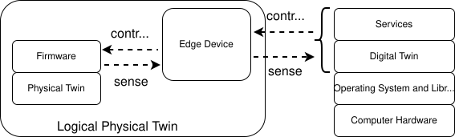
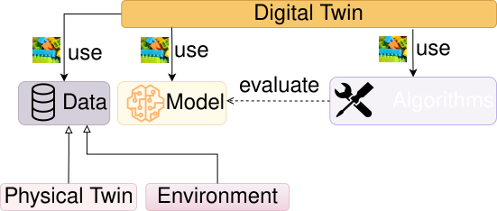
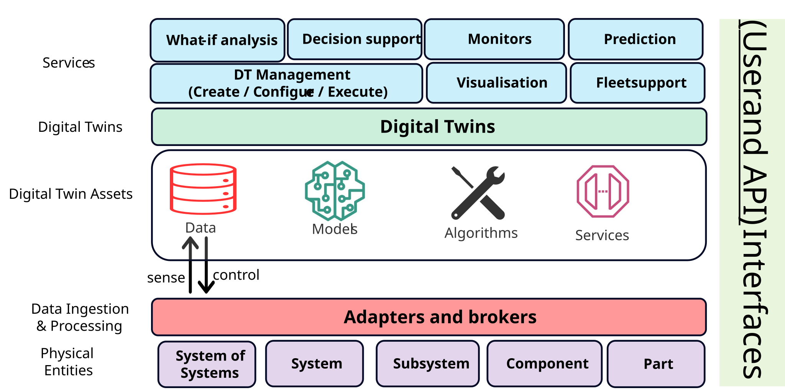

---
hide:
  - navigation
  - toc
---

# Digital Twins: An Introduction to Beginners

**Disclaimer:** This article has been generated using
[chitragupta](https://prasad.talasila.in/chitragupta).
Despite some potential for hallucination, the ideas communicated in this
tutorial are accurate. Please send your corrections and suggestions to
<prasad.talasila@gmail.com>

> **Summary.** A digital twin is a virtual representation of a physical
> system and connected to it through a continuous, two-way flow of data.
> Digital twins enable monitoring, what-if, fault-diagnosis, and
> maintenance services of physical systems.
> This tutorial defines the idea and many types of digital twins, surveys
> the data, models, and algorithms that form digital twins.
> This tutorial also covers digital twin standards that let twins
> interoperate, works through six case studies spanning wind turbines,
> bridges, aircraft, hospital wards, and greenhouses, and closes with
> the technical, security, and workforce challenges left unresolved,
> followed by exercises and a concluding synthesis of the lessons that
> cut across all of them.

## Learning Objectives

By the end of this tutorial, you should be able to:

1. **Define** a digital twin precisely -- and tell one apart from a
   digital model or a digital shadow by checking which way the data
   flows and whether the loop back to the physical system is closed.
2. **Decompose** any digital twin you encounter into its three building
   blocks -- data, models, and algorithms -- and name which specific
   choices (streaming vs. batch data, physics-based vs. data-driven vs.
   hybrid models, filtering vs. classification algorithms) a given
   system has made.
3. **Distinguish** the main model families used inside digital twins,
   explain the fidelity-versus-cost trade-off that drives the choice
   between them, and give a real published example of each family in
   use.
4. **Explain** why standards such as the Asset Administration Shell,
   ISO 23247, and DTDL exist, what architecture each one implies, and
   why a real project usually touches more than one of them.
5. **Analyze** a published digital twin case study -- identify its
   data, model, algorithm, and services, and compare the design choices
   two different twins make for the same kind of physical asset.
6. **Anticipate** the open technical, security, and organizational
   challenges a real digital twin project will face beyond the toy
   stage.

## Outline

- [Digital Twins: An Introduction to Beginners](#digital-twins-an-introduction-to-beginners)
  - [Learning Objectives](#learning-objectives)
  - [Outline](#outline)
  - [1. Motivation](#1-motivation)
  - [2. What Is a Digital Twin, Really?](#2-what-is-a-digital-twin-really)
    - [2.1 Types and Maturity of Digital Twins](#21-types-and-maturity-of-digital-twins)
    - [2.2 Why Build One? Uses and Benefits](#22-why-build-one-uses-and-benefits)
  - [3. The Building Blocks: Data, Models, Algorithms, and Services](#3-the-building-blocks-data-models-algorithms-and-services)
    - [3.1 Data](#31-data)
    - [3.2 Models](#32-models)
    - [3.3 Algorithms](#33-algorithms)
    - [3.4 Combining Models: Co-Simulation and Hybrid Systems](#34-combining-models-co-simulation-and-hybrid-systems)
    - [3.5 Architecture: Putting the Blocks Together](#35-architecture-putting-the-blocks-together)
    - [3.6 Services](#36-services)
  - [4. Why Standards Matter: Industry 4.0, AAS, and Friends](#4-why-standards-matter-industry-40-aas-and-friends)
  - [5. Case Studies](#5-case-studies)
    - [5.1 A floating offshore wind turbine](#51-a-floating-offshore-wind-turbine)
    - [5.2 A high-speed railway bridge](#52-a-high-speed-railway-bridge)
    - [5.3 A statistically monitored railway bridge](#53-a-statistically-monitored-railway-bridge)
    - [5.4 A self-aware unmanned aircraft wing](#54-a-self-aware-unmanned-aircraft-wing)
    - [5.5 A hospital ward](#55-a-hospital-ward)
    - [5.6 A greenhouse on a shelf](#56-a-greenhouse-on-a-shelf)
  - [6. Challenges and Open Issues](#6-challenges-and-open-issues)
  - [7. Exercises](#7-exercises)
  - [8. Conclusion](#8-conclusion)
  - [References](#references)

## 1. Motivation

Picture a wind turbine floating far out at sea. You can't just walk up and
peer inside it every time something feels off -- a maintenance visit means
a boat, a crew, and a very expensive afternoon. So the National Renewable
Energy Laboratory and Stiesdal Offshore built something cleverer instead:
a live computer model wired to the real turbine's sensors, checked
against a full-scale prototype, that estimates loads and stresses the
physical sensors alone can't see [@branlard_digital_2024]. That's a
*digital twin* -- and once you notice the pattern, you start seeing it
everywhere. At the University of Oslo, the BedreFlyt project runs a
digital twin of a hospital ward to simulate patient flow, so planners can
spot a bed shortage days before it happens instead of scrambling on the
day [@sieve_bedreflyt_2025]. In Extremadura, Spain, engineers built one
for a high-speed railway bridge, updating it live during load tests so
raw sensor readings turn into a structural model that corrects itself as
the data comes in [@chacon_digital_2024]. Different industries, same
trick: take a physical thing, give it a virtual counterpart wired to live
data, and let the two talk to each other. Each of these three examples is
already leaning on one of the specific *services* a digital twin can
provide, even if none of them use that word: BedreFlyt's bed-shortage
forecast is a what-if analysis, the turbine's load and stress estimates
support predictive maintenance, and the bridge's self-correcting model is
itself a monitoring service. Sections 3 and 5 come back to
the wind turbine and the bridge in much more detail, once you have the
vocabulary to talk about what's actually inside them -- Section 3.6
covers exactly these services.

If the pattern feels like it is suddenly everywhere, that's because it
is. Scholarly articles on digital twins grew from 295 in 2015 to over
17,100 in 2022, and general internet search hits from about a million
in 2018 to over 17 million in 2023 [@grieves_digital_2024]. Market
analysts have valued the digital twin market at 3.1 billion US dollars
in 2020 with growth projected to 48.2 billion by 2026
[@alcaraz_digital_2022], and one 2022 industry forecast put the market
at 183 billion dollars in revenue by 2031 [@larsen_engineering_2024].
Yet the same author who coined the concept reports engineering
graduates arriving in industry having never once heard the term
"digital twin" in four years of coursework [@grieves_digital_2024].
That mismatch -- a field growing explosively while curricula stand
still -- is exactly the gap a tutorial like this one is meant to help
close.

## 2. What Is a Digital Twin, Really?

Here's a tempting but wrong definition: "a digital twin is a 3D model of
something real." A 3D model is just a passive abstraction -- it doesn't know or care
what the real object is doing right now. Here's a definition closer to
the truth, from the paper that coined the term: a digital twin is a
virtual object connected to its physical counterpart by a continuous flow
of data in *both* directions -- sensor readings flow in from the physical
side, and decisions computed on the virtual side flow back out to
actually change something in the real world [@grieves_digital_2017].

That two-way flow is the whole trick, and there's a quick way to test for
it: if data only flows one way -- physical object to model, full stop --
what you have is merely a *digital shadow*. Only when the loop closes,
and the model's output changes the physical object's behavior
automatically, do you get a real digital twin [@kritzinger_digital_2018].
In practice, many papers use "digital twin" more broadly for human-in-the-loop
or advisory systems; this tutorial keeps the stricter definition for clarity,
while treating shadow-to-twin systems as a maturity continuum. Held to
the strict test, most deployed systems fall short of the name they
advertise: one group of digital twin researchers reports that, in their
experience, "the majority of current DT applications are actually
digital shadows," with the loop back to the physical asset still closed
by a human [@larsen_engineering_2024].

The shadow-versus-twin line can also be drawn more sharply than a
which-way-does-the-data-flow test, and manufacturing researchers have
found it worth doing. One proposal from production engineering defines
the digital shadow as a pure assignment of measured status data to a
specific asset at a specific instant -- no interpretation attached --
and the digital twin as what you get when *models* advance that dataset
into statements about the physical asset itself [@bergs_concept_2021].
Their milling example makes the distinction concrete: recording a
carbide milling cutter's sintering temperature and powder grain size is
a shadow; feeding those measurements through a calibrated model that
predicts the resulting grain size in the sintered material, and from it
the tool's wear behavior, is a twin. Statistics on the shadow alone
revealed a *correlation* between grain size and tool lifetime -- but no
cause-and-effect relationship; only the model-backed twin could speak
to causality [@bergs_concept_2021]. On this view a shadow's resolution
is capped by its measurement system's sample rate, while a twin's
resolution "can be increased at will on the basis of models"
[@bergs_concept_2021] -- as compact a summary as any of what a digital
twin's models are actually *for*.

"Digital twin" is not the only name this idea goes by, and the name
arrived well after the idea. Grieves sketched the concept in a 2002
University of Michigan presentation, then taught it in that university's
first product lifecycle management courses in early 2003 -- under a
different name, the *Mirrored Spaces Model*. The term "digital twin" was
attached to it only years later [@grieves_digital_2017]. Grieves' own
later retelling adds texture: the model's first public outing was at a
Society of Manufacturing Engineering conference in Troy, Michigan, in
October 2002, the slide bore no name beyond "Underlying Premise of
PLM," and the name "digital twin" was eventually coined by John Vickers
of NASA [@grieves_digital_2024]. From the beginning, that model
assigned its virtual half two jobs that remain the cleanest statement
of what a digital twin is for: *replication* -- the twin holds all the
data of its physical counterpart that its use cases require -- and
*prediction* -- the twin forecasts future states, causally or
probabilistically [@grieves_digital_2024]. Meanwhile
industries that needed something like it built it under names of their
own: a *computational megamodel*, a *device shadow*, a *mirrored system*,
an *avatar*, or a *synchronized virtual prototype*. Several of the
earliest systems matching the pattern predate the term entirely. Logs of
patient health history, online operation monitoring of process plants,
traffic and logistics management, weather forecasting driven by dynamic
data assimilation, remote monitoring of satellites, and real-time
detection of leaks in oil and water pipelines all qualify in hindsight,
though none of their builders would have used the word
[@rasheed_digital_2020].

The idea has an even longer prehistory in the modeling-and-simulation
world, and it is worth knowing because it explains why simulation
researchers sometimes bristle at being told digital twins are new. In
1991 -- a decade before Grieves' presentation -- the computer scientist
David Gelernter published *Mirror Worlds*, imagining software models of
parts of the real world fed by live information streams so that the
model stays perpetually up to date: a city's mirror world would track
the state of its bridges and the locations of its police cars, and a
hospital's would contain digital versions of its patients, doctors,
rooms, and medical inventory, with each user viewing whichever aspects
they cared about at whatever level of detail [@ali_modeling_2024].
Simulation researchers likewise trace a closed-loop lineage of their
own through *symbiotic simulation* -- a term introduced at a 2002
research seminar for a simulation that exchanges data with the physical
system in a closed loop, the physical side sending measurements while
the simulation runs what-if experiments to control it
[@ali_modeling_2024]. NASA engineers date the whole idea further back
still, to the 1960s "living model" of the Apollo missions
[@ali_modeling_2024], and NASA also supplied one of the field's
most-quoted definitions, from a 2010 technology roadmap: "an integrated
multiphysics, multiscale, probabilistic simulation of an as-built
vehicle or system that uses the best available physical models, sensor
updates, fleet history, etc., to mirror the life of its corresponding
flying twin" [@ali_modeling_2024]. Small wonder, then, that a recent
commentary from the modeling-and-simulation community asks in its own
title whether the digital twin is an *evolution* of simulation or a
*revolution*. Its answer is worth internalizing even though the authors
deliberately leave the question open: what is genuinely new is not the
models but the standing, two-way synchronization between model and
asset -- a classic simulation study represents the past or a possible
future computed from initial assumptions, while a digital twin is about
what is happening *right now* [@ali_modeling_2024].

The lesson for a beginner is to hold the word loosely. What matters is
the *pattern* -- physical asset, virtual model, closed two-way loop. That
pattern recurs under many names, across many industries and decades.

Two examples make the loop concrete. The first is deliberately small: a
teaching case study built around an *incubator* -- a styrofoam box
fitted with a heatbed, a fan, and three temperature sensors, all wired
to a Raspberry Pi, and built for a purpose you can taste: fermenting
tempeh, a traditional Indonesian soybean food that must be held near
37.5 °C for one to two days [@gomes_digital_2025]. The biology is what
makes the control problem interesting. After roughly twenty hours the
fungus doing the fermenting begins producing its own heat, raising the
box's internal temperature by as much as 7 °C above its surroundings
[@gomes_digital_2025] -- so a controller that merely heats on a fixed
schedule will eventually cook its own product. The case study walks
through a controller model that reads the real incubator's live
temperature sensors, computes a new heater setting, and pushes that
setting back to the real heater, no human in the loop
[@gomes_digital_2025]. The offshore wind turbine from Section 1
closes the same loop at industrial scale: sensor data streams in
continuously, and the twin's estimates feed back into the turbine's own
control system [@branlard_digital_2024]. Different scales, same
handshake.

It helps to see that two-way loop drawn as software instead of just
described in prose. On the physical side sits a *logical* physical twin:
the physical asset itself, plus whatever firmware already reads its
sensors and drives its actuators. Plenty of real assets have neither, in
which case an add-on firmware card -- an Arduino or Raspberry Pi board is
a common, cheap choice -- gets bolted on to bridge the gap. An *edge
device* sits between that logical physical twin and everything else,
carrying *sense* data one way and *control* commands back the other --
the same closed loop this section keeps insisting on, just drawn as boxes
and arrows instead of prose. The digital twin itself turns out to be
nothing exotic: ordinary software
running on an ordinary operating system on an ordinary computer,
distinguished from any other program only by that wire back to a real
object. Whatever the twin computes gets handed up to *services* sitting
on top of it, and that's the layer a person, or another piece of
software, actually touches -- a structural-health alert, a maintenance
recommendation, a what-if simulation result [@talasila_digital_2026].

Definitions of the term have multiplied -- NASA's, Siemens', General
Electric's, standards bodies' -- but distill them and the same three
ingredients keep precipitating out. One distillation requires exactly:
a model of the twinned system, an ever-evolving dataset about that
system, and a means of updating the model in accordance with the data
[@ali_modeling_2024]. Another, from a book devoted to the engineering
of digital twins, wraps the same ingredients in three properties:
*model-centricity* (a digital twin curates a collection of models as
its physical twin changes), *fidelity* (the gap between the twin's
perception and reality must be known and managed, because "we need to
know how accurate is 'accurate enough'"), and *additionality* (the twin
must add capabilities without compromising the physical twin's own
operation) [@larsen_engineering_2024]. That last property does quiet but important
work: it is what separates a digital twin from an ordinary control
system, since the physical twin should still operate, degraded but
functional, if the digital twin goes down [@gomes_digital_2025]. The
same book adds a framing subtlety a beginner can miss for years: the
thing being engineered is not the digital twin alone but the
*DT-enabled system* -- twin, physical asset, and the communication
infrastructure between them, considered together -- and the
stakeholders of that system need not be the stakeholders of the
physical asset; for some users of the asset, the twin may be entirely
invisible [@larsen_engineering_2024].

### 2.1 Types and Maturity of Digital Twins

Kritzinger's twin/shadow/model split from above isn't the only way
researchers have sliced up the concept. Grieves and Vickers, who coined
the term, split digital twins by what they're *for*: a **predictive
digital twin** forecasts how the physical asset will behave next, while
an **interrogative digital twin** is simply queried for the asset's
current status, no forecasting involved. A separate, complementary split
looks at *what part of the lifecycle* the twin focuses on: a **product
digital twin** prototypes and validates a design before it's built; a
**production digital twin** validates the manufacturing process itself,
ahead of and during actual production; and a **performance digital twin**
tracks the finished product and process together during operation,
feeding what it learns back into the next design cycle
[@iliuta_digital_2024].

Scale is a third axis: a **unit-level** twin models a
single component; a **system-level** twin is a collaboration of several
unit-level twins representing one larger machine; and a
**system-of-systems** twin connects multiple system-level twins together,
spanning the asset's entire life cycle [@iliuta_digital_2024]. The wind
turbine from Section 1 is a system-level twin built from unit-level
pieces (the tower, the rotor); a whole wind farm's digital twin,
coordinating many turbines together, would be the system-of-systems level
above it.

None of this happens at once. Several proposed maturity ladders describe
how a digital twin typically grows more capable over time. One ladder
tracks *how much of the twin exists and how it behaves*: a **partial
digital twin** starts with just a few tracked parameters (say, temperature
and pressure) used to prove out basic connectivity; a **digital twin
clone** adds a fuller, data-backed replica of the product; an **augmented
digital twin** starts correlating current data against historical data to
draw conclusions the clone alone couldn't. A
second, independent ladder tracks *how autonomous the twin is*: a
**pre-digital twin** exists before the physical asset does, informing
early design decisions; a plain **digital twin** exchanges data with the
built asset in both directions; an **adaptive digital twin** starts
learning operator preferences and makes real-time decisions using
supervised machine learning; and an **intelligent digital twin** goes
further still, using unsupervised learning to raise its own accuracy and
autonomy without being told what to look for [@iliuta_digital_2024]. A
beginner building a first digital twin project is almost always building
a partial, pre-digital-twin-stage system -- and that's fine; nobody starts
at "intelligent."

These ladders are not confined to manufacturing, either. A scoping
review of digital twins for healthcare arrives at a strikingly similar
four-rung version from a completely different starting point: a *static
twin* captures only fixed properties; a *functional* (or *mirror*) twin
adds dynamic behavior, enough for surgical planning or simulated
clinical trials; a *self-adaptive* twin acquires real-time patient data
and updates its own model; and an *intelligent* twin adds autonomy in
learning and reasoning, able to communicate with other twins
[@katsoulakis_digital_2024]. Two research communities that rarely read
each other's journals converging on "start static, grow toward
autonomous" is decent evidence that the ladder reflects something real
about how these systems actually get built.

Practitioners in wind energy use yet another version, a six-level
capability scale that is handy because each level names what the twin
can *do*: standalone (no real-time connection), descriptive (real-time
data aggregation and visualization), diagnostic (detects anomalies and
diagnoses failures), predictive (forecasts future states), prescriptive
(adds uncertainty quantification, what-if analyses, and
recommendations), and autonomous (acts on the asset without a human in
the loop) [@stadtmann_diagnostic_2024]. Published deployments cluster
toward the bottom of such scales -- the diagnostic twin those authors
built for a real floating wind turbine sits at capability level 2, and
they say so plainly [@stadtmann_diagnostic_2024], a candor worth
imitating in your own project write-ups.

There is also a finer-grained way to slice the space between "not
quite a twin" and "fully autonomous twin," borrowed from software
engineering's habit of naming recurring design patterns. One catalog
documents nine reusable digital twin architecture patterns -- Digital
Model, Digital Generator, Digital Shadow, Digital Matching, Digital
Proxy, Digital Restoration, Digital Monitor, Digital Control, and
Digital Autonomy -- each written up the way software patterns usually
are, with the context it fits, the problem it solves, and the solution
structure [@tekinerdogan_systems_2020]. The last three form a ladder of
increasing autonomy that echoes the maturity ladders above: a Digital
Monitor merely observes, a Digital Control twin adds a feedback loop
whose control parameters are still set externally by a client, and a
Digital Autonomy twin defines and adjusts its own control parameters,
learning from dynamically changing situations
[@tekinerdogan_systems_2020]. When the catalog's authors checked the
patterns against three real agricultural projects, every project turned
out to have started as a plain digital model or shadow and only later
grown into a twin, with monitoring and control patterns layered on top
[@tekinerdogan_systems_2020] -- the same "nobody starts at intelligent"
lesson, observed in the field.

### 2.2 Why Build One? Uses and Benefits

Why go to the trouble? The AIAA and the Aerospace Industries Association's
joint position paper on digital twins puts it plainly: the value of a
digital twin comes from moving work out of the expensive, slow physical
world and into a cheap, fast virtual one, then feeding the results back to
actually change what happens physically. That value shows up differently
depending on what stage of a product's life the twin is watching. A
digital twin can shadow a product through its entire life cycle: the "as
designed" phase, where a virtual prototype is analyzed and refined before
a single physical part is cut; the "as built" phase, where a twin of the
actual manufacturing process helps catch defects and optimize throughput;
and the "as used" and "as maintained" phases, where a twin of the
operating asset tracks wear, predicts failures, and extends service life.
Whatever question the twin is being asked to answer, its output usually
falls into one of four buckets: *descriptive* (what is happening right
now), *diagnostic* (why did it happen), *predictive* (what will happen
next), or *prescriptive* (what should be done about it)
[@noauthor_digital_nodate-1].

Concrete applications range far wider than the wind-turbine-and-bridge
examples in Section 1 might suggest. On the aerospace side, a digital twin
of a single material coupon can combine physics models, physical
experiments, and machine learning to characterize how a material behaves
under uncertainty, while a digital twin of a flight-test vehicle --
including the individual test pilot's characteristics -- can be used to
plan test flights that extract the most engineering knowledge per flight
hour [@noauthor_digital_nodate-1].

A survey of digital twins across many fields shows the same pattern
spreading much further. In medicine, an *organ-on-a-chip* studies how
different drugs affect human tissue, substituting a digital twin for the
human test subject to obtain the same information; combining several such
chips yields a *body-on-a-chip* overview of the whole organism. Neural
networks trained on electrocardiogram (ECG) data can classify heart
rhythms and diagnose circulatory pathologies. Emotion-recognition twins built
from webcam images have been proposed to detect stress and depression
early, so medication can be given in advance of a crisis. In automotive
manufacturing, a digital twin of a bodywork production line can check
whether production can proceed according to plan, test the line's
adaptability to abnormal scenarios, and evaluate proposed changes to
product ordering. At city scale, a smart-city twin integrates Building
Information Modeling (BIM) with Geographic Information System (GIS) data:
GIS supplies the city's geospatial context, BIM the detailed engineering
models, and the pair together supports sustainable urban design
[@iliuta_digital_2024].

BIM appears twice in this tutorial for unrelated reasons: once as the IFC
format carrying a single bridge's geometry, and once as half of an
entire city's digital twin. That overlap is worth noting. "Standards
for digital twins" and "standards a digital twin project inherits from
its own industry" are not separate categories in practice.

Medicine deserves a longer look than one paragraph, because it is where
the physical-asset vocabulary gets stretched furthest: the "asset" is a
person. A scoping review of digital twins for health found published
work concentrated on patient care -- particularly lung and breast
cancer, cardiovascular disease, and clinical trials -- and it collects
examples that make the pattern concrete [@katsoulakis_digital_2024].
The Living Heart project, a collaboration launched in 2014 between
Dassault Systèmes and the US Food and Drug Administration, crowdsourced
a validated virtual model of the human heart that is now used to
examine organ-drug interactions in silico and to refine cardiac device
designs [@katsoulakis_digital_2024]. In-silico *trials* push the idea
from one patient to a whole cohort of virtual ones: the VICTRE study
compared two breast-imaging methods using 2,986 synthetic image-based
virtual patients, and its findings correlated well with a real clinical
trial in which 400 women received both imaging methods
[@katsoulakis_digital_2024]. The catalog runs on from a digital twin of
COVID-19 patients' lungs, built to optimize the allocation of scarce
ventilators, to "synthetic control arms," where virtual patients stand
in for a trial's control group -- in one cited case, 68 such patients
supported extending a lung-cancer drug's coverage across 20 European
countries [@katsoulakis_digital_2024]. The economics explain the enthusiasm --
bringing a new drug to market costs about 2.6 billion US dollars and
takes about ten years, so any virtual substitute for part of that
pipeline is worth a great deal [@katsoulakis_digital_2024]. A related
position paper is careful about what such a twin is *not*, though. Its
authors observe that most of today's healthcare twins are "highly
specialised, highly focused patient-specific models" -- informed by
personal patient data at least once in their lifecycle, but only rarely
running in real time -- and their proposed *Virtual Human Twin* is
explicitly "not a gigantic digital twin" but a shared infrastructure of
data, models, and operating procedures that makes building and
validating individual medical twins easier [@viceconti_position_2024].
That distinction -- one focused twin per clinical question, plus shared
infrastructure underneath -- is one the industrial digital twin world
is converging on too, under the banner of reusability.

Agriculture supplies some of the most down-to-earth examples on record,
courtesy of three European Internet-of-Food-and-Farm projects used to
evaluate the pattern catalog from Section 2.1. An arable-farming twin
combines low-cost, geo-localized soil, crop, and climate sensing with
agro-climatic and economic models to manage zones *within* a single
field; the "Happy Cow" project fits dairy cows with 3D activity sensors
(on the neck, for instance) and streams cow-level and herd-level data
over long-range wireless networks into cloud analytics for health and
heat detection; and a greenhouse-tomato twin supports water and energy
efficiency and traceability across an entire supply chain
[@tekinerdogan_systems_2020]. It is worth pausing on the cow: mobile,
biological, and distinctly unmachinelike, it nonetheless fills exactly
the same physical-twin role Section 1 gave a wind turbine.

Zoom out from individual examples and a survey of industrial IoT digital
twins reports the same handful of use cases recurring across almost every
deployment it studied: smart manufacturing, product design, supply-chain
management, predictive maintenance, and remote diagnosis
[@xu_survey_2023]. None of those five is exotic on its own, and that's
rather the point -- most real digital twin projects aren't chasing a novel
application so much as applying the same physical-asset-plus-virtual-model
pattern to whichever of these ordinary, recurring business problems is
costing the most money to solve the old way.

One more use deserves separate billing: the digital twin as a
*teaching* technology. Grieves -- the same Grieves who coined the
concept -- has argued that the standard digital twin types map
naturally onto engineering education: a digital twin *prototype* lets
students explore and validate a design far more cheaply than building
it physically; a digital twin *instance*, connected to an individual
physical product, teaches them what sensor data to collect and how to
design the sensing; and *aggregated* twins supply synthetic data for
prediction and machine-learning coursework [@grieves_digital_2024]. His
sharpest exhibit is an industry-sponsored capstone project in which a
mixed team of students and aerospace-company employees built and
analyzed a digital twin of a multi-domain aircraft fuel system, then a
scale physical prototype whose measured performance matched the twin's
predictions within a few percentage points -- and at the final design
review, the reviewers could not tell the students from the employees
[@grieves_digital_2024].

That breadth is itself the point. A digital twin isn't a single
off-the-shelf product; it's a pattern -- physical asset, virtual model,
two-way data flow -- that keeps turning out to be useful nearly everywhere
someone is willing to invest in building the virtual half.

## 3. The Building Blocks: Data, Models, Algorithms, and Services

Zoom in on that loop from Section 2 and you'll find it isn't one thing --
it's three things, stitched together. Every digital twin worth the name
needs to move *data*, run it through a *model*, and let some *algorithm*
decide what to do with the result. That same three-part shape holds
together whether you're twinning a wind turbine or a hospital ward. Once
those three pieces are combined and arranged into an architecture, they
surface as the *services* -- monitoring, what-if analysis, predictive
maintenance -- that a person or another piece of software actually
interacts with. The rest of this section takes each piece in turn.

The picture is deliberately spare: a physical twin feeds a digital twin,
and the digital twin in turn *uses* data, a model, and algorithms, all of
which get *evaluated* against a shared environment rather than in a
vacuum. That word "uses" is doing real work. A platform paper describing how digital twins get built
out of reusable pieces makes the same point more formally: only an
algorithm (that paper splits it into a *function* asset and a *tool*
asset) is allowed to use a model or a piece of data -- data and models
never invoke each other directly -- and a specific combination of the
three is what turns a pile of reusable assets into one concrete digital
twin rather than another [@talasila_composable_2025]. This tutorial folds
that paper's separate *function* and *tool* categories into the single
label *algorithms*, purely to keep the vocabulary from multiplying past
what a beginner needs to track.

### 3.1 Data

Data is the raw material: the temperature readings, vibration spectra,
and bed-occupancy counts flowing in from the physical side. But "data" is
not one thing, and the shape it takes changes what you can do with it.
Some of it is *structured* -- a clean row of numbers with a known
meaning, like a rotor-speed reading tagged with a timestamp. Some of it
is *semi-structured or unstructured* -- a maintenance technician's
free-text note, a photo of a cracked weld, a video clip from an
inspection drone -- and needs real interpretation before any model can
use it at all. There's also a split in how the data arrives: some
pipelines process it in *batches*, collecting a large chunk and crunching
through it all at once, while others are built for *time-series* or
*streaming* data, where new readings show up continuously and have to be
handled a little at a time, in something close to real time
[@xu_survey_2023].

That streaming data has to get from the physical sensor to wherever the
twin actually lives, and that's a communication problem, not just a data
problem -- which is where the digital twin world runs straight into the
wider Internet of Things (IoT) ecosystem. Two surveys already sitting in
this project's bibliography map that overlap in useful detail. One traces
how digital twins for the Industrial Internet of Things lean on
open-source streaming tools such as Apache Kafka and Apache Spark to move
batch and time-series data around once it arrives [@xu_survey_2023]. The
other catalogs the communication protocols that actually carry the bytes
before that: MQTT and CoAP for lightweight publish/subscribe messaging
between small, low-power devices, HTTP and HTTPS where a heavier
request/response exchange is acceptable, and LoRaWAN where the sensor is
far away and battery life matters more than bandwidth
[@hakiri_comprehensive_2024]. None of these protocols is "the" protocol
for digital twins; picking one is mostly a question of how much power,
bandwidth, and latency the physical side of the twin can spare, and real
deployments often mix several -- MQTT from a nearby gauge, LoRaWAN from a
remote one, all landing in the same streaming pipeline.

Whichever protocol gets the bytes there, raw sensor data is almost never
usable straight off the wire. A temperature sensor might report in
Fahrenheit when the model expects Celsius; a vibration sensor might spit
out noisy readings that need filtering before anything downstream can
trust them; a firehose of per-second measurements might need batching
into slightly larger chunks before a model can digest them efficiently.
None of that cleanup logic is specific to any one digital twin; a
unit-conversion routine works the same whether it cleans turbine data or
hospital data. So these small, unglamorous routines tend to get written
once and reused across many twins, usually through off-the-shelf tool
chains built for exactly this kind of heavy lifting rather than
hand-rolled per project [@talasila_realising_2024].
It's easy to skip past this step when you're first learning about digital
twins, since "data cleanup" sounds far less interesting than "physics
simulation" -- but a beautifully built model fed garbage data will
confidently produce garbage output, so in practice this unglamorous layer
is where a lot of a real digital twin project's engineering time actually
goes.

At the level of concrete plumbing, even the desktop-scale incubator
runs a full data pipeline: its services exchange messages through a
RabbitMQ broker (an implementation of the AMQP messaging protocol),
store their time series in the InfluxDB database, and chart them in
Grafana dashboards [@gomes_digital_2025] -- the same
publish/subscribe shape as an industrial deployment, scaled down to a
styrofoam box. Nor is "the data" usually one organization's property.
An analysis of digital-twin-based predictive maintenance identifies
four distinct data types a mature service needs -- equipment operating
data from the asset's user, manufacturing environment data, resource
state data from whoever provides the maintenance resources, and
scheduling data from third-party service providers
[@zhong_overview_2023] -- a reminder that a twin's data pipeline often
crosses company boundaries, with all the contractual friction that
implies.

Once data is flowing, it typically passes through a layered software
stack rather than going straight from sensor to model. One widely used
framework for industrial IoT platforms splits the stack into four layers:
a *data layer* that represents the different sources and enterprise
systems feeding the twin; an *integration layer* that dispatches
well-formed information to the rest of the stack; a *service layer* that
chains services together and manages the twins themselves; and a
*business layer* that connects the whole pipeline to the actual business
logic driving decisions [@minerva_digital_2020]. Two further data problems
are easy to overlook until they bite. The first is *data fusion*: merging
readings from sensors that measure overlapping or complementary things
into one consistent picture rather than several disagreeing ones. The
second is *data security*. A twin that faithfully mirrors a physical asset
also faithfully mirrors an attack surface, and tampering with the data
feeding a twin -- or with the twin's stored history -- corrupts every
decision made downstream of it [@wu_comprehensive_2023].

Not all of a twin's data comes from the same place, either. It's useful
to separate *static modeling data* (the asset's fixed design parameters),
*dynamic interaction data* (live sensor readings that change moment to
moment), and *service knowledge data* (accumulated know-how about how to
interpret the first two) [@wu_comprehensive_2023]. Sensors themselves can
also fail or go missing, and a surprisingly common fix borrows the
digital twin idea recursively: train a machine-learning model to act as a
*virtual sensor*, estimating what a broken or absent physical sensor would
have reported, using the other, still-working sensors and the twin's own
model as context [@wu_comprehensive_2023]. Taken far enough, the same
trick -- a digital twin of the sensing device itself, compensating for
gaps in the very data the main digital twin depends on -- shows up as its
own small, nested digital twin problem sitting inside the larger one.

How hard the data side is varies enormously by domain, and a medical
example shows the ceiling. An operational twin's data are noisy -- the
heart is beating while you measure it, the aircraft may be flying --
collected non-destructively within whatever the asset's operation
tolerates, sparse in both space and time, and arriving at wildly
different latencies: heart rate streams in real time, but a scan of the
heart's anatomy might come every six months [@niederer_scaling_2021].
A twin has to fuse all of that into one coherent, continuously updated
picture anyway.

When many similar assets are involved, it also pays to standardize how
the data is *organized*, not just how it is cleaned. Wind-farm
researchers built the PBSHM Schema, a database schema that restructures
each operator's raw SCADA data by structure and collection time into
uniform channel documents, precisely so that "generic algorithms that
can function across the varying datasets, regardless of the turbine
owner or type" become possible [@bull_data-centric_2023] -- the data
layer's version of the reusability argument this section started with.

### 3.2 Models

The model is where the twin actually knows something about the physical
world. There isn't just one kind, though, and the literature on
digital twins tends to sort them into a small number of recurring families.

**Physics-based models** start from known physical laws -- structural
mechanics, fluid dynamics, the equations describing how a solid bends or
a fluid flows -- and simulate them directly. Within this family, a useful
further split is by how the model treats time. A **continuous-time (CT)**
model describes a system's physical state as it evolves smoothly --
typically a set of ordinary differential equations relating quantities
such as position, velocity, and acceleration -- and since most such
equations are too complex to solve analytically, a digital twin instead
uses *numerical integration*, stepping the simulation forward in small
time increments and trading a smaller step size for a more accurate but
slower-running result, the same fidelity/cost trade-off in miniature
[@carreira_foundations_2020]. A **discrete-event (DE)** model instead
represents a system whose state changes only at distinct instants -- a
controller deciding whether to switch a heater on or off, or a
supervisory system recovering from a detected fault -- using formalisms
such as finite state machines or Petri nets [@carreira_foundations_2020].
A physical asset with any onboard control logic typically needs both: its
physical dynamics captured in continuous time, and its controller
captured as a discrete-event model. A particularly common
and widely used continuous-time model is the **Finite Element Model
(FEM)**, which handles problems too geometrically complex for a
closed-form equation -- structural stress, electromagnetic fields, heat
and fluid flow -- by discretizing the object itself into a mesh of small,
simple elements and solving the governing equations across that mesh
instead of over the whole shape at once; a finite element model of a beam
bending under load, or a computational-fluid-dynamics model of airflow
around a wing, are typical examples [@thelen_comprehensive_2022]. A
related, domain-specific case is **Building Information Modeling (BIM)**,
which represents a building or piece of infrastructure's physical and
functional characteristics for design and construction purposes; Section
2.2 already met BIM as half of a smart-city digital twin, and it belongs
here too, as another, model-categorization view of the same recurring
idea. The trade-off across every one of these variants is
always fidelity against computational cost. A model detailed enough to
capture every bolt and weld is far too expensive to run in real time.
Practical digital twins therefore use a deliberately lower-fidelity
physics-based model, accepting a small, quantified loss of accuracy in
exchange for one that keeps up with live sensor data
[@thelen_comprehensive_2022].

**Statistical models** take a different approach: instead of encoding
physical laws, they fit a mathematical structure -- an autoregressive
model, a stochastic process -- directly to measured data, without
necessarily explaining *why* the system behaves that way. They show up
twice in digital twins: identifying a dynamic system's behavior from
sensor measurements (a task called system identification), and modeling
how a physical asset degrades over time to support predictive
maintenance. In both cases the appeal is the same: statistical models
tend to need far less computation than a detailed physics-based
simulation, at the cost of not really explaining *why* the numbers come
out the way they do [@thelen_comprehensive_2022].

**Machine-learning (data-driven) models** go a step further and let a
general-purpose learning algorithm find the pattern in the data itself,
with no assumption about its mathematical form at all. These range from
comparatively simple methods, like random forests and Gaussian process
regression, to deep neural networks -- convolutional networks, LSTMs --
trained on large amounts of sensor data, and they are commonly split into
*supervised* approaches that learn from labeled examples and
*unsupervised* ones that find structure in unlabeled data on their own
[@iliuta_digital_2024]. They earn their keep precisely
where physics-based modeling struggles: when the underlying physics is
poorly understood, or well understood but too expensive to simulate at
the speed a digital twin needs. The price is data -- a machine-learning
model is only as good as the examples it was trained on, and it can fail
badly on situations that look nothing like anything it has seen before
[@thelen_comprehensive_2022]. When the thing being learned is a
*dynamical system* -- a system whose state evolves over time, which is
most of what digital twins model -- a survey of neural-network
simulation models offers a two-way split worth remembering:
*direct-solution* models take time itself as an input and learn one
particular trajectory, while *time-stepper* models learn the system's
dynamics, computing the next state from the current one the way a
numerical solver does. The consequence is practical: time-steppers cope
with new initial conditions and new inputs by construction, while a
direct-solution model must be retrained for each new scenario
[@legaard_constructing_2023]. The same survey covers *physics-informed
neural networks*, trained with a loss function that penalizes
disagreement with the governing equations -- a bridge to the hybrid
family below -- and *hidden physics networks*, whose extra output can
recover a physically meaningful but unmeasured quantity because the
equations constrain what it must be [@legaard_constructing_2023].

**Hybrid models** try to get the best of both worlds by combining a
physics-based model with a data-driven one. One common approach trains a
neural network with a loss function that penalizes any prediction
violating a known physical law; another runs a physics-based simulation
purely to generate extra training examples for a machine-learning model
that would otherwise not have enough real data. The result generalizes
better than pure machine learning while staying far cheaper to run than a
full physics-based simulation -- essentially borrowing the physics
model's ability to stay sensible outside the training data, and the
data-driven model's ability to run fast [@thelen_comprehensive_2022].
(The word "hybrid" also gets used for systems that mix continuous and
discrete-event behavior within a single sub-system -- related in
spirit, since both pair two different ways of capturing behavior, but
not the same idea as the physics-plus-ML combination here.)

| Model type | What it's built from | Typical use in a digital twin |
|---|---|---|
| Physics-based | Known physical laws (structural, thermal, fluid equations) | Simulating a system's behavior directly from first principles [@thelen_comprehensive_2022] |
| Statistical | A mathematical structure fitted to measured data | Identifying dynamic system behavior; modeling long-term degradation [@thelen_comprehensive_2022] |
| Machine-learning | A general-purpose learning algorithm trained on data | Capturing patterns too complex, or too expensive, to simulate from physics alone [@thelen_comprehensive_2022] |
| Hybrid | A physics-based model combined with a data-driven one | Improving generalization over pure ML while staying cheaper than full physics-based simulation [@thelen_comprehensive_2022] |

Choosing among these four families is itself a design decision, not
something forced by the physics alone: A digital twin can be modeled
with first-principles heat-transfer equations,
with a data-driven regression fit to logged temperatures, or with a
hybrid of both, and picking one over another trades off precision,
development cost, and how well the result generalizes to conditions the
model has never seen [@abbiati_modelling_2024]. The National Academies'
digital twin report offers a useful compass for the choice: where data
are abundant and the decisions to be made lie within the conditions the
data already cover, the data form the twin's core and the model can be
largely empirical; in data-poor settings, or when the twin must
extrapolate beyond anything yet observed, the models form the core and
the data are assimilated *through* them
[@committee_on_foundational_research_gaps_and_future_directions_for_digital_twins_foundational_2024].
A related industrial vocabulary is worth picking up here too:
*model-order reduction*, the family of techniques for shrinking a
high-fidelity model into one small enough to run against live data,
which practitioners sort into black-box approaches (learn a small
stand-in from simulation data), grey-box, and white-box approaches
(mathematically reduce the equations themselves -- with the advantage
that some white-box methods carry rigorous accuracy guarantees)
[@hartmann_executable_2022]. Whichever family is
chosen, a model built once and never touched again will slowly drift from
the real asset it's supposed to represent -- through wear, repairs, or
simply conditions the original model never anticipated -- so a production
digital twin needs a plan for *updating* its model over time. That may
mean periodically retraining a machine-learning model on fresh data, or
using one of the state-estimation methods in Section 3.3 to nudge a
physics-based model's internal state back toward what the sensors report
[@wu_comprehensive_2023].

Each of the four families is easiest to remember through a published
academic example -- a research group that made the choice, documented
it, and reported honestly how it went.

**A physics-based example: the cardiac digital twin.** Research groups
building digital twins for heart-failure patients follow a loop that is
worth tracing step by step. The patient receives an electrocardiogram
and a cardiac CT scan on day 0; an *inverse problem* is then solved --
adjusting a mechanistic heart model until its output matches those
measurements -- to infer the patient's specific anatomy, material
properties, and boundary conditions; the resulting day-0 twin predicts
what the day-10 rescan should show, which validates it; and the day-0
parameters become statistical priors when the twin is updated again at
day 35 [@niederer_scaling_2021]. Each cycle leaves behind "a dynamic
digital history" of that one heart. The same authors are frank about
the scale problem: early clinical examples each involve ten or fewer
patients, often requiring computing facilities no hospital has, while a
clinic sees a new patient every 10 to 15 minutes
[@niederer_scaling_2021].

**A statistical example: the population "form."** In structural health
monitoring, a single structure's measured signals cover only a fraction
of the operational, environmental, and damage conditions it could ever
meet, and labeled damage data are usually incomplete or absent
[@bull_foundations_2021]. Population-based monitoring answers with a
*form*: a statistical model -- for wind-turbine power curves, a
Gaussian process -- whose mean captures the essential shape of a
feature across a whole population of similar structures and whose
variance captures the expected differences between healthy members
[@bull_foundations_2021]. Fitted to 125 weeks of operating data from a
real Vattenfall wind farm, a mixture-of-Gaussian-processes version of
the form learned on its own to separate normal operation from
operator-imposed 50% power curtailment -- which looks alarming in the
data but is not damage -- while still flagging the genuinely bad power
curves as outliers [@bull_foundations_2021]. The statistical model
never explains *why* a curve is bad; it just knows, calibratedly, what
normal looks like.

The population idea scales well beyond power curves. The same wind-farm
research program shares information across turbines and across models:
a graph neural network treats each turbine in a farm as a node, so it
can generate the wake-induced wind deficit one turbine casts on another
-- trained on one simulated farm layout and tested on a different one,
it predicted the deficit accurately for turbines more than 200 meters
apart [@bull_data-centric_2023]; an ensemble method fuses ten different
stochastic simulators of fatigue loading on a 30-meter turbine blade,
letting subgroups of concurring simulators reinforce each other in the
regions where each is reliable [@bull_data-centric_2023]; and a dual
Kalman filter estimates an unknown distributed force on a blade jointly
with the blade's state, then reconstructs the response at every
unmeasured location [@bull_data-centric_2023] -- the virtual-sensor
idea from Section 3.1, yet again.

**A machine-learning example: surrogates and a very small network.**
One structural study built a deep-learning surrogate for an L-shaped
concrete cantilever monitored by eight displacement channels: the full
finite element model has 4,659 degrees of freedom, so a reduced-order
version with just 14 basis functions generated 10,000 cheap training
simulations, and a two-part network (a fully connected part plus an
LSTM) learned from those plus only 1,000 expensive full-order
simulations. The combined multi-fidelity network reproduced ground
truth with a worst-case correlation of 0.983, where the high-fidelity
network alone managed at best 0.791 [@torzoni_deep_2023]. At the other
extreme of model size, a diagnostic twin of Zefyros -- the world's
first full-scale floating offshore wind turbine -- detects anomalies
with a dense neural network of just three layers of eight, five, and
one neurons, one such network per gearbox temperature signal, trained
on a year of data. It flagged a generator anomaly 7.8 hours before the
turbine stopped for 4.2 days, with no false positives -- an event the
turbine's commercial monitoring system had not identified
[@stadtmann_diagnostic_2024]. The authors report that larger networks
overtrained, and that a fancier LSTM variant failed to detect the same
fault reliably [@stadtmann_diagnostic_2024]. In digital twins, bigger
machine learning is not automatically better.

**A hybrid example: battery prognostics.** Predicting a lithium-ion
battery's remaining useful life offers a clean before-and-after. An
"augmented" framework keeps an empirical capacity-fade model as the
primary predictor, then trains machine-learning models to predict and
correct that model's *error*. Across five datasets totaling 237 cells,
the correction cut root-mean-square error by 40% on average; on one
48-cell dataset it took the error from roughly 397 cycles down to 67
[@thelen_augmented_2022]. The telling comparison is against a purely
data-driven model, which achieved similar raw accuracy on that dataset
but with far worse *calibration* -- its confidence intervals could not
be trusted -- while the hybrid kept the model-based approach's honest
uncertainty estimates [@thelen_augmented_2022]. A follow-on study of
early battery-degradation forecasting adds a second moral: when coupled
physics-plus-learning models were tested on cells operated *outside*
the training distribution, the most robust performer was the simplest
-- a small linear model trained end-to-end through the physics -- which
beat far larger neural networks at extrapolation [@li_coupling_2025].

### 3.3 Algorithms

A model by itself doesn't *do* anything; it just sits there providing
simplified abstraction of a physical twin. Something has to actually
run the numbers, and that something is what the literature -- depending
on which paper you're reading -- calls an *algorithm*, a *tool*, or
a *method*. All three names
point at the same idea: a software implementation of a domain-specific
procedure that takes a model and some data and evaluates it
[@talasila_realising_2024]. Each model type from Section 3.2 tends to
come with its own family of algorithms built specifically to evaluate it.

For a **physics-based model**, the workhorse algorithm is a numerical
solver: finite element analysis (FEA) for structural stress and strain,
or computational fluid dynamics (CFD) for thermal and airflow problems,
each breaking the object into a mesh and solving the governing equations
at every point in it. The finer the mesh, the more accurate the result --
and the longer the solver takes to run, which is the same fidelity/cost
trade-off from Section 3.2 showing up again, now as a runtime cost
instead of a modeling choice [@thelen_comprehensive_2022].

For a **statistical model**, a common algorithm family is *system
identification* -- methods like the nonlinear autoregressive exogenous
(NARX) model or stochastic subspace identification (SSI), which fit a
mathematical structure to sequences of sensor measurements. A closely
related algorithm, the *Kalman filter*, estimates a system's current
internal state from noisy measurements by continuously blending a
model's prediction with each new sensor reading as it arrives -- neither
trusting the model blindly nor the noisy sensor blindly, but combining
the two in proportion to how much each is trusted at that moment
[@thelen_comprehensive_2022].

For a **machine-learning model**, the algorithm is a training procedure
-- backpropagation for a neural network, or a kernel-fitting procedure
for Gaussian process regression -- that adjusts the model's internal
parameters until its predictions match a set of training examples
closely enough. In many deployments, the model is initially trained
offline before the twin goes live; what runs inside the twin in real time
is usually the already-trained model doing fast inference, not the full
training procedure itself. In long-lived systems, retraining can still
happen periodically or continuously as new data accumulates
[@thelen_comprehensive_2022; @wu_comprehensive_2023].

For a **hybrid model**, the algorithm has to coordinate both halves at
once: a physics-informed loss function trains a neural network while
penalizing any prediction that violates a known physical law, or a
delta-learning procedure trains a machine-learning model specifically to
learn the discrepancy left over by a simplified physics-based model. Both
are ways of dividing the same labor: let the physics-based half handle
what's already well understood, and let the data-driven half absorb
whatever the physics-based model gets wrong [@thelen_comprehensive_2022].

Two more algorithm families deserve a place in the toolbox. The first
is the *inverse problem* solver, also called data assimilation: given
measurements of what a system actually did, work backwards to the model
parameters that best explain them. This is the step that turns a
generic heart model into one particular patient's heart, by
"formulating an inverse/data assimilation problem and solving it via
optimization and/or sampling-based algorithms"
[@niederer_scaling_2021]. A widely used sampling approach, Markov chain
Monte Carlo (MCMC), produces not one best-fit answer but a probability
distribution over answers -- at the price of needing thousands of model
evaluations, which is precisely why the surrogate models of Section 3.2
exist. One structural-monitoring study runs its MCMC
damage-localization chains against a trained neural-network stand-in
rather than against its 4,659-degree-of-freedom finite element model
directly [@torzoni_deep_2023].

The second is the *explanation* algorithm. When a twin's
machine-learning model flags an anomaly, an engineer's first question
is "why?", and attribution methods such as SHAP (Shapley additive
explanations) answer it by dividing responsibility for the model's
output among its inputs. The floating-turbine diagnostic twin from
Section 3.2 does exactly this: when its anomaly detector fired, the
SHAP values pointed overwhelmingly at the generator temperature input,
telling operators not just *that* something was wrong but *where* to
look [@stadtmann_diagnostic_2024].

Not every machine-learning algorithm trades away interpretability for
accuracy, either. **Optimal classification trees** are a good example: a
more recent, exact optimization approach to building decision trees,
has been used to predict damage to aircraft blades [@kapteyn_toward_2020].
That combination -- competitive accuracy without giving up the ability
to explain *why* the algorithm decided what it decided -- matters more
in a digital twin context than in most machine-learning applications,
since a twin's output often feeds directly into a real-world
safety decision.

Put the three pieces together and you get the whole loop from Section 2
back again: data flows in, an algorithm evaluates it against a model, and
the result flows back out to the physical twin. Change any one piece --
swap in a better model, plug in a faster algorithm, or feed it richer
data -- and the twin improves without touching the other two pieces at
all. That's the entire point of treating data, models, and algorithms as
separate, swappable building blocks instead of one big tangled program.

### 3.4 Combining Models: Co-Simulation and Hybrid Systems

Section 3.2's four model families are rarely used in isolation on
anything beyond a toy example. A real asset usually needs several models
built by different specialists, in different formalisms, for different
sub-systems -- a finite element model of a beam from a structural
engineer, a statechart describing a controller's logic from a software
engineer -- and at some point those separately built models have to be
coupled together into one working digital twin [@abbiati_modelling_2024].

**Co-simulation** is the most common way to do that coupling without
forcing everyone onto the same tool. Instead of rewriting every sub-model
in one shared modeling language, each sub-model keeps its own internal
implementation private and exposes only a small, standardized interface --
typically three functions: one to read a variable's current value, one to
set it, and one to advance the simulation by a short time step
[@abbiati_modelling_2024]. The most widely adopted standard for this
interface is the *Functional Mock-up Interface* (FMI), maintained by the
Modelica Association and supported by more than 140 modeling and
simulation tools, including Simulink, Dymola, OpenModelica, and 20-sim; a
model packaged to this standard is called a *Functional Mock-up Unit*
(FMU) [@abbiati_modelling_2024].
Co-simulation lets a structural engineer's finite-element model and a
controls engineer's statechart be combined into one digital twin without
either engineer needing to learn the other's tool, or disclose the
proprietary internals of their own.

How well does this work outside the lab? Co-simulation's footprint is
wide -- a keyword analysis found its publications spread across
engineering (40%) and computer science (25%), with citations growing
steadily since 2000 [@schweiger_empirical_2019] -- and a two-round
expert study of practicing co-simulation engineers, drawn from energy,
software, automotive, maritime, and avionics domains, found FMI to be
"by far the most commonly used standard for any kind of
co-simulation." The same study also surfaced where practice still
hurts. The experts' top-rated
current challenges were not exotic mathematics: the information
technology prerequisites of cross-company collaboration, poor
communication between theorists and practitioners, and -- tellingly --
how to judge whether a co-simulation's results are valid at all
[@schweiger_empirical_2019]. That last worry deserves a beginner's
respect. Wiring two individually correct models together does not
automatically produce a correct coupled simulation, because the
coupling itself -- how large a step the orchestrator takes between data
exchanges -- introduces numerical error of its own; the same study's
experts ranked the choice of that macro step size and numerical
stability among their leading concerns [@schweiger_empirical_2019].

Packaging matters here too, enough that industry has coined a name for
the packaged artifact: the *executable digital twin* (xDT), defined as
a self-contained, executable representation of one specific behavior of
the asset, instantiated from the full digital twin for a specific
purpose and deployment target -- an FMU for co-simulation, an ONNX file
when the model is a neural network, a Docker container when it ships as
a microservice [@hartmann_executable_2022]. The point of the extra name
is reuse with traceability: unlike an ad-hoc embedded model, an xDT
stays explicitly linked to the digital twin it was derived from. The
industrial examples show why the idea earns its keep. A thermal model
of an electric motor, shrunk by model-order reduction and calibrated
online by a state estimator, acts as a *virtual sensor* for rotor
temperature that no physical sensor can reach -- Section 3.1's
virtual-sensor idea, productized -- and in robot milling, combining
first-principles process-force prediction with online calibration at
roughly 5-millisecond update rates reduced the machining errors of
robots by 90% [@hartmann_executable_2022]. The same catalog includes a
failure analysis of a truck anchorage reconstructed from only four
available strain measurements, and fail-safe testing of an electric
vehicle's propulsion control unit against simulated faults -- short
circuits, lost communication, torque inversion -- injected over the
vehicle's own network, with packaged twin models standing in for the
vehicle and its other three wheel motors [@hartmann_executable_2022].
The practitioners' own wish list, for what it's worth, puts
user-friendly tooling -- predefined orchestration algorithms,
integrated error estimation -- at the top of co-simulation's
opportunities [@schweiger_empirical_2019].

Not every combination problem is solved by wrapping separate tools,
though. Some systems are inherently **hybrid**: they mix genuinely
continuous behavior (a temperature drifting smoothly) with genuinely
discrete behavior (a thermostat switching a heater on or off) within a
*single* sub-system, not across two separately built ones.

The incubator mentioned in Section 2 is a case in point, and it is worth
describing concretely, since one modelling text uses it as a running
example throughout. The device is a Styrofoam box fitted with an electric
heater, a fan, and temperature sensors, holding its contents at a
controlled temperature anywhere between 20 and 60 °C. Its controller reads
those temperature measurements and decides whether to switch the heater
on or off; the heater in turn injects thermal power into the air enclosed
by the box, raising its temperature [@abbiati_modelling_2024].

Heat transfer inside the box is continuous physics, while the controller
deciding when to switch the heater is a discrete state machine. Neither
description alone is enough. A **hybrid automaton** captures both at once:
the system moves
between a small number of discrete *modes* (heater on, heater off), and
within each mode its continuous state evolves according to a set of
differential equations that apply only in that mode; crossing a threshold
triggers a discrete transition to a different mode with different
equations [@abbiati_modelling_2024]. Co-simulation coordinates separate
models across a shared interface. A hybrid automaton, by contrast,
describes one system that has both kinds of behavior built in. Which
formalism fits depends on whether a system's continuous and discrete parts
were built by different people using different tools, or were always one
integrated whole.

### 3.5 Architecture: Putting the Blocks Together

Data, models, and algorithms are the ingredients; *architecture* is the
recipe for how they're arranged into a working system -- and different
research groups have converged on genuinely different answers.

One influential proposal extends Grieves' original three-part sketch (a
physical twin, a digital twin, and a connection between them) into a
**five-dimension model**: physical twin, digital twin, connection,
*digital twin data* (the twin's own accumulated data, distinct from live
sensor readings), and *services* (the functions -- simulation,
prediction, decision support -- that the twin exposes to the humans and
software around it) [@tao_five-dimension_2019-1].

A second proposal, aimed specifically at industrial IoT deployments,
arranges a twin into three layers instead of five: a **virtual asset
layer** holding the data, models, and virtual entities that make up the
twin's fundamental components; a **real-time "3C" layer** (computation,
communication, and control) that actually runs the twin's processes in
sync with the physical twin; and a **visualization and
human-machine-interface layer** on top, for the people who need to assess
and interact with the twin [@xu_survey_2023]. Where Tao's five-dimension
model is organized around what a twin *contains*, this layering model is
organized around what a twin *does* at runtime -- collect, compute,
communicate, and display -- and the same physical asset could reasonably
be described with either vocabulary.

A third view, closer to Section 3.1's IoT platform stack, comes from
manufacturing practice rather than an abstract reference model: data
layer, integration layer, service layer, and business layer, stacked in
that order so raw sensor data at the bottom is progressively refined into
the business decisions at the top [@minerva_digital_2020]. None of these
three architectures is simply "correct" while the others are wrong --
they're different lenses on the same underlying idea, chosen depending on
whether the person drawing the diagram cares more about a twin's internal
structure, its runtime behavior, or its place in a factory's existing IT
stack. ISO 23247's own functional architecture is a fourth
lens again, this time organized around which named responsibilities
(collecting data, controlling the asset, keeping things secure) a
compliant implementation must cover -- a reminder that "architecture," in
the digital twin literature, usually means "the thing this particular
paper's authors found most useful to draw a box around," not a single
settled blueprint [@noauthor_iso_nodate-1].

Drawn out, that functional architecture looks like a pipeline running left
to right. On the physical side, entities are organized hierarchically --
*part*, *component*, *subsystem*, *system*, and *system of systems* -- and
adapters and brokers carry their sensor data through a data-ingestion-and-
processing stage into a set of *digital twin assets*: the same data,
model, algorithm, and service building blocks introduced earlier in this
section, just relabeled in ISO's own vocabulary. From there, user and API
interfaces expose decision-support services -- prediction, monitoring,
what-if analysis -- while a separate DT-management layer handles the
unglamorous work of creating, configuring, and executing twins, and a
visualization layer and *fleet support* sit alongside it, acknowledging
that a real deployment rarely means just one twin, but many twins
built for large numbers of the same physical-twin type
[@noauthor_iso_nodate-1].

Architecture also has to answer a question none of the diagrams above
quite settles: *where does the twin actually run?* One of the earliest
worked-out answers, the C2PS reference model for cloud-based
cyber-physical systems, hosts every physical thing's twin in the cloud
-- each physical device automatically gets a "cyber thing" with a
one-to-one connection -- and then lets computation slide between the
two sides: a task can run entirely on the physical device, entirely in
the cloud twin, or in a hybrid mode that keeps cheap computation local
and pushes expensive computation to the cloud, with the mode chosen at
runtime by a decision layer weighing communication cost, computation
cost, and battery state [@alam_c2ps_2017]. The authors validated the
model with a vehicular driving-assistance prototype fusing a
smartphone's sensors with the car's on-board diagnostics scanner --
down to combining a locally detected speeding event with cloud-side
location and weather services to warn the driver about the road ahead
[@alam_c2ps_2017]. The model also shows how twins compose upward: four
smart temperature sensors in the corners of a room each get their own
cyber thing, and a master cyber thing above them aggregates the four
into a single room temperature [@alam_c2ps_2017] -- the
unit-to-system hierarchy from Section 2.1, drawn as software. A more recent Industry 4.0 reference model pushes
the same thought toward *Digital Twin as a Service* (DTaaS): five
layers -- physical, communication, digital, cyber, and application --
crossed with the shadow-to-twin integration ladder from Section 2.1, so
that twin capability can be consumed the way cloud storage is
[@aheleroff_digital_2021]. Its validating case study is pleasingly
unglamorous: scheduling maintenance for more than five hundred unique
constructed wetlands around Auckland, New Zealand, replacing a fixed
calendar of inspections with sensor-triggered, weather-aware predictive
maintenance [@aheleroff_digital_2021].

Zoom out one more level and the twins start needing management of their
own. When many DT-enabled systems are composed -- a wind farm of
turbine twins, a fleet of vehicle twins -- the engineering problem
becomes systems-of-systems engineering, and an added layer of *twin
management services* is needed to update and orchestrate the
constituent twins [@larsen_engineering_2024]. The business shapes are
already recognizable: a consumer fitness watch is a
business-to-consumer digital twin service, a paid wind-turbine
monitoring twin a business-to-business one -- where, as one book on
digital twin engineering observes, the twin "can become the means for
offering long-term services that could prove more profitable than the
physical product" [@larsen_engineering_2024].

None of these architectures builds itself, and the beginner's practical
question -- "what software do I actually download?" -- has been studied
systematically. One survey graded 14 open-source digital twin
frameworks against ten criteria and then implemented the same case
study, the incubator from Section 2, in five of them: Eclipse Ditto,
Eclipse BaSyx, SAP's Asset Administration Shell implementation, iTwin,
and the INTO-CPS co-simulation framework [@gil_survey_2024]. The
fourteen tools sort into six natural categories -- structured-data
asset-description frameworks, domain-specific tools, twin-description
language specifications, geospatial platforms, 3D
infrastructure-oriented platforms, and co-simulation frameworks
[@gil_survey_2024] -- a taxonomy that doubles as a map of how many
different things "digital twin software" can mean. The
results are a useful reality check on any tidy architecture diagram.
The asset-description frameworks handled connectivity and the physical
controller well but had no way to run simulation models at all; the
co-simulation framework suited the simulation-heavy services best but
struggled to interface bidirectionally with the physical device; and
analytics support everywhere topped out at basic integrated dashboards
[@gil_survey_2024]. The survey's list of common drawbacks -- missing
documentation, too-simple examples, uncertain long-term support -- is
worth reading before betting a project on any single framework
[@gil_survey_2024].

City-scale twins stress every one of these architectural decisions at
once, and a recent smart-city proposal shows what the answers look like
when written down concretely. Observing that existing reference
architectures are either too generic or manufacturing-specific -- and
that "there is currently no standardized DT architecture for smart
cities" from any standards body -- its authors decompose the twin into
six subsystems (edge, data management, digital twin, event management,
resource management, and system management) and validate the stack on
urban traffic in Issy-les-Moulineaux, a commune of Paris, using seven
months of data [@herath_smart_2024]. The concrete choices read like a
tour of this tutorial: traffic observations follow a standardized data
model carried by an NGSI-LD context broker,
Apache Kafka brokers the events (Section 3.1's streaming tools), an
LSTM neural network predicts traffic intensity (Section 3.2's
machine-learning family), and everything ships as containers across
edge and cloud (this section's where-does-it-run question)
[@herath_smart_2024]. Its most tutorial-worthy result is a trade-off
made measurable: letting the twin tune how often sensors report, the
authors show prediction error staying essentially flat when sampling
drops from hourly to two-hourly, then roughly doubling at three-hourly
[@herath_smart_2024] -- the data-cost-versus-accuracy dial from
Section 3.1, with numbers attached.

### 3.6 Services

The architectures above keep naming *services* as one of a digital
twin's essential ingredients -- Tao's five-dimension model gave the word
its own dimension, and ISO 23247's functional architecture lists
prediction, monitoring, and what-if analysis as the decision-support
services a user interface exposes. This section looks at what those
services actually look like in practice, using the incubator introduced
in Section 2 as a running example: the same small system that
demonstrated the basic sense-compute-actuate loop turns out to
demonstrate each of these more advanced capabilities too, just at a
larger scale in a full industrial deployment.

**Monitoring** is the most basic of these services, and arguably a
prerequisite for the rest: before a twin can decide what to do about its
physical twin's behavior, it first has to notice something worth acting
on. A monitor checks a trace of the physical twin's observed states
against a specification of desired behavior, producing a verdict on
whether the behavior is acceptable
[@frasheri_system_2024]. That
specification is usually written in a *temporal logic* -- a notation for
properties spanning multiple points in time rather than a single
snapshot -- which distinguishes *safety* properties (something bad never
happens, like the incubator's heater temperature never exceeding 40°C)
from *liveness* properties (something good eventually happens, like the
air temperature eventually reaching a target). Linear Temporal Logic
(LTL) checks such properties over discrete points in time and returns a
binary verdict; Signal Temporal Logic (STL) instead treats time as
continuous and returns a *robustness* value -- a real number whose sign
says whether the property holds and whose magnitude says how comfortably
[@frasheri_system_2024]. Not every
monitor is built from an explicit specification, either: where the
desired behavior is hard to write down precisely, a *data-driven* monitor
instead learns what "normal" looks like from historical sensor data and
flags anything that deviates from it, an approach that is especially
common for anomaly detection across many correlated sensors at once
[@frasheri_system_2024].

The incubator makes monitoring concrete at desktop scale. Its
monitoring service is a Kalman filter running against the calibrated
two-state thermal model, and its anomaly detector simply reuses the
filter's prediction error: opening the incubator's lid violates the
physical assumptions the model was built on, so the filter stops
tracking, and the growing discrepancy between estimate and sensor
readings *is* the anomaly signal. In one reported experiment, two
roughly one-minute lid openings were both detected this way, the
discrepancy decaying gradually after each closing
[@gomes_digital_2025]. The same filter also estimates the heater's own
temperature, which no physical sensor in the box measures directly --
Section 3.1's virtual-sensor idea again [@gomes_digital_2025]. The
Kalman filter is not the only state estimator in industrial use --
practitioners also reach for the moving-horizon estimator, which fits
the recent window of measurements as an optimization problem, both
families weighing measurements against model predictions according to
how much each is trusted [@hartmann_executable_2022] -- but the Kalman
filter is the one a beginner will meet first and most often.

**What-if simulation and design space exploration (DSE)** let a twin
examine several alternative futures side by side before anything actually
happens to the physical twin. A what-if simulation runs faster than real
time, exploring how the physical twin would respond to a hypothetical
intervention -- for the incubator, finding the safest setting for how
long a heater boost should run before a planned power outage, by
comparing several candidate values in parallel and keeping the one that
stays within safe temperature bounds the longest
[@frasheri_advanced_2024]. In the incubator's published version of that
scenario, three candidate boost durations are simulated side by side --
one overheats unsafely, one best balances temperature against the time
available for the power swap -- and the winning parameter is then
pushed down to reconfigure the real controller [@gomes_digital_2025]:
what-if analysis closing the loop rather than merely informing a human. Design space exploration
takes the same underlying idea and turns it into a systematic search over
many design alternatives, rather than a handful of ad-hoc scenarios,
often ranking or plotting the results against several competing
objectives at once -- balancing, say, an incubator's controller error
against how hard its heater is worked -- to reveal a Pareto front of
non-dominated trade-offs a human can choose from
[@frasheri_advanced_2024].

**Fault injection** deliberately introduces faults into a running
simulation or system to see how it responds -- a long-established
validation technique for dependability, covering availability,
reliability, safety, and security, that predates digital twins by decades
[@frasheri_advanced_2024]. Faults can be injected at
the hardware level (physically disturbing a power supply or pin values)
or, increasingly, in software, by tampering with a model's inputs or
outputs at the interface between components. Where a digital twin is
built from co-simulated FMUs (Section 3.4), a fault-injection wrapper can
sit at exactly those FMI interface points, letting an engineer test how a
controller responds to a sensor reporting a plausible but wrong value --
simulating, for the incubator, what a Kalman-filter-based monitor sees
when its lid is unexpectedly removed -- without ever touching the real
hardware [@frasheri_advanced_2024].

**Fault diagnosis and predictive maintenance** both build on monitoring,
but push further: past noticing that something is wrong, toward saying
what is wrong and when it is likely to get worse. Fault diagnosis
techniques are broadly *model-based* (comparing observed outputs against
what a model predicts) or *signal-based* (extracting features directly
from raw measurements), and both can draw on the physics-based,
statistical, or machine-learning models from Section 3.2, depending on
how well the underlying physics is understood
[@frasheri_advanced_2024]. Predictive maintenance
takes this a step further still, using the same statistical and
machine-learning techniques to analyze trends over a much longer time
horizon -- for the incubator, tracking the fan motor's rising current
draw as friction from wear increases -- so that a worn part gets replaced
on a planned schedule instead of failing without warning
[@frasheri_advanced_2024].

Predictive maintenance is a large enough business that its
digital-twin-driven version has grown a literature of its own. One
review distinguishes digital-twin-based predictive maintenance from the
traditional kind by three properties -- real-time perception, a
high-fidelity model, and high-confidence simulation prediction -- and
by what it replaces: expert judgment of maintenance timing gives way to
continuous, data-driven analysis [@zhong_overview_2023]. Its worked
example is an industrial robot whose geometric model is imported from
CAD, whose joint motors come from a simulation tool's component
library, and whose remaining useful life is predicted by a hybrid
CNN-LSTM network -- convolutional layers extracting spatial features
from the sensor time series, LSTM layers handling the sequence in time
[@zhong_overview_2023]. In wind energy, the same review collects work
predicting the remaining useful life of a turbine's power converter --
a component under especially rapid thermal cycling on floating
platforms -- and estimating drivetrain fatigue by combining a torsional
dynamic model with online measurement [@zhong_overview_2023].

**Visualization** is the service beginners most often forget to count
as a service at all, because it produces no decision -- only
understanding. It is rarely optional in practice, since a twin's
stakeholders can only act on what they can see. The incubator project
alone ships three different visualization front ends: a time-series
dashboard built on InfluxDB and Grafana, a 4D rendering of the box, and
an augmented-reality mobile application that overlays the incubator's
estimated internal state on a live camera view [@gomes_digital_2025].
The floating-turbine diagnostic twin from Section 3.2 renders its
components in a Unity-based virtual-reality interface, color-coded by
temperature, and pushes its alarms out by SMS, complete with farm,
turbine, component, and sensor identifiers
[@stadtmann_diagnostic_2024].

**Reconfiguration** closes the loop from Section 2 in its most
consequential form: rather than merely reporting a problem, the digital
twin changes the physical twin's own behavior to cope with it. A common
pattern is the **Monitor-Analyze-Plan-Execute over shared Knowledge
(MAPE-K)** loop, a self-adaptation cycle borrowed from autonomic
computing. For the incubator, opening its lid mid-operation invalidates
both the plant model and the controller that were tuned for a closed
box; a MAPE-K loop detects the anomaly with a Kalman filter, gathers
fresh data, re-calibrates the model and re-optimizes the controller, and
pushes the new parameters back down to the physical twin, all without a
human in the loop [@frasheri_advanced_2024]. That is
the same closed loop from Section 2's definition, just running one level
up: instead of a controller reacting to a single sensor reading, the
whole model-and-controller pair reacts to a change in the *operating
conditions* themselves.

Taken together, these services are what actually justify calling a
data-plus-model-plus-algorithm stack a *digital twin* rather than just a
well-instrumented simulation: they are the point at which the twin's
insight is turned into something a stakeholder can act on, or that the
twin acts on by itself.

As a compact checklist, it is worth seeing a full service inventory for
one small system. When researchers set out to compare open-source
frameworks by reimplementing the incubator, they specified its digital
twin as exactly seven services: a real-time mock-up, real-time
visualization, a plant Kalman filter, what-if simulation, the physical
controller, an anomaly detector, and a self-adaptation manager
[@gil_survey_2024]. Every one of those maps onto a service named in
this section -- and that, for a styrofoam box with a heater. A
beginner scoping a first project can do worse than to write the
equivalent seven-line list for their own physical twin and ask which
lines they actually need.

## 4. Why Standards Matter: Industry 4.0, AAS, and Friends

Here's a problem you'll hit the moment two digital twins, built by two
different companies, need to talk to each other: whose data format wins?
A handful of standards have grown up specifically to answer that
question, and each one implies a different underlying architecture for
how a twin actually gets built and hosted -- which turns out to matter
just as much as what the standard formally specifies on paper.

Before comparing standards head to head, it's worth having one more
reference picture in hand, since several of the standards below turn out
to be different ways of naming and grouping the same five ingredients.
Extending Grieves' original three-part sketch from Section 2, a widely
cited five-dimension model breaks a digital twin into physical twin,
digital twin, services, data, and connection, and gives each one a
distinct job: (1) digital twin data stems from the physical twin, from
services, from domain-expert knowledge, or from some combination of the
three; (2) physical twins exist within the physical world and serve as
the underlying basis for the twin; (3) the digital twin replicates the
physical twin, including its physical properties and behaviors; (4)
services provided by the twin offer the added-value functions a user
actually asked for -- simulation, verification, monitoring, optimization,
diagnosis, and prognosis (Section 3.6 walks through several of these
concretely, using the incubator); and (5) connections tie the other four
components together so they can collaborate rather than sit side by side
[@tao_five-dimension_2019-1; @qi_enabling_2021]. The model's original
formulation used different names for the first two dimensions --
*physical entity* for what this tutorial calls the physical twin, and
*virtual entity* (or *virtual model*) for what it calls the digital twin
-- and this tutorial substitutes its own Section 2 vocabulary throughout
for consistency. Keep this five-way split in mind while
reading the rest of this section: AAS's submodels, ISO 23247's functional
entities, and DTDL's telemetry/property/command split are all, in their
own vocabulary, ways of carving up these same five dimensions.

Germany's Plattform Industrie 4.0 defines the *Asset Administration
Shell* (AAS), a standardized digital "wrapper" that describes any
physical asset -- a machine, a sensor, a whole product line -- in a way
any AAS-aware software can read [@noauthor_asset_nodate]. It isn't a
single-organization effort, either: the Industrial Digital Twin Alliance,
a separate industry consortium, specifies AAS jointly alongside Plattform
Industrie 4.0, which is part of why the standard has drawn adoption from
multiple vendors rather than staying tied to one company's product
[@ferko_standardisation_2023]. The architecture
the AAS implies is decentralized and self-describing: every asset carries
its own AAS instance, assembled from independent, swappable "submodels,"
so different tools can query the same asset the same way without a
central server coordinating them. That decentralization is deliberate:
Plattform Industrie 4.0 was designed for factories where thousands of
assets from many different vendors need to interoperate without any one
vendor's cloud service becoming a single point of failure for the whole
plant. The AAS itself is just a paper specification, though; somebody
still has to write the software that reads and writes it. 
Eclipse BaSyX is exactly that: an open-source
*implementation* of the AAS standard, providing a registry, a client
library, and visualization tools already built, so engineers don't have
to write that plumbing themselves [@jacoby_open-source_2023]. BaSyX
doesn't standardize anything new on its own -- it just makes the AAS
architecture above something you can actually run.

The manufacturing world also has its own international standard,
developed independently of AAS: ISO 23247, introduced in 2021, defines "a
digital twin in manufacturing as a fit for purpose digital representation
of an observable manufacturing element with synchronisation between the
element and its digital representation" that spans the element's entire
product life cycle [@ferko_standardisation_2023]. The standard calls
whatever physical thing is being twinned an *Observable Manufacturing
Element* (OME) -- a product, a process, or a piece of equipment. It then
organizes a compliant implementation around four entities. A **Device
Communication** entity collects data from the OME and sends it control
commands. A **Digital Twin** entity models that data and provides
realization, management, and simulation services. A **User** entity hosts
whatever application consumes the twin. Finally, a **Cross-System** entity
spans the other three, supplying what all of them need -- chiefly security
and data translation -- rather than leaving any one of them to own it.

Rather than describing one asset at a time the way AAS does, ISO 23247
implies a *functional* architecture layered on top of those four
entities: it names around twenty specific functional entities (FEs) a
compliant implementation should realize, or something equivalent -- things
like data collecting, data pre-processing, controlling, actuation,
simulation, analytic service, reporting, security support, and
plug-and-play support for dynamically connecting a new OME
[@ferko_standardisation_2023]. A real implementation is judged by how
many of these it actually covers, and in practice most published
architectures only implement a handful.
A standard can specify exactly what a compliant architecture
ought to include, and real-world implementations can still quietly skip
the harder, less immediately rewarding parts.

Some experts point at AAS from earlier in this section as a plausible
fix for one of ISO 23247's specific gaps: standardizing the Peer Interface
functional entity that lets one digital twin talk to another, something
pivotal for scaling digital twins across a
whole flexible production system rather than one machine at a time
[@ferko_standardisation_2023]. That's worth noticing on its own terms: AAS
and ISO 23247 were developed independently, aimed at different problems,
yet practitioners on the ground are already reaching for one to patch a
hole in the other -- standards meant to solve narrow, separate problems
end up needing to interoperate with each other just as much as the
digital twins built on top of them do.

Where AAS and ISO 23247 both describe an asset or a factory, Eclipse
Ditto takes the cloud-hosted-service angle instead. It's an open-source
platform, designed to run in the cloud, that manages a fleet of digital
twins as addressable cloud objects reachable through APIs and SDKs
[@picone_wldt_2021]. The architecture it implies is centralized and
topic-based: every physical device is mirrored by a twin object living
in the cloud, and the two stay in sync by exchanging messages over four
kinds of topics -- telemetry, events, commands, and command responses --
rather than the asset itself hosting any local logic [@picone_wldt_2021].
That's a meaningfully different shape from AAS's decentralized,
asset-carries-its-own-shell model: Ditto centralizes the twin in the
cloud, while AAS is designed so an asset's shell can travel with the
asset itself. The trade-off mirrors the one between statistical and
physics-based models from Section 3.2: a centralized, cloud-hosted twin
is usually simpler to build and operate, at the cost of depending on a
network connection back to that cloud service being available whenever
the physical device needs to be checked or controlled.

Microsoft's cloud platform takes a related but distinct approach with the
*Digital Twins Definition Language* (DTDL). A DTDL twin is described as
an **Interface** -- a reusable unit that can declare Telemetry (data a
device emits), Properties (values that can be read or written), Commands
(functions that can be invoked), Components (sub-parts of the twin), and
Relationships that link one twin to another [@cavalieri_proposal_2023].
That last piece, Relationship, is what makes DTDL's implied architecture
distinctive: because any twin can declare a relationship to any other,
DTDL naturally produces a **graph of twins** rather than a single
isolated shell -- exactly the shape you'd want for modeling, say, a
building full of connected rooms and equipment, where "which room
contains which sensor" is itself important information. Microsoft's own
Azure Digital Twins service is built directly on top of DTDL, which is
part of why a graph-shaped standard designed for one cloud platform tends
to stay closely tied to that platform, unlike AAS, which several
different vendors implement independently.

What happens when one project needs two of these standards at once?
That question has been put to the test directly. One study analyzed
five digital twin description standards -- AAS, DTDL, NGSI-LD, Eclipse
Vorto, and the W3C Web of Things Thing Description -- by modeling the
same fictitious 3D printer in each, and found them incompatible in four
distinct ways: their syntax, their mechanisms for representing
properties and behavior, their communication mechanisms, and their
semantics [@schmidt_increasing_2023]. Concluding that no single
dominant international standard can be expected, the authors argue that
*transformation between standards* is the pragmatic way through -- and
built one, a working Java transformation from DTDL descriptions into
AAS that produced complete machine-readable AAS files for its test
inputs. Even so, some complex data types could not be transformed
generically [@schmidt_increasing_2023]: a reminder that a
standard-to-standard bridge, like any translation, leaks a little. The
same comparison usefully punctures any assumption that the standards
are interchangeable: NGSI-LD lacks functions and so is limited in
commanding the asset back, Eclipse Vorto supports neither relationships
nor compositions and so cannot model larger systems, and even AAS --
the study's transformation target -- lacked native time-series support
at the time [@schmidt_increasing_2023]. Practitioners hit these edges
quickly: the open-source framework survey noted, for instance, that an
AAS submodel element can represent an attribute but gives no standard
way to hold that attribute's initial, operational, and estimated values
side by side [@gil_survey_2024] -- exactly what a twin that both
measures and predicts the same quantity needs. Nor
has the landscape stopped moving -- ISO and IEC working groups on
digital twin concepts and terminology, use cases, and reference
architectures were all recent or still in progress as of the
mid-2020s, alongside the 2023 publication of the AAS itself as IEC
63278 [@larsen_engineering_2024].

| Standard | What it standardizes | Implied architecture | Behind it |
|---|---|---|---|
| AAS (Asset Administration Shell) | A uniform digital "wrapper" describing any physical asset [@noauthor_asset_nodate] | Decentralized: each asset carries its own self-describing shell, built from swappable submodels | Plattform Industrie 4.0 |
| Eclipse BaSyX | Nothing new -- an open-source *implementation* of the AAS standard above [@jacoby_open-source_2023] | (Same as AAS -- BaSyX just makes it runnable) | Eclipse Foundation |
| ISO 23247 | A reference architecture for digital twins in manufacturing [@ferko_standardisation_2023] | Functional: the twin is decomposed into named functional entities (data collection, maintenance, security, ...) | International Organization for Standardization |
| Eclipse Ditto | A cloud platform for managing device twins as addressable objects [@picone_wldt_2021] | Centralized, topic-based: a cloud-hosted twin object stays in sync with its device over telemetry/event/command topics | Eclipse Foundation |
| DTDL (Digital Twins Definition Language) | A metamodel for describing a twin's telemetry, properties, commands, and relationships [@cavalieri_proposal_2023] | Graph-based: twins declare relationships to other twins, forming a connected graph rather than an isolated shell | Microsoft |

Notice the pattern: none of these standards imply the same architecture,
because none of them are solving the same problem. AAS and ISO 23247 are
both concerned with describing physical assets -- one asset-by-asset, the
other factory-wide by function -- while Ditto and DTDL both assume a
cloud-hosted twin but disagree on what that twin's defining feature is:
its live message stream (Ditto) or its place in a graph of related twins
(DTDL). A real digital twin project usually ends up leaning on more than
one of these at once, the same way a web application leans on both HTTP
and a database format without anyone treating that as strange.

## 5. Case Studies

Section 1 introduced two real systems in passing -- the floating wind
turbine and the Extremadura railway bridge -- purely as motivation. Now
that Sections 3 and 4 have given you a vocabulary of data, models,
algorithms, and standards, it's worth going back to both and looking at
exactly which pieces they used, alongside four further case studies --
a second, statistically built railway bridge, a single unmanned
aircraft wing, a hospital ward, and a tabletop greenhouse -- that show
the same building blocks combined in very different ways.

### 5.1 A floating offshore wind turbine

The digital twin behind the TetraSpar floating prototype has to solve a
genuinely hard problem: estimating fatigue loads on the turbine's tower
without being able to instrument every point along it directly
[@branlard_digital_2024]. Its *data* comes entirely from sensors that are
already standard on most wind turbines -- power output, blade pitch,
rotor speed, and tower-top acceleration -- plus motion sensors
(inclinometers and GPS) specific to a floating platform
[@branlard_digital_2024]. That restriction is a deliberate design
decision, not an accident of budget: by limiting itself to signals
"expected to be available on most wind turbines," the twin stays
transferable to turbines that were never specially instrumented, with
the prototype's extra load cells reserved for validation only
[@branlard_digital_2024]. The project also quantified how the twin
degrades as its inputs do -- with 10% noise added to the measurements,
the wind speed estimate's mean error grew only from 2.6% to 4.1%
[@branlard_digital_2024] -- the kind of robustness figure worth
demanding from any twin whose sensors will age in salt air. Its *model* is a linear structural model of the
tower, built two different ways within the same project: once from a
dedicated suite of Python tools written for this work, and once using the
built-in linearization feature of the OpenFAST wind-turbine simulation
software, with the final digital twin combining components of both
[@branlard_digital_2024]. Its *algorithm* is exactly the statistical
algorithm introduced in Section 3.3: a Kalman filter, which continuously
blends the structural model's prediction with each new sensor reading to
estimate the tower's internal state, paired with a separate aerodynamic
estimator and a physics-based virtual-sensing step that turns those state
estimates into actual loads along the tower [@branlard_digital_2024].

Some context makes the achievement legible. The TetraSpar prototype --
a floating platform built by Stiesdal Offshore with partners including
Shell, RWE, and TEPCO Renewable Power, carrying a 3.6 MW Siemens
Gamesa turbine with a 130-meter rotor -- was commissioned off the coast
of Norway in November 2021, and the twin consumes its measurements as
ten-minute time series sampled at 25 Hz [@branlard_digital_2024]. The
structural model is deliberately tiny by simulation standards: eight
degrees of freedom in total -- the floating platform's six rigid-body
motions, one generalized fore-aft tower bending mode, and the shaft's
rotation [@branlard_digital_2024]. And the Kalman filter is an
*augmented* one: its state vector includes a quantity the model cannot
otherwise track, handled as a random walk -- assume it holds steady
between updates, and let the filter's model noise absorb the changes
[@branlard_digital_2024]. That small trick, estimating something by
formally admitting you don't know how it evolves, recurs all over the
state-estimation literature.

In simulation, where the true loads are known exactly because they were
generated by the same simulator, the digital twin's estimates came within
roughly 5-10% of the truth. Checked against real measurements from the
full-scale prototype instead, that error grew to roughly 10-15% -- a
reminder that a digital twin's accuracy on synthetic test data is always
an optimistic bound on how well it will do against the messier
real thing. Still a promising result overall, though the paper is candid
that turning these estimates into actual maintenance decisions is still
future work [@branlard_digital_2024]. The validation campaign's shape
is itself instructive: four days of prototype data, two in summer and
two in winter, totaling 576 ten-minute samples across wind speeds from
4 to 24.5 m/s [@branlard_digital_2024] -- deliberately spanning
seasons and operating regimes rather than cherry-picking a calm week.

The runtime arithmetic explains a modeling choice from Section 3.2
better than any abstract argument. The twin's state estimation runs
about ten times faster than real time, and its virtual sensing about
twice as fast -- but a full OpenFAST simulation of the TetraSpar runs
three times *slower* than real time, so a full-fidelity model could
never have kept up with the live turbine [@branlard_digital_2024]. The
deliberately reduced model is not a compromise; for an online digital
twin it is a requirement. The paper's closing wish list is equally
practical: several linear models stitched together by gain scheduling,
to cover the different operating regions of a pitch-regulated turbine
better than one linear model can, and a few more accelerometers or load
cells along the tower to pin the load estimates down
[@branlard_digital_2024].

The choice to build the tower model twice was deliberate, not redundant.
The dedicated Python toolset mirrored OpenFAST's own structural,
hydrodynamic, and mooring modules, which gave the team an independent way
to check that OpenFAST's built-in linearization produced a trustworthy
result. The two were combined only after the team confirmed the pathways
agreed with each other [@branlard_digital_2024]. That two-pathway habit is itself a
*composability* argument: rather than committing to one monolithic tower
model, the project treated the model as an assembly of swappable,
independently checkable pieces -- the same spirit behind the co-simulation
approach in Section 3.4, even though this project combines two
custom-built linearizations rather than two off-the-shelf FMI tools.

### 5.2 A high-speed railway bridge

The Extremadura bridge project starts from a more traditional
civil-engineering practice -- the *load test*, where a known load is
applied to a new or existing bridge and its response is measured -- and
turns it into a digital twin [@chacon_digital_2024]. The setting is the
437-kilometer Madrid-Badajoz high-speed line, built for trains at up to
310 km/h; in the segment studied, nineteen viaducts covering roughly
eight kilometers had to be load-tested before entering service, and two
became digital twins: the Valdelinares Viaduct, eight simply supported
spans totaling 280.4 meters, and the La Plata Viaduct, a four-span
continuous structure of 114 meters [@chacon_digital_2024]. The load
tests themselves are pleasingly physical: locomotives of 82 tons and
loaded wagons are parked on the deck in prescribed configurations, with
load cases deliberately designed below 60% of service loads, following
a five-step protocol -- measure unloaded, position the vehicles, hold
until the deformed shape stabilizes, unload, and measure until the
bridge returns to its original shape [@chacon_digital_2024]. During all
of this the bridge is instrumented with displacement transducers
accurate to two hundredths of a millimeter, strain gauges, and
accelerometers, sampling at rates up to 200 Hz
[@chacon_digital_2024].

Its *data* is
explicitly heterogeneous: sensor measurements taken during the load test,
geometric data capturing the bridge's as-built shape via the IFC
building-information-modeling standard, and simulation output, all
funneled into a shared "Common Data Environment" so every discipline on
the project works from the same information [@chacon_digital_2024]. Its
*model* is a finite element model of the bridge -- the same physics-based
model family introduced in Section 3.2 -- built during design and then
checked, and where necessary corrected, against what the load test
actually measured [@chacon_digital_2024].

The project does name its *algorithms*, and there are two, one per kind of
load test. For the static tests it uses **CONS**, a previously developed
numerical model for nonlinear, time-dependent analysis of
three-dimensional reinforced and prestressed concrete. CONS was wrapped in
parametric modeling software, so an engineer can vary the cross-section
geometry, the material constitutive models, and the prestressing loads and
watch the results update immediately. That responsive feedback loop is
what makes calibration practical: by matching the strains measured at each
sensor against the corresponding strains in a fibre-based model of the
cross section, it becomes feasible to calibrate the concrete's elastic
modulus by reverse engineering. Calibration matters here for a specific
physical reason. Concrete is heterogeneous and changes over time, so the
mechanical properties assumed at the design stage may simply not match the
ones of the finished bridge [@chacon_digital_2024].

For the dynamic tests, the acceleration data goes through **MOMAP**, the
Multiple Operational Modal Analysis Platform -- a Python signal-analysis
tool. It first cleans the signal with a high-pass filter, downsampling,
and noise reduction based on singular value decomposition, then extracts
the bridge's vibration frequencies, mode shapes, and damping. For that
last step MOMAP offers a menu of *operational modal analysis* methods,
among them an enhanced version of frequency-domain decomposition and
covariance-driven stochastic subspace identification. Operational modal
analysis earns its place for a practical reason: it needs only the
structure's measured response, not a controlled known load, so the data
can be gathered without interrupting the asset's regular operation
[@chacon_digital_2024]. That second method should look familiar --
stochastic subspace identification (SSI) is one of the
system-identification methods from Section 3.3, here doing real work on a
real bridge.

Unlike the wind turbine, this case study also
shows a *standard* from Section 4 in action, just not one of the
digital-twin-specific ones: IFC, a building-information-modeling
standard, is what lets the bridge's geometry travel between the different
tools used to design, test, and maintain it [@chacon_digital_2024]. The
supporting stack around the twin is a small ecosystem in itself:
preliminary finite element models built in a commercial bridge-analysis
tool and updated against the data flow, geometry authored as BIM and
exported to IFC, an open-source IoT platform carrying the sensor
streams, a game-engine-based common data environment for the project's
many stakeholders, and drone photogrammetry generating image-based 3D
representations of the structures [@chacon_digital_2024]. That's
worth pausing on, because it's easy to assume "standards for digital
twins" means only the five entries in Section 4's table -- but any given
digital twin project typically also inherits a whole stack of
domain-specific standards from its own industry (IFC for construction,
in this case) underneath whichever digital-twin-specific standard, if
any, sits on top of it.

Did the twinning work? The check the governing standards care about is
the ratio of measured to predicted vibration frequencies, and across
the two viaducts' modes those ratios ranged from 91% to 119%,
satisfying the requirements [@chacon_digital_2024]. Two of the
project's reflections are worth carrying beyond bridges. First, on
timing: bridge twins, the authors argue, need information not on a
"real-time" basis but on a "right-time" basis, "which may take days,
weeks or even years" [@chacon_digital_2024] -- a deliberate
counterpoint to the reflex that every digital twin must stream
continuously. Second, on lifecycle: since a load test happens exactly
once, at handover, with the bridge fully instrumented anyway, the
authors call it an ideal milestone for twinning -- the asset's "digital
birth," acquired at insignificant additional operating cost
[@chacon_digital_2024].

### 5.3 A statistically monitored railway bridge

Not every digital twin in this tutorial's case studies is built the way
Section 5.2's bridge was. A separate research group proposed and evaluated
a digital-twin framework for a different real bridge -- an integral
concrete portal-frame bridge on the Bothnia railway line near Hörnefors,
Sweden -- using almost entirely different building blocks from Section 3,
even though the physical asset (a railway bridge) is the same type of
thing [@torzoni_digital_2024].
Where the Extremadura bridge's twin (Section 5.2) is built around a
single finite element model, corrected against load-test measurements,
the Hörnefors twin is built around a **dynamic Bayesian network**: a
statistical model (Section 3.2) that represents the bridge's health as a
probability distribution over possible states, continually updated as
new sensor readings arrive, rather than as one fixed numerical answer
[@torzoni_digital_2024]. The bridge itself is an integral concrete
portal-frame structure with a 15.7-meter span; its simulated damage
scenarios are localized stiffness reductions of 30% to 80% in six
predefined regions of the structure, which -- once severity is
discretized into intervals -- gives the twin a vocabulary of 37
possible "digital states" to reason over [@torzoni_digital_2024].

Its *data* comes from ten simulated displacement sensors recording the
bridge's response as trains cross it at speeds between 160 and 215 km/h,
sampled fast enough (400 Hz) to resolve the bridge's motion even at the
highest train speed, and deliberately corrupted with realistic sensor
noise to test the approach honestly rather than against a clean signal
[@torzoni_digital_2024]. Its *model* has two halves. The first is a finite
element model of the bridge with almost 17,300 degrees of freedom at full
resolution, reduced offline to a much cheaper approximation so it can
generate the huge number of training examples the approach needs. The
second is a deep-learning classifier that turns noisy real-time sensor
readings into a diagnosis of the bridge's structural health, expressed as
a probability spread across six possible damage locations plus a healthy
state [@torzoni_digital_2024]. Its *algorithm* is
sequential Bayesian inference: each new batch of sensor data updates the
twin's belief about which of those states is most likely. This is the
blend-the-prediction-with-the-new-measurement idea from Section 3.3,
applied to a discrete set of health states rather than a continuous
physical quantity. That belief then feeds a
decision-making layer that recommends a maintenance action -- do nothing,
or one of several levels of repair -- chosen to balance the bridge's
safety against the cost of unnecessary maintenance [@torzoni_digital_2024].

The details reward a closer look. The classifier is a twelve-layer
convolutional network trained on 10,000 simulated train passages
generated by the reduced model -- itself distilled offline, 133 basis
functions extracted from 400 runs of the full model. Its overall
classification accuracy is 91.39%, and its mistakes are almost all
confusions between *adjacent* damage severities at the same location
[@torzoni_digital_2024]. Rather than wishing that error away, the
framework builds it in: the classifier's confusion matrix is used
directly as a conditional probability table inside the Bayesian network
-- the twin literally encodes how often its own perception is wrong,
and by how much [@torzoni_digital_2024]. The maintenance actions are
three: do nothing, repair fully, or restrict operations by admitting
only trains under 18 tons per axle, which slows degradation at the
price of revenue. The computed policy is readably sensible: run
normally until damage reaches roughly 30-35%, then restrict operations
to slow further degradation, and repair once damage passes about 65%
[@torzoni_digital_2024].

The result: in simulation, the framework tracked the bridge's true
(simulated) health state accurately and recommended the right maintenance action
within at most two sensor readings of when the ground truth actually
called for it [@torzoni_digital_2024]. The authors are candid that the
framework has only been tested against simulated data so far, not a real
instrumented bridge, and that a more realistic future version would need
to keep learning and updating its own internal transition model over time
rather than treating it as fixed from the start [@torzoni_digital_2024].
Setting this twin side by side with Section 5.2's shows something worth
remembering: two digital twins of the same *kind* of physical asset can be
built from almost entirely different data, model, and algorithm choices,
and both still legitimately earn the name "digital twin."

### 5.4 A self-aware unmanned aircraft wing

The last case study shifts scale down to a single component: the wing of
a 12-foot-wingspan unmanned aerial vehicle (UAV), monitored by 24 strain
gauges as it flies a mission [@kapteyn_toward_2020]. Rather than running
one large structural model continuously, the twin keeps a **library** of
many small reduced-order models (Section 3.2's physics-based family, but
each one deliberately cut down to run fast), pre-computed offline from
high-fidelity finite element simulations of the wing in a whole range of
pristine and damaged states [@kapteyn_toward_2020]. Building the models
this way -- as swappable components rather than one big monolithic model
-- is what lets the approach scale to a complex asset without needing a
single enormous simulation to run in real time; it's the same
component-based instinct behind Section 3.4's co-simulation, just applied
within one team's own model library rather than across independently
built tools.

The airframe and the numbers behind that library both deserve a look.
The aircraft's fuselage comes from an off-the-shelf Telemaster model
airplane, but its wings are custom-built in plywood and carbon fiber --
and interchangeable, so the same aircraft can fly with pristine wings
or with varying degrees of deliberately inflicted damage
[@kapteyn_toward_2020]. The 24 strain gauges sit in two spanwise rows
between 25% and 75% of the right wing's span. The reduced-order
machinery is what makes the library affordable: where a full
finite-element model of the UAV has 1,383,234 degrees of freedom, the
component-based reduced model has 928 -- three orders of magnitude
smaller -- and the full library spans 28 damage regions across both
wings, of which the published case study exercises a 25-model slice
[@kapteyn_toward_2020].

Its *algorithm* is where this case study earns its "self-aware" label: the
**optimal classification tree** from Section 3.3, chosen specifically
because a human engineer can read off exactly which strain-gauge readings
led the tree to its conclusion, unlike a typical neural network
[@kapteyn_toward_2020]. Fed the live strain-gauge readings, the tree
infers which model in the library best matches the wing's current
damaged (or undamaged) state, in effect picking the right "twin" for
right now out of the library rather than continuously re-deriving one
from scratch [@kapteyn_toward_2020]. That inferred state then feeds a
simple decision rule: in its pristine state the wing can safely handle an
aggressive, fast flight maneuver (a 3g load), but once the model
estimates that stiffness in either wing region has dropped by more than
40%, the twin tells the UAV to fall back to a slower, gentler 2g maneuver
instead [@kapteyn_toward_2020]. In a simulated mission through a field of
obstacles, with damage growing steadily across 100 timesteps, the
resulting digital twin let the UAV dynamically replan its route around
accumulating structural damage -- taking the fast path while it safely
could, and the cautious path once it couldn't -- without a human ever
manually re-assessing the aircraft [@kapteyn_toward_2020].

One further finding from this case study generalizes well beyond
aircraft: the trained trees revealed that most of the 24 sensors were
redundant for the classification task. For one of the two damage
parameters, a single strain gauge -- sensor 22 -- was enough to
partition the feature space perfectly, and overall the trees delivered
accurate estimates of both damage parameters using just three of the 24
available sensors [@kapteyn_toward_2020]. An interpretable model does
not just explain its decisions; it can tell you which sensors you
needn't have installed. The authors are equally clear about the
approach's blind spot: nothing yet accounts for the case where the
aircraft's true state matches *nothing* in the model library
[@kapteyn_toward_2020] -- the closed-world assumption every
library-based twin quietly makes.

This case study is a useful bookend to Section 5.1's wind turbine. Both
use a physics-based model plus a data-driven layer to estimate a
structure's internal state from sensors that cannot see inside it
directly. But the turbine's filter tracks one continuously evolving
numerical state, while the UAV's classification tree picks whichever of a
discrete library of pre-built states best fits right now. Two different,
equally valid answers to the same question from Section 3: how do I know
what is happening inside my structure?

### 5.5 A hospital ward

Section 1's BedreFlyt example deserves a full treatment, because it
stretches the tutorial's vocabulary in a direction none of the other
case studies do: the physical twin is not a machine but a *process* --
patients flowing through a hospital ward -- and the twin's core model
is not a differential equation but logic. The problem is bed bay
allocation: assigning each patient a bed slot in a room while
respecting diagnosis, gender, infection status (contagious patients
must be isolated), the need for continuous staff monitoring, room
care-level categories, and room capacity -- a process that today "is
often handled manually" and still is in many major hospitals
[@sieve_bedreflyt_2025].

The building blocks map cleanly onto Section 3's vocabulary all the
same. Its *data* is an anonymized real-world dataset from a hospital
ward at Oslo University Hospital, with patients recorded by identifier,
gender, and contagiousness at day-level granularity
[@sieve_bedreflyt_2025]. Its *models* are two: a ward-workflow
simulator written in the executable modeling language ABS, which turns
a timed stream of arriving patients and their treatment plans into a
timed stream of daily allocation problems, and a knowledge graph
holding the domain knowledge -- which task depends on which, what each
room offers [@sieve_bedreflyt_2025]. Its *algorithm* is a constraint
solver: each day's allocation problem is reformulated as one logical
formula and handed to the Z3 solver, a problem the authors note is
similar to the NP-hard general assignment problem
[@sieve_bedreflyt_2025]. The glue is a technique called *semantic
reflection*: the orchestration program's own runtime state can be
automatically represented as a knowledge graph and queried from within
the program, so the twin can literally query itself
[@sieve_bedreflyt_2025]. The authors frame the result as "an
infrastructure for data-driven formal methods" -- the constraint solver
and the simulator's formal semantics are doing the work that fell to
numerical mathematics in the other case studies -- and as a shift "from
the predictive analysis of near-future events to the prescriptive
analysis of hypothetical scenarios" [@sieve_bedreflyt_2025].

The service on top is multi-day planning that minimizes moving patients
between beds while satisfying every constraint, with a capacity buffer
reserved for emergency arrivals [@sieve_bedreflyt_2025]. Performance is
comfortably practical: a typical scenario of 100 patients arriving over
30 days is computed in about 30 seconds, and scaled-up scenarios of up
to 2,000 patients over a full year stayed under 20 minutes in all but
one configuration [@sieve_bedreflyt_2025]. The authors are candid that
this is a proof of concept running on historical data -- connecting to
live ward data raises integration and legal challenges they explicitly
defer [@sieve_bedreflyt_2025]. In Kritzinger's terms from Section 2,
BedreFlyt today is a digital shadow with prescriptive ambitions, and
that candor is itself worth imitating.

### 5.6 A greenhouse on a shelf

The last case study is one you could build in a dorm room, which is
exactly its point. GreenhouseDT is an open-source *exemplar* -- a
complete, reproducible digital twin published specifically so other
researchers can experiment on it -- whose physical twin is a
three-level indoor greenhouse: four basil plants on two shelves, a
water basin on the third, one light sensor, a temperature-and-humidity
sensor per shelf, a soil-moisture sensor per pot, and one small water
pump per plant, coordinated by Raspberry Pi boards
[@kamburjan_greenhousedt_2024] -- the add-on-firmware pattern from
Section 2's layered picture, in miniature.

What makes it more than a hobby project is how it is modeled. The
greenhouse's structure lives in a knowledge graph -- an ontology of
shelves, pots, plants, and pumps, each carrying properties like its
ideal soil moisture -- and the simulation model is written in SMOL, a
language whose every runtime state can itself be read as a knowledge
graph [@kamburjan_greenhousedt_2024]. Self-adaptation then becomes a
matter of *querying*: "defect queries" run over the combined graph of
asset model and program state, each returned witness marks a mismatch
between the twin and reality, and repair routines patch the twin
accordingly [@kamburjan_greenhousedt_2024]. The eventing is wired so
this cannot be forgotten: every update query against the knowledge
graph also emits a message on the system's broker, and that message is
what triggers architectural reconfiguration
[@kamburjan_greenhousedt_2024]. The design cleanly
separates two kinds of adaptation that Section 3.6's MAPE-K loop lumps
together: *behavioral* adaptation (water more often as the soil dries
faster) and *architectural* adaptation (a plant was physically moved to
a different shelf, so the twin's own structure must change)
[@kamburjan_greenhousedt_2024].

Two extensions demonstrate that the exemplar is genuinely extensible:
plant-health monitoring via an infrared camera computing a vegetation
index per plant, and model-based control in which watering decisions
are made on a simulated moisture value -- an OpenModelica model
exported through FMI, Section 3.4's standard again -- with a drift
procedure resetting the model against the sensor stream whenever
simulation and reality drift too far apart
[@kamburjan_greenhousedt_2024]. And for reproducibility, the whole
greenhouse can be *virtualized*: prerecorded sensor data are replayed
into the twin so experiments run without any physical greenhouse at all
[@kamburjan_greenhousedt_2024]. A digital twin of a digital twin
exemplar, in effect -- and a genuinely accessible on-ramp for a student
who wants to touch every layer of this tutorial's stack with real
hardware costing less than a textbook.

Six case studies, six industries, six different combinations of data,
model, and algorithm -- a recursive filter tracking a continuous state,
a finite element model calibrated by reverse engineering against a load
test, a Bayesian network tracking a discrete probability distribution,
a classification tree picking from a library of pre-built models, a
constraint solver packing patients into hospital beds, and a knowledge
graph keeping a tabletop greenhouse honest. Yet the same three-part
shape from Section 3 holds every time: data comes in from real sensors
(or real hospital records), an algorithm evaluates it against a model,
and the result either estimates something you couldn't measure directly
(the turbine's tower loads, the UAV wing's hidden damage, tomorrow's
bed shortage) or validates something you designed on paper (the
Extremadura bridge's finite element model, the Hörnefors bridge's
Bayesian health estimate). That's the whole idea of a digital twin,
seen six times, in industries that otherwise have almost nothing in
common.

## 6. Challenges and Open Issues

Everything so far has described digital twins that already work. Getting
there is harder than the tidy case studies in Section 5 let on, and the
challenges cluster into a few recurring categories.

**Modeling challenges** split along the same lines as Section 3.2's model
families. Physics-based models are limited by how well the underlying
physics is actually understood and how much of it can be captured before
the equations become too expensive to solve in real time; data-driven
models are limited by how much good-quality training data is actually
available, and can fail badly outside the conditions they were trained on
[@rasheed_digital_2020].

Hovering over every modeling choice is the question of *trust*, and the
US National Academies' 2024 consensus report on digital twins makes it
the headline research need. Verification, validation, and uncertainty
quantification -- VVUQ, in the report's shorthand -- cannot be a
one-time exercise for a digital twin the way it often is for a
simulation study: it must be "a continual process that must adapt to
changes in the physical counterpart, digital twin virtual models, data,
and the prediction/decision task at hand"
[@committee_on_foundational_research_gaps_and_future_directions_for_digital_twins_foundational_2024].
The same report's framing echoes this tutorial's definition -- "a
digital twin is more than just simulation and modeling," with the
bidirectional interaction between virtual and physical central -- and
adds a design principle worth memorizing, *fit for purpose*: model
types, fidelity, resolution, and quantities of interest should be
chosen, and often dynamically adapted, to match the decision the twin
serves and the computational budget it has
[@committee_on_foundational_research_gaps_and_future_directions_for_digital_twins_foundational_2024].
Its bluntest sentence is also its most useful for a beginner reading
vendor brochures: "the publicity around digital twins and digital twin
solutions currently outweighs the evidence base of success," so it is
important to separate the aspirational from the actual
[@committee_on_foundational_research_gaps_and_future_directions_for_digital_twins_foundational_2024].
The trust gap is institutional as much as mathematical: there are
currently no widely accepted standards for validating a digital twin
and no agreed credibility process, so each adopter invents their own
checks -- while safety-critical domains set the bar at certification
levels on the order of one failure in a billion
[@niederer_scaling_2021]. The National Academies' recommendations
follow from the diagnosis: make VVUQ an integral part of every new
digital twin program rather than an afterthought, launch crosscutting
research programs on the mathematical and computational foundations,
and give digital twin researchers serious computational resources,
"recognizing the large existing gap between simulated and actionable
scales"
[@committee_on_foundational_research_gaps_and_future_directions_for_digital_twins_foundational_2024].
Co-simulation practitioners, polled about their own research needs,
land on the same spot from below: their top-rated needs included model
validity assumptions, coupled error-controlled algorithms, and
uncertainty quantification [@schweiger_empirical_2019] -- trust,
again, all the way down the stack.

A further, less obvious challenge sits underneath
both: **interoperability**, which itself splits into *composability* (can
independently built models actually be assembled together, as in Section
3.4), *scalability* (does an approach that works for one component still
work for a whole system-of-systems, per Section 2.1's hierarchy), and
*heterogeneity* (can models built in completely different formalisms be
reconciled at all) [@rasheed_digital_2020]. The numbers behind that
worry are sobering on both of this tutorial's flagship domains: a
representative human comprises eleven organ systems built from some 200
cell types, a modern passenger aircraft has over three million parts,
and a system-level twin of either must couple submodels written in
different formats, units, solvers, and uncertainty tolerances
[@niederer_scaling_2021]. The National Academies' report calls the
integration of component and subsystem twins of differing fidelity "a
pacing item" for complex-system twins
[@committee_on_foundational_research_gaps_and_future_directions_for_digital_twins_foundational_2024]
-- the thing the rest of the field waits on.

**Infrastructure challenges** are just as real as modeling ones. 
Big-data -- moving, storing, and securing the volume of data a live
digital twin generates -- and human-machine interface design, making a
twin's output something a person can actually act on rather than a wall
of numbers, round out Rasheed, San, and Kvamsdal's list of the five major
categories where digital twin research still needs enabling technology to
catch up with the ambition [@rasheed_digital_2020].

**Security** deserves
its own callout. A twin that faithfully mirrors a physical asset's state
is also a faithful attack surface. Worse, a compromised twin does not
merely leak information about the asset it is supposed to protect; it can
issue plausible-looking commands back to it. That is exactly the failure
mode Section 4 flagged in noting how few published ISO 23247
architectures implement the standard's security and data-assurance
functional entities [@ferko_standardisation_2023]. Industrial IoT
researchers have argued the fix has to run in both directions at once.
Rather than bolting security on as a separate concern, extend the twin
that already monitors an asset's physical health so it monitors,
analyzes, and models the asset's *cyber* state too. Its own historical
and real-time data then assess security risk and trigger a mitigation
response -- the closed loop from Section 2, applied to attacks instead of
wear and tear [@xu_survey_2023]. That
approach is still described as an open research direction rather than a
solved problem, precisely because it asks a digital twin to defend the
very channel it depends on to function [@xu_survey_2023].

A dedicated survey of digital twin security threats gives that warning
teeth. It maps threats onto a four-layer functional model -- data
acquisition, data management and synchronization, modeling and
services, visualization and access -- and identifies two attack
surfaces, digital and physical, with attacks able to propagate in
*either* direction: compromise the physical side and you corrupt
everything the twin computes upstream of it; compromise the twin and it
can push plausible-looking commands downstream
[@alcaraz_digital_2022]. Ranked by impact on operational requirements,
the most damaging threat class is the deployment of rogue components --
a fake sensor node, a fake twin server -- followed by
man-in-the-middle attacks; and confidentiality threats carry outsized
weight "because digital models represent an exact copy of the physical
counterparts," so stealing a twin means stealing the asset's
intellectual property wholesale [@alcaraz_digital_2022]. One
documented attack pattern sticks in the mind: stealthily zeroing a
controller's register values so the operator's screen presents a
different reality and the human makes the wrong call
[@alcaraz_digital_2022] -- an attack aimed not at the machine but at
the person trusting the twin.

Two more challenges are specific to *how a twin behaves over time*, and
neither has a settled answer yet. First, real-time performance: many
promising digital twin architectures assume a volume and speed of data
exchange that today's communication infrastructure genuinely struggles to
support, which is one reason researchers are already looking to
next-generation networks (6G) as an enabling technology rather than an
optional upgrade [@xu_survey_2023]. Second, reusability: building a
high-quality digital twin from scratch for every single asset is
expensive, and most organizations can't justify it for anything but their
highest-value equipment; one proposed way out is a "general" digital twin
containing just the reusable core infrastructure -- control,
communication, computation -- that gets fine-tuned per asset instead of
rebuilt each time [@xu_survey_2023]. A related, harder problem is getting
a twin to reconfigure and update *itself* as conditions change, rather
than requiring an engineer to manually intervene every time the
underlying system drifts -- the self-evolving, predictive digital twin
that current research treats as a goal rather than a solved problem
[@xu_survey_2023].

Reusability's research-side cousin is *reproducibility*, and it now has
a dedicated exemplar. Reproducing a published digital twin result
usually means reproducing its physical twin too -- prohibitive when the
asset is an ocean-observation network or a wind turbine. One response
is the PiCar-X exemplar: a robot car costing roughly 200 euros in total
(a kit plus a Raspberry Pi) whose entire ladder from digital model to
digital twin is published as open-source, step-by-step configurations
[@barbie_toward_2024]. Its neatest trick solves a problem simulators
alone cannot: simulation environments interface at the application
layer but "do not replace the hardware layer," so the exemplar emulates
the car's GPIO and I2C hardware interfaces with Linux kernel tools --
and the device drivers cannot tell the emulated hardware from the real
thing [@barbie_toward_2024]. With the hardware emulated, the twin's
whole software stack runs in continuous-integration pipelines: every
code commit triggers builds and emulator-backed integration tests on
three processor architectures before anything is released
[@barbie_toward_2024] -- ordinary software-engineering discipline,
imported into a field that badly needs it. The exemplar is also
pedagogically deliberate: it walks the entire ladder from physical twin
through digital model, digital shadow, and digital twin, each rung
published as its own runnable configuration [@barbie_toward_2024], so a
learner can *diff* adjacent maturity stages instead of taking the
ladders of Section 2.1 on faith. Even its bug-avoidance carries a
lesson -- reusing the physical car's own steering software inside the
twin, rather than reimplementing it, is what kept the digital model
from diverging from the real car's turning behavior at larger steering
angles [@barbie_toward_2024].

Finally, some of the hardest challenges are conceptual rather than
technical. Fully capturing a physical asset's real-world behavior in a
virtual model is, in the words of one survey of digital twins in IoT, "a
daunting task" -- there will always be some gap between what a model
represents and what the physical world is actually doing
[@minerva_digital_2020]. Large systems introduce a further complexity:
representing hundreds or thousands of interacting parts and their dynamic
behavior is qualitatively harder than representing one part in isolation,
which is exactly why unit/system/system-of-systems
hierarchy exists as a way to manage that complexity rather than eliminate
it [@minerva_digital_2020]. And proprietary, closed interfaces between
different vendors' equipment can quietly undermine everything Section 4's
standards are trying to fix: a standard only helps if the organizations
building digital twins actually agree to use it, and siloed, closed
ecosystems of twins that can't interoperate remain a real, unsolved
problem in practice, not just a hypothetical one [@minerva_digital_2020].

When the physical twin is a person, the challenge list grows ethical
teeth. The healthcare scoping review from Section 2 catalogs them:
synchronizing a medical twin runs into fragmented health records and
strict privacy regulation; training data skewed by race, gender, or
demographics would let a twin amplify exactly the biases it inherits;
and questions of consent, data ownership, and patient autonomy have no
settled answers yet [@katsoulakis_digital_2024]. The review's sharpest
observation cuts both ways: digital twins could act as a social
equalizer -- or as a driver of inequality and a new digital divide --
depending entirely on who gets access to them
[@katsoulakis_digital_2024]. The Virtual Human Twin position paper's
community-polled barrier list points in the same direction: alongside
missing models and data sit a lack of clear regulatory pathways, poorly
informed stakeholders, a missing trained workforce, and immature
business models [@viceconti_position_2024] -- the non-technical
barriers outnumber the technical ones.

Not every challenge is technical, either. Automating the monitoring and
management of a physical asset naturally raises workforce concerns.
Studies of automation more broadly suggest it redistributes jobs rather
than simply eliminating them. Used well, it hands the dirty, dull, and
dangerous tasks to machines and leaves humans free for more creative work
-- but only if the transition comes with deliberate training and career
support instead of being left to happen on its own. There is a sharper
version of this, sometimes called the "ironies of automation." As a
digital twin takes over the routine monitoring and decision-making, the
remaining human role shifts toward the rare, unpredictable situations the
twin was never built for. That is a *harder* job, not an easier one, and a
difficult one to stay sharp at when it is called on only after the twin
has run out of ideas [@rasheed_digital_2020].

The education system is where the workforce problem either gets solved
or doesn't, and Section 2.2's teaching argument returns here with
concrete proposals: a first-semester survey course on digital twins and
digital transformation, industry involvement in curriculum design, and
stacked software certificates with vendors supplying the tools and the
training material [@grieves_digital_2024]. The scale of the mismatch
those proposals answer is measurable -- an industry consortium survey
found new graduates "not at all prepared" with respect to digital
twins [@grieves_digital_2024].

If the pile of open problems reads as damning, history counsels
patience instead. The finite element method -- the workhorse behind
half of this tutorial's case studies -- originated more than seven
decades ago, and became something an ordinary engineer could trust only
after three things matured together: its mathematical error analysis,
sufficient computing power, and flexible commercial and open-source
software [@niederer_scaling_2021]. Digital twins are visibly earlier on
that same curve, and their machine-learning components earlier still,
with many methods still requiring expert-driven tuning of architectures
and hyperparameters [@niederer_scaling_2021]. The institutional
machinery is likewise starting to move: in medicine,
credibility-assessment frameworks originally built for computational
models are being generalized and harmonized into standards, so that a
twin used for clinical decisions can be regulated the way other
software-based medical devices are [@viceconti_position_2024].

None of this is a reason to be discouraged -- every case study in Section
5 is a real, working system built despite these challenges, not in their
absence. But a beginner's mental model of a digital twin shouldn't stop
at "sensors talk to a model and the model talks back"; it should include
"and every one of those steps is still an open engineering and research
problem for anyone pushing past a toy example."

## 7. Exercises

These exercises are ordered roughly by difficulty and mapped to the
learning objectives at the start of the tutorial. Hints are given in
brackets where an exercise benefits from one; full worked solutions are
deliberately not provided, since most exercises admit more than one
defensible answer -- the justification is the point.

1. **Twin, shadow, or model?** (Objective 1.) For each of the
   following, decide whether it is a digital model, a digital shadow,
   or a digital twin under Kritzinger's classification, and justify
   your answer: (a) a CAD file of a bicycle; (b) a dashboard showing a
   building's live electricity consumption; (c) the incubator of
   Section 2 with its controller connected; (d) BedreFlyt as actually
   evaluated in Section 5.5, on historical data. [Hint: for each one,
   ask which direction data flows *automatically*.]

2. **Spot the services.** (Objective 2.) Section 1 claimed its three
   motivating examples each lean on a specific service. For each of the
   six case studies in Section 5, name every service from Section 3.6
   you can identify, and note which services none of the six provides.

3. **Building-block decomposition.** (Objectives 2 and 3.) Pick any
   "smart" device you own or can observe -- a thermostat, a fitness
   watch, an e-bike. Write down what its data is, what model family a
   digital twin of it would need, what algorithm would evaluate that
   model, and the single service you would build first. State one
   assumption you had to make because the device's internals are closed
   to you.

4. **Fidelity versus cost.** (Objective 3.) The turbine twin of
   Section 5.1 uses an 8-degree-of-freedom model because its
   full-fidelity simulator runs three times slower than real time.
   Suppose someone hands you an improved simulator that runs at
   *exactly* real-time speed. Explain why it would still be inadequate
   for the what-if simulation service of Section 3.6. [Hint: how fast
   must a simulation run to compare five futures before one arrives?]

5. **Kalman filter intuition.** (Objectives 2 and 5.) In your own
   words, explain what a Kalman filter does with (a) a trustworthy
   model and a noisy sensor, and (b) a broken model and a good sensor.
   Then explain why the incubator's anomaly detector (Section 3.6)
   works by watching the filter's prediction error, and what event it
   detected that way.

6. **Hybrid automaton sketch.** (Objective 2.) Draw the hybrid
   automaton for the incubator's bang-bang controller of Section 3.4:
   name the discrete modes, the continuous variable, and the threshold
   conditions that trigger each mode transition.

7. **Standards matching.** (Objective 4.) For each scenario, pick the
   most natural standard or platform from Section 4's table and defend
   the choice in two sentences: (a) a factory floor with equipment from
   forty vendors and no tolerance for a single point of failure; (b) a
   startup managing ten thousand identical delivery robots from one
   cloud service; (c) a hospital campus where knowing which room
   contains which device matters as much as the devices themselves.

8. **Population thinking.** (Objectives 3 and 5.) A wind-farm operator
   sometimes curtails turbines to 50% power on purpose. Explain why an
   anomaly detector trained only on one turbine's "normal" data would
   raise false alarms, and how the population-form approach of Section
   3.2 handled exactly this situation without being told about
   curtailment in advance.

9. **Will error correction help?** (Objectives 3 and 5.) Section 3.2's
   hybrid battery example came with practitioner guidance: check the
   physics-based model's prediction residuals for skew or bias, and
   check whether any measurable feature correlates with those
   residuals. Describe a monitoring setup of your choice and walk
   through both checks, concluding whether a data-driven error
   corrector is worth adding.

10. **Security tabletop.** (Objective 6.) Using the four-layer threat
    model of Section 6, trace a single attack from a rogue sensor at
    the data-acquisition layer all the way to a wrong maintenance
    decision at the visualization layer, then propose one countermeasure
    at each layer it crossed. [Hint: the survey's ranked threats --
    rogue components first -- tell you where to start.]

11. **Critical reading (mini-project).** (All objectives.) Choose any
    recent paper or product page that claims a "digital twin." Grade
    the claim against this tutorial: identify the data, model,
    algorithm, and services; place it on a maturity ladder; check
    whether the loop back to the physical asset is automated; and note
    whether accuracy, uncertainty, and limitations are reported. Write
    a one-paragraph verdict separating, in the National Academies'
    words, the aspirational from the actual.

12. **Build one (project).** (All objectives.) Reproduce one of the
    open exemplars -- the incubator, GreenhouseDT, or the PiCar-X --
    and extend it with one new service from Section 3.6 that the
    published version does not ship. Document which building blocks you
    had to touch, and which you could reuse unchanged.

## 8. Conclusion

A tutorial that began with a wind turbine bobbing off the Norwegian
coast has ended with basil plants on a shelf, and the distance between
those two images is the real lesson: a digital twin is not a product
you buy or a technology you install, but a *pattern* -- physical asset,
virtual counterpart, closed two-way loop -- that survives every change
of industry, scale, and budget this tutorial has thrown at it.

If you retain only three things, make them these. First, the
definition has teeth. The two-way, automated loop is what separates a
digital twin from a 3D model or a digital shadow, and applying that
test honestly will tell you -- as it tells researchers, who report that
most deployed "twins" are actually shadows [@larsen_engineering_2024]
-- that the name on a system and the maturity of a system are different
facts. A shadow is not a failure; it is a stage. Every maturity ladder
in Section 2 says the same thing from a different direction.

Second, every digital twin you will ever meet decomposes into data,
models, and algorithms, with services on top. That decomposition is
this tutorial's working method, and it transfers: faced with any new
digital twin paper or product, ask what data it consumes, what model
family it runs (physics-based, statistical, machine-learning, or
hybrid), what algorithm evaluates the one against the other, and which
services justify the whole exercise. The six case studies show how
differently those questions can be answered -- a Kalman filter, a
calibrated finite element model, a dynamic Bayesian network, a
classification tree, a constraint solver, a knowledge graph -- while
the questions themselves never change.

Third, the recurring engineering constraint is fidelity versus cost,
and the recurring scientific constraint is trust. The fidelity-cost
trade-off surfaced as mesh sizes, co-simulation step sizes, and
reduced-order models -- most vividly in the turbine twin, whose
full-fidelity simulator runs three times slower than reality and so
could never power a live twin [@branlard_digital_2024]. Trust
surfaced everywhere else: in continual verification, validation, and
uncertainty quantification
[@committee_on_foundational_research_gaps_and_future_directions_for_digital_twins_foundational_2024],
in hybrid models prized for honest confidence intervals as much as
accuracy [@thelen_augmented_2022], in interpretable trees chosen so an
engineer can audit a safety decision [@kapteyn_toward_2020], and in
the candid limitation statements that every good paper in Section 5
turned out to contain. Where the opening summary of this tutorial
promised you topics, this is the thread that actually ties them
together: a digital twin is only as valuable as the confidence you can
justify in it.

None of this requires waiting for permission to start. The incubator
[@gomes_digital_2025], the greenhouse [@kamburjan_greenhousedt_2024],
and the PiCar-X [@barbie_toward_2024] are all open, documented, and
cheaper than a semester's textbooks; building any one of them will
exercise every learning objective this tutorial opened with. The
buzzword will fade, as *mirror worlds* and *symbiotic simulation* faded
before it [@ali_modeling_2024]. The pattern -- and the engineering
judgment to apply it honestly -- will not.

## References

- **abbiati_modelling_2024** -- Modelling for Digital Twins (2024).
- **aheleroff_digital_2021** -- Digital Twin as a Service (DTaaS) in Industry 4.0: An Architecture Reference Model (2021).
- **alam_c2ps_2017** -- C2PS: A digital twin architecture reference model for the cloud-based cyber-physical systems (2017).
- **alcaraz_digital_2022** -- Digital Twin: A Comprehensive Survey of Security Threats (2022).
- **ali_modeling_2024** -- From modeling and simulation to Digital Twin: evolution or revolution? (2024).
- **barbie_toward_2024** -- Toward Reproducibility of Digital Twin Research: Exemplified with the PiCar-X (2024).
- **bergs_concept_2021** -- The concept of digital twin and digital shadow in manufacturing (2021).
- **branlard_digital_2024** -- A digital twin solution for floating offshore wind turbines validated using a full-scale prototype (2024).
- **bull_data-centric_2023** -- Data-Centric Monitoring of Wind Farms: Combining Sources of Information (2023).
- **bull_foundations_2021** -- Foundations of population-based SHM, Part I: Homogeneous populations and forms (2021).
- **carreira_foundations_2020** -- Foundations of Multi-Paradigm Modelling for Cyber-Physical Systems (2020).
- **cavalieri_proposal_2023** -- Proposal of Mapping Digital Twins Definition Language to Open Platform Communications Unified Architecture (2023).
- **chacon_digital_2024** -- Digital twinning during load tests of railway bridges - case study: the high-speed railway network, Extremadura, Spain (2024).
- **committee_on_foundational_research_gaps_and_future_directions_for_digital_twins_foundational_2024** -- Foundational Research Gaps and Future Directions for Digital Twins (2024).
- **ferko_standardisation_2023** -- Standardisation in Digital Twin Architectures in Manufacturing (2023).
- **frasheri_advanced_2024** -- Advanced Digital Twin Services (2024).
- **frasheri_system_2024** -- System Monitoring through a Digital Twin (2024).
- **gil_survey_2024** -- Survey on open‐source digital twin frameworks–A case study approach (2024).
- **gomes_digital_2025** -- Digital Twin Tutorial: The Incubator Case Study (2025).
- **grieves_digital_2017** -- Digital Twin: Mitigating Unpredictable, Undesirable Emergent Behavior in Complex Systems (2017).
- **grieves_digital_2024** -- Digital Twins and Their Role in Reengineering Engineering Education (2024).
- **hakiri_comprehensive_2024** -- A comprehensive survey on digital twin for future networks and emerging Internet of Things industry (2024).
- **hartmann_executable_2022** -- The Executable Digital Twin: merging the digital and the physics worlds (2022).
- **herath_smart_2024** -- Smart City Digital Twins: A Modular and Adaptive Architecture for Real-Time Data-Driven Urban Management (2024).
- **iliuta_digital_2024** -- Digital Twin—A Review of the Evolution from Concept to Technology and Its Analytical Perspectives on Applications in Various Fields (2024).
- **jacoby_open-source_2023** -- Open-Source Implementations of the Reactive Asset Administration Shell: A Survey (2023).
- **kamburjan_greenhousedt_2024** -- GreenhouseDT: An Exemplar for Digital Twins (2024).
- **kapteyn_toward_2020** -- Toward predictive digital twins via component-based reduced-order models and interpretable machine learning (2020).
- **katsoulakis_digital_2024** -- Digital twins for health: a scoping review (2024).
- **kritzinger_digital_2018** -- Digital Twin in manufacturing: A categorical literature review and classification (2018).
- **larsen_engineering_2024** -- Engineering Digital Twins for Cyber-Physical Systems (2024).
- **legaard_constructing_2023** -- Constructing neural network-based models for simulating dynamical systems (2023).
- **li_coupling_2025** -- Coupling a capacity fade model with machine learning for early prediction of the battery capacity trajectory (2025).
- **minerva_digital_2020** -- Digital twin in the IoT context: A survey on technical features, scenarios, and architectural models (2020).
- **niederer_scaling_2021** -- Scaling digital twins from the artisanal to the industrial (2021).
- **noauthor_asset_nodate** -- Asset Administration Shell Part - 1 (n.d.).
- **noauthor_digital_nodate-1** -- Digital Twin: Definition & Value – An AIAA and AIA Position Paper (n.d.).
- **noauthor_iso_nodate-1** -- ISO 23247-1:2021 (n.d.).
- **picone_wldt_2021** -- WLDT: A general purpose library to build IoT digital twins (2021).
- **qi_enabling_2021** -- Enabling technologies and tools for digital twin (2021).
- **rasheed_digital_2020** -- Digital Twin: Values, Challenges and Enablers From a Modeling Perspective (2020).
- **schmidt_increasing_2023** -- Increasing Interoperability between Digital Twin Standards and Specifications: Transformation of DTDL to AAS (2023).
- **schweiger_empirical_2019** -- An empirical survey on co-simulation: Promising standards, challenges and research needs (2019).
- **sieve_bedreflyt_2025** -- BedreFlyt: Improving Patient Flows through Hospital Wards with Digital Twins (2025).
- **stadtmann_diagnostic_2024** -- Diagnostic Digital Twin for Anomaly Detection in Floating Offshore Wind Energy (2024).
- **talasila_composable_2025** -- Composable digital twins on Digital Twin as a Service platform (2025).
- **talasila_digital_2026** -- A digital twin platform for structural health monitoring (2026).
- **talasila_realising_2024** -- Realising Digital Twins (2024).
- **tao_five-dimension_2019-1** -- Five-Dimension Digital Twin Modeling and Its Key Technologies (2019).
- **tekinerdogan_systems_2020** -- Systems Architecture Design Pattern Catalog for Developing Digital Twins (2020).
- **thelen_augmented_2022** -- Augmented model-based framework for battery remaining useful life prediction (2022).
- **thelen_comprehensive_2022** -- A comprehensive review of digital twin — part 1: modeling and twinning enabling technologies (2022).
- **torzoni_deep_2023** -- A Deep Neural Network, Multi-fidelity Surrogate Model Approach for Bayesian Model Updating in SHM (2023).
- **torzoni_digital_2024** -- A digital twin framework for civil engineering structures (2024).
- **viceconti_position_2024** -- Position Paper From the Digital Twins in Healthcare to the Virtual Human Twin: A Moon-Shot Project for Digital Health Research (2024).
- **wu_comprehensive_2023** -- A Comprehensive Review of Digital Twin from the Perspective of Total Process: Data, Models, Networks and Applications (2023).
- **xu_survey_2023** -- A Survey on Digital Twin for Industrial Internet of Things: Applications, Technologies and Tools (2023).
- **zhong_overview_2023** -- Overview of predictive maintenance based on digital twin technology (2023).
