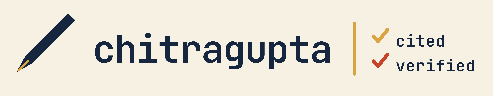

---
hide:
  - navigation
  - toc
---

Here are the writing samples generated by [Chitragupta](https://prasad.talasila.in/chitragupta).

## Tutorials

1. [Digital Twins for Software Engineers](tutorials/digital-twins-for-software-engineers.md)

## Book Chapters

1. [Digital Twins: An Introduction to Beginners](book-chapters/introduction/article.md)
1. [Data for Digital Twins: Protocols, Processing, Storage and Integration](book-chapters/data/article.md)
1. [Modelling Techniques for Digital Twins: One Plant Pot, Twelve Ways to Model It](book-chapters/modelling.md)
1. [Building, Deploying and Operating a Digital Twin: A Software Engineering Approach](book-chapters/software-engineering.md)

## Thesis Chapters

1. [Digital Twins in Ecosystem](thesis-chapters/digital-twins-ecosystem.md)

## Surveys

1. [Digital Twin Applications](surveys/digital-twin-applications.md)
1. [Digital Twin Architectures](surveys/digital-twin-architectures.md)

## Deep Research

1. [Digital Twin Platforms](deep-research/digital-twin-platforms.md)
