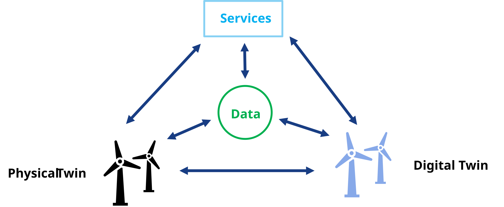

# Digital Twins: A Beginner's Tutorial

**Disclaimer:** This tutorial was generated using an LLM, with fact-checking
done by Prasad Talasila, who works in this research area.
Despite some potential for hallucination, the ideas communicated in
this tutorial are intended to be accurate. Please send corrections and suggestions to
<prasad.talasila@gmail.com>

> **Summary.** A digital twin links a physical system to a virtual model
> through a continuous, two-way flow of data.
> This tutorial defines the idea and its many types, surveys the data,
> models, algorithms, and architectures that build one, explains the
> standards that let twins interoperate, works
> through four case studies spanning wind turbines, bridges, and aircraft,
> and closes with the technical, security, and workforce challenges left
> unresolved.

## Outline

- [Digital Twins: A Beginner's Tutorial](#digital-twins-a-beginners-tutorial)
  - [Outline](#outline)
  - [1. Motivation](#1-motivation)
  - [2. What Is a Digital Twin, Really?](#2-what-is-a-digital-twin-really)
    - [2.1 Types and Maturity of Digital Twins](#21-types-and-maturity-of-digital-twins)
    - [2.2 Why Build One? Uses and Benefits](#22-why-build-one-uses-and-benefits)
  - [3. The Building Blocks: Data, Model, and Algorithms](#3-the-building-blocks-data-model-and-algorithms)
    - [3.1 Data](#31-data)
    - [3.2 Models](#32-models)
    - [3.3 Algorithms](#33-algorithms)
    - [3.4 Combining Models: Co-Simulation and Hybrid Systems](#34-combining-models-co-simulation-and-hybrid-systems)
    - [3.5 Architecture: Putting the Blocks Together](#35-architecture-putting-the-blocks-together)
  - [4. Why Standards Matter: Industry 4.0, AAS, and Friends](#4-why-standards-matter-industry-40-aas-and-friends)
  - [5. Case Studies](#5-case-studies)
    - [5.1 A floating offshore wind turbine](#51-a-floating-offshore-wind-turbine)
    - [5.2 A high-speed railway bridge](#52-a-high-speed-railway-bridge)
    - [5.3 A statistically monitored railway bridge](#53-a-statistically-monitored-railway-bridge)
    - [5.4 A self-aware unmanned aircraft wing](#54-a-self-aware-unmanned-aircraft-wing)
  - [6. Challenges and Open Issues](#6-challenges-and-open-issues)
  - [References](#references)

## 1. Motivation

Picture a wind turbine floating far out at sea. You can't just walk up and
peer inside it every time something feels off -- a maintenance visit means
a boat, a crew, and a very expensive afternoon. So the National Renewable
Energy Laboratory and Stiesdal Offshore built something cleverer instead:
a live computer model wired to the real turbine's sensors, checked
against a full-scale prototype, that estimates loads and stresses the
physical sensors alone can't see [@branlard_digital_2024]. That's a
*digital twin* -- and once you notice the pattern, you start seeing it
everywhere. At the University of Oslo, the BedreFlyt project runs a
digital twin of a hospital ward to simulate patient flow, so planners can
spot a bed shortage days before it happens instead of scrambling on the
day [@sieve_bedreflyt_2025]. In Extremadura, Spain, engineers built one
for a high-speed railway bridge, updating it live during load tests so
raw sensor readings turn into a structural model that corrects itself as
the data comes in [@chacon_digital_2024]. Different industries, same
trick: take a physical thing, give it a virtual counterpart wired to live
data, and let the two talk to each other. Sections 3 and 5 come back to
the wind turbine and the bridge in much more detail, once you have the
vocabulary to talk about what's actually inside them.

## 2. What Is a Digital Twin, Really?

Here's a tempting but wrong definition: "a digital twin is a 3D model of
something real." A 3D model is just a passive abstraction -- it doesn't know or care
what the real object is doing right now. Here's a definition closer to
the truth, from the paper that coined the term: a digital twin is a
virtual object connected to its physical counterpart by a continuous flow
of data in *both* directions -- sensor readings flow in from the physical
side, and decisions computed on the virtual side flow back out to
actually change something in the real world [@grieves_digital_2017].

That two-way flow is the whole trick, and there's a quick way to test for
it: if data only flows one way -- physical object to model, full stop --
what you have is merely a *digital shadow*. Only when the loop closes,
and the model's output changes the physical object's behavior
automatically, do you get a real digital twin [@kritzinger_digital_2018].
In practice, many papers use "digital twin" more broadly for human-in-the-loop
or advisory systems; this tutorial keeps the stricter definition for clarity,
while treating shadow-to-twin systems as a maturity continuum.

"Digital twin" is not the only name this idea goes by, and the name
arrived well after the idea. Grieves sketched the concept in a 2002
University of Michigan presentation, then taught it in that university's
first product lifecycle management courses in early 2003 -- under a
different name, the *Mirrored Spaces Model*. The term "digital twin" was
attached to it only years later [@grieves_digital_2017]. Meanwhile
industries that needed something like it built it under names of their
own: a *computational megamodel*, a *device shadow*, a *mirrored system*,
an *avatar*, or a *synchronized virtual prototype*. Several of the
earliest systems matching the pattern predate the term entirely. Logs of
patient health history, online operation monitoring of process plants,
traffic and logistics management, weather forecasting driven by dynamic
data assimilation, remote monitoring of satellites, and real-time
detection of leaks in oil and water pipelines all qualify in hindsight,
though none of their builders would have used the word
[@rasheed_digital_2020].

The lesson for a beginner is to hold the word loosely. What matters is
the *pattern* -- physical asset, virtual model, closed two-way loop. That
pattern recurs under many names, across many industries and decades.

Two examples make the loop concrete. One incubator case study, built
specifically to teach this idea, walks through a controller model that
reads a real incubator's live temperature sensor, computes a new heater
setting, and pushes that setting back to the real heater, no human in the
loop [@gomes_digital_2025]. The offshore wind turbine from Section 1
closes the same loop at industrial scale: sensor data streams in
continuously, and the twin's estimates feed back into the turbine's own
control system [@branlard_digital_2024]. Different scales, same
handshake.

It helps to see that two-way loop drawn as software instead of just
described in prose. On the physical side sits a *logical* physical twin:
the physical asset itself, plus whatever firmware already reads its
sensors and drives its actuators. Plenty of real assets have neither, in
which case an add-on firmware card -- an Arduino or Raspberry Pi board is
a common, cheap choice -- gets bolted on to bridge the gap. An *edge
device* sits between that logical physical twin and everything else,
carrying *sense* data one way and *control* commands back the other --
the same closed loop this section keeps insisting on, just drawn as boxes
and arrows instead of prose. The digital twin itself turns out to be
nothing exotic: ordinary software running on an ordinary operating system
on an ordinary computer, distinguished from any other program only by
that wire back to a real object. Whatever the twin computes gets handed
up to *services* sitting on top of it, and that's the layer a person, or
another piece of software, actually touches -- a structural-health alert,
a maintenance recommendation, a what-if simulation result
[@talasila_digital_2026].

### 2.1 Types and Maturity of Digital Twins

Kritzinger's twin/shadow/model split from above isn't the only way
researchers have sliced up the concept. Grieves and Vickers, who coined
the term, split digital twins by what they're *for*: a **predictive
digital twin** forecasts how the physical asset will behave next, while
an **interrogative digital twin** is simply queried for the asset's
current status, no forecasting involved. A separate, complementary split
looks at *what part of the lifecycle* the twin focuses on: a **product
digital twin** prototypes and validates a design before it's built; a
**production digital twin** validates the manufacturing process itself,
ahead of and during actual production; and a **performance digital twin**
tracks the finished product and process together during operation,
feeding what it learns back into the next design cycle
[@iliuta_digital_2024].

Scale is a third axis, and it's the same one Section 3.5 comes back to
when discussing digital twin architecture: a **unit-level** twin models a
single component; a **system-level** twin is a collaboration of several
unit-level twins representing one larger machine; and a
**system-of-systems** twin connects multiple system-level twins together,
spanning the asset's entire life cycle [@iliuta_digital_2024]. The wind
turbine from Section 1 is a system-level twin built from unit-level
pieces (the tower, the rotor); a whole wind farm's digital twin,
coordinating many turbines together, would be the system-of-systems level
above it.

None of this happens at once. Several proposed maturity ladders describe
how a digital twin typically grows more capable over time. One ladder
tracks *how much of the twin exists and how it behaves*: a **partial
digital twin** starts with just a few tracked parameters (say, temperature
and pressure) used to prove out basic connectivity; a **digital twin
clone** adds a fuller, data-backed replica of the product; an **augmented
digital twin** starts correlating current data against historical data to
draw conclusions the clone alone couldn't. A
second, independent ladder tracks *how autonomous the twin is*: a
**pre-digital twin** exists before the physical asset does, informing
early design decisions; a plain **digital twin** exchanges data with the
built asset in both directions; an **adaptive digital twin** starts
learning operator preferences and makes real-time decisions using
supervised machine learning; and an **intelligent digital twin** goes
further still, using unsupervised learning to raise its own accuracy and
autonomy without being told what to look for [@iliuta_digital_2024]. A
beginner building a first digital twin project is almost always building
a partial, pre-digital-twin-stage system -- and that's fine; nobody starts
at "intelligent."

### 2.2 Why Build One? Uses and Benefits

Why go to the trouble? The AIAA and the Aerospace Industries Association's
joint position paper on digital twins puts it plainly: the value of a
digital twin comes from moving work out of the expensive, slow physical
world and into a cheap, fast virtual one, then feeding the results back to
actually change what happens physically. That value shows up differently
depending on what stage of a product's life the twin is watching. A
digital twin can shadow a product through its entire life cycle: the "as
designed" phase, where a virtual prototype is analyzed and refined before
a single physical part is cut; the "as built" phase, where a twin of the
actual manufacturing process helps catch defects and optimize throughput;
and the "as used" and "as maintained" phases, where a twin of the
operating asset tracks wear, predicts failures, and extends service life.
Whatever question the twin is being asked to answer, its output usually
falls into one of four buckets: *descriptive* (what is happening right
now), *diagnostic* (why did it happen), *predictive* (what will happen
next), or *prescriptive* (what should be done about it)
[@noauthor_digital_nodate-1].

Concrete applications range far wider than the wind-turbine-and-bridge
examples in Section 1 might suggest. On the aerospace side, a digital twin
of a single material coupon can combine physics models, physical
experiments, and machine learning to characterize how a material behaves
under uncertainty, while a digital twin of a flight-test vehicle --
including the individual test pilot's characteristics -- can be used to
plan test flights that extract the most engineering knowledge per flight
hour [@noauthor_digital_nodate-1].

A survey of digital twins across many fields shows the same pattern
spreading much further. In medicine, an *organ-on-a-chip* studies how
different drugs affect human tissue, substituting a digital twin for the
human test subject to obtain the same information; combining several such
chips yields a *body-on-a-chip* overview of the whole organism. Neural
networks trained on electrocardiogram (ECG) data can classify heart
rhythms and diagnose circulatory pathologies -- the same
machine-learning family from Section 3.2. Emotion-recognition twins built
from webcam images have been proposed to detect stress and depression
early, so medication can be given in advance of a crisis. In automotive
manufacturing, a digital twin of a bodywork production line can check
whether production can proceed according to plan, test the line's
adaptability to abnormal scenarios, and evaluate proposed changes to
product ordering. At city scale, a smart-city twin integrates Building
Information Modeling (BIM) with Geographic Information System (GIS) data:
GIS supplies the city's geospatial context, BIM the detailed engineering
models, and the pair together supports sustainable urban design
[@iliuta_digital_2024].

BIM appears twice in this tutorial for unrelated reasons: once as the IFC
format carrying a single bridge's geometry (Section 5.2), and once as half
of an entire city's digital twin. That overlap is worth noting. "Standards
for digital twins" (Section 4) and "standards a digital twin project
inherits from its own industry" are not separate categories in practice.

Zoom out from individual examples and a survey of industrial IoT digital
twins reports the same handful of use cases recurring across almost every
deployment it studied: smart manufacturing, product design, supply-chain
management, predictive maintenance, and remote diagnosis
[@xu_survey_2023]. None of those five is exotic on its own, and that's
rather the point -- most real digital twin projects aren't chasing a novel
application so much as applying the same physical-asset-plus-virtual-model
pattern to whichever of these ordinary, recurring business problems is
costing the most money to solve the old way.

That breadth is itself the point. A digital twin isn't a single
off-the-shelf product; it's a pattern -- physical asset, virtual model,
two-way data flow -- that keeps turning out to be useful nearly everywhere
someone is willing to invest in building the virtual half.

## 3. The Building Blocks: Data, Model, and Algorithms

Zoom in on that loop from Section 2 and you'll find it isn't one thing --
it's three things, stitched together. Every digital twin worth the name
needs to move *data*, run it through a *model*, and let some *algorithm*
decide what to do with the result. That same three-part shape holds
together whether you're twinning a wind turbine or a hospital ward. The
rest of this section takes each piece in turn.

The picture is deliberately spare: a physical twin feeds a digital twin,
and the digital twin in turn *uses* data, a model, and algorithms, all of
which get *evaluated* against a shared environment rather than in a
vacuum. That word "uses" is doing real work. A platform paper describing
how digital twins get built out of reusable pieces makes the same point
more formally: only an algorithm (that paper splits it into a *function*
asset and a *tool* asset) is allowed to use a model or a piece of data --
data and models never invoke each other directly -- and a specific
combination of the three is what turns a pile of reusable assets into one
concrete digital twin rather than another [@talasila_composable_2025].
This tutorial folds that paper's separate *function* and *tool* categories
into the single label *algorithms*, introduced properly in Section 3.3,
purely to keep the vocabulary from multiplying past what a beginner needs
to track.

### 3.1 Data

Data is the raw material: the temperature readings, vibration spectra,
and bed-occupancy counts flowing in from the physical side. But "data" is
not one thing, and the shape it takes changes what you can do with it.
Some of it is *structured* -- a clean row of numbers with a known
meaning, like a rotor-speed reading tagged with a timestamp. Some of it
is *semi-structured or unstructured* -- a maintenance technician's
free-text note, a photo of a cracked weld, a video clip from an
inspection drone -- and needs real interpretation before any model can
use it at all. There's also a split in how the data arrives: some
pipelines process it in *batches*, collecting a large chunk and crunching
through it all at once, while others are built for *time-series* or
*streaming* data, where new readings show up continuously and have to be
handled a little at a time, in something close to real time
[@xu_survey_2023].

That streaming data has to get from the physical sensor to wherever the
twin actually lives, and that's a communication problem, not just a data
problem -- which is where the digital twin world runs straight into the
wider Internet of Things (IoT) ecosystem. Two surveys already sitting in
this project's bibliography map that overlap in useful detail. One traces
how digital twins for the Industrial Internet of Things lean on
open-source streaming tools such as Apache Kafka and Apache Spark to move
batch and time-series data around once it arrives [@xu_survey_2023]. The
other catalogs the communication protocols that actually carry the bytes
before that: MQTT and CoAP for lightweight publish/subscribe messaging
between small, low-power devices, HTTP and HTTPS where a heavier
request/response exchange is acceptable, and LoRaWAN where the sensor is
far away and battery life matters more than bandwidth
[@hakiri_comprehensive_2024]. None of these protocols is "the" protocol
for digital twins; picking one is mostly a question of how much power,
bandwidth, and latency the physical side of the twin can spare, and real
deployments often mix several -- MQTT from a nearby gauge, LoRaWAN from a
remote one, all landing in the same streaming pipeline.

Whichever protocol gets the bytes there, raw sensor data is almost never
usable straight off the wire. A temperature sensor might report in
Fahrenheit when the model expects Celsius; a vibration sensor might spit
out noisy readings that need filtering before anything downstream can
trust them; a firehose of per-second measurements might need batching
into slightly larger chunks before a model can digest them efficiently.
None of that cleanup logic is specific to any one digital twin; a
unit-conversion routine works the same whether it cleans turbine data or
hospital data. So these small, unglamorous routines tend to get written
once and reused across many twins, usually through off-the-shelf tool
chains built for exactly this kind of heavy lifting rather than
hand-rolled per project [@talasila_realising_2024].
It's easy to skip past this step when you're first learning about digital
twins, since "data cleanup" sounds far less interesting than "physics
simulation" -- but a beautifully built model fed garbage data will
confidently produce garbage output, so in practice this unglamorous layer
is where a lot of a real digital twin project's engineering time actually
goes.

Once data is flowing, it typically passes through a layered software
stack rather than going straight from sensor to model. One widely used
framework for industrial IoT platforms splits the stack into four layers:
a *data layer* that represents the different sources and enterprise
systems feeding the twin; an *integration layer* that dispatches
well-formed information to the rest of the stack; a *service layer* that
chains services together and manages the twins themselves; and a
*business layer* that connects the whole pipeline to the actual business
logic driving decisions [@minerva_digital_2020]. Two further data problems
are easy to overlook until they bite. The first is *data fusion*: merging
readings from sensors that measure overlapping or complementary things
into one consistent picture rather than several disagreeing ones. The
second is *data security*. A twin that faithfully mirrors a physical asset
also faithfully mirrors an attack surface, and tampering with the data
feeding a twin -- or with the twin's stored history -- corrupts every
decision made downstream of it [@wu_comprehensive_2023].

Not all of a twin's data comes from the same place, either. It's useful
to separate *static modeling data* (the asset's fixed design parameters),
*dynamic interaction data* (live sensor readings that change moment to
moment), and *service knowledge data* (accumulated know-how about how to
interpret the first two) [@wu_comprehensive_2023]. Sensors themselves can
also fail or go missing, and a surprisingly common fix borrows the
digital twin idea recursively: train a machine-learning model to act as a
*virtual sensor*, estimating what a broken or absent physical sensor would
have reported, using the other, still-working sensors and the twin's own
model as context [@wu_comprehensive_2023]. Taken far enough, the same
trick -- a digital twin of the sensing device itself, compensating for
gaps in the very data the main digital twin depends on -- shows up as its
own small, nested digital twin problem sitting inside the larger one.

### 3.2 Models

The model is where the twin actually knows something about the physical
world. There isn't just one kind, though, and the literature on
digital twins tends to sort them into a small number of recurring families.

**Physics-based models** start from known physical laws -- structural
mechanics, fluid dynamics, the equations describing how a solid bends or
a fluid flows -- and simulate them directly. A finite element model of a
beam bending under load, or a computational-fluid-dynamics model of
airflow around a wing, are typical examples. The trade-off is always
fidelity against computational cost. A model detailed enough to capture
every bolt and weld is far too expensive to run in real time. Practical
digital twins therefore use a deliberately lower-fidelity physics-based
model, accepting a small, quantified loss of accuracy in exchange for one
that keeps up with live sensor data [@thelen_comprehensive_2022].

**Statistical models** take a different approach: instead of encoding
physical laws, they fit a mathematical structure -- an autoregressive
model, a stochastic process -- directly to measured data, without
necessarily explaining *why* the system behaves that way. They show up
twice in digital twins: identifying a dynamic system's behavior from
sensor measurements (a task called system identification), and modeling
how a physical asset degrades over time to support predictive
maintenance. In both cases the appeal is the same: statistical models
tend to need far less computation than a detailed physics-based
simulation, at the cost of not really explaining *why* the numbers come
out the way they do [@thelen_comprehensive_2022].

**Machine-learning (data-driven) models** go a step further and let a
general-purpose learning algorithm find the pattern in the data itself,
with no assumption about its mathematical form at all. These range from
comparatively simple methods, like random forests and Gaussian process
regression, to deep neural networks -- convolutional networks, LSTMs --
trained on large amounts of sensor data. They earn their keep precisely
where physics-based modeling struggles: when the underlying physics is
poorly understood, or well understood but too expensive to simulate at
the speed a digital twin needs. The price is data -- a machine-learning
model is only as good as the examples it was trained on, and it can fail
badly on situations that look nothing like anything it has seen before
[@thelen_comprehensive_2022].

**Hybrid models** try to get the best of both worlds by combining a
physics-based model with a data-driven one. One common approach trains a
neural network with a loss function that penalizes any prediction
violating a known physical law; another runs a physics-based simulation
purely to generate extra training examples for a machine-learning model
that would otherwise not have enough real data. The result generalizes
better than pure machine learning while staying far cheaper to run than a
full physics-based simulation -- essentially borrowing the physics
model's ability to stay sensible outside the training data, and the
data-driven model's ability to run fast [@thelen_comprehensive_2022].

| Model type | What it's built from | Typical use in a digital twin |
|---|---|---|
| Physics-based | Known physical laws (structural, thermal, fluid equations) | Simulating a system's behavior directly from first principles [@thelen_comprehensive_2022] |
| Statistical | A mathematical structure fitted to measured data | Identifying dynamic system behavior; modeling long-term degradation [@thelen_comprehensive_2022] |
| Machine-learning | A general-purpose learning algorithm trained on data | Capturing patterns too complex, or too expensive, to simulate from physics alone [@thelen_comprehensive_2022] |
| Hybrid | A physics-based model combined with a data-driven one | Improving generalization over pure ML while staying cheaper than full physics-based simulation [@thelen_comprehensive_2022] |

Choosing among these four families is itself a design decision, not
something forced by the physics alone: A digital twin can be modeled
with first-principles heat-transfer equations,
with a data-driven regression fit to logged temperatures, or with a
hybrid of both, and picking one over another trades off precision,
development cost, and how well the result generalizes to conditions the
model has never seen [@abbiati_modelling_2024]. Whichever family is
chosen, a model built once and never touched again will slowly drift from
the real asset it's supposed to represent -- through wear, repairs, or
simply conditions the original model never anticipated -- so a production
digital twin needs a plan for *updating* its model over time. That may
mean periodically retraining a machine-learning model on fresh data, or
using one of the state-estimation methods in Section 3.3 to nudge a
physics-based model's internal state back toward what the sensors report
[@wu_comprehensive_2023].

### 3.3 Algorithms

A model by itself doesn't *do* anything; it just sits there providing
simplified abstraction of a physical system. Something has to actually
run the numbers, and that something is what the literature -- depending
on which paper you're reading -- calls an *algorithm*, a *tool*, or
a *method*. All three names
point at the same idea: a software implementation of a domain-specific
procedure that takes a model and some data and evaluates it
[@talasila_realising_2024]. Each model type from Section 3.2 tends to
come with its own family of algorithms built specifically to evaluate it.

For a **physics-based model**, the workhorse algorithm is a numerical
solver: finite element analysis (FEA) for structural stress and strain,
or computational fluid dynamics (CFD) for thermal and airflow problems,
each breaking the object into a mesh and solving the governing equations
at every point in it. The finer the mesh, the more accurate the result --
and the longer the solver takes to run, which is the same fidelity/cost
trade-off from Section 3.2 showing up again, now as a runtime cost
instead of a modeling choice [@thelen_comprehensive_2022].

For a **statistical model**, a common algorithm family is *system
identification* -- methods like the nonlinear autoregressive exogenous
(NARX) model or stochastic subspace identification (SSI), which fit a
mathematical structure to sequences of sensor measurements. A closely
related algorithm, the *Kalman filter*, estimates a system's current
internal state from noisy measurements by continuously blending a
model's prediction with each new sensor reading as it arrives -- neither
trusting the model blindly nor the noisy sensor blindly, but combining
the two in proportion to how much each is trusted at that moment
[@thelen_comprehensive_2022].

For a **machine-learning model**, the algorithm is a training procedure
-- backpropagation for a neural network, or a kernel-fitting procedure
for Gaussian process regression -- that adjusts the model's internal
parameters until its predictions match a set of training examples
closely enough. In many deployments, the model is initially trained
offline before the twin goes live; what runs inside the twin in real time
is usually the already-trained model doing fast inference, not the full
training procedure itself. In long-lived systems, retraining can still
happen periodically or continuously as new data accumulates
[@thelen_comprehensive_2022; @wu_comprehensive_2023].

For a **hybrid model**, the algorithm has to coordinate both halves at
once: a physics-informed loss function trains a neural network while
penalizing any prediction that violates a known physical law, or a
delta-learning procedure trains a machine-learning model specifically to
learn the discrepancy left over by a simplified physics-based model. Both
are ways of dividing the same labor: let the physics-based half handle
what's already well understood, and let the data-driven half absorb
whatever the physics-based model gets wrong [@thelen_comprehensive_2022].

Not every machine-learning algorithm trades away interpretability for
accuracy, either. **Optimal classification trees** are a good example: a
more recent, exact optimization approach to building decision trees,
has been used to predict damage to aircraft blades [@kapteyn_toward_2020].
That combination -- competitive accuracy without giving up the ability
to explain *why* the algorithm decided what it decided -- matters more
in a digital twin context than in most machine-learning applications,
since a twin's output often feeds directly into a real-world
safety decision, and Section 5.4 shows exactly that algorithm at work.

Put the three pieces together and you get the whole loop from Section 2
back again: data flows in, an algorithm evaluates it against a model, and
the result flows back out to the physical twin. Change any one piece --
swap in a better model, plug in a faster algorithm, or feed it richer
data -- and the twin improves without touching the other two pieces at
all. That's the entire point of treating data, models, and algorithms as
separate, swappable building blocks instead of one big tangled program --
and Section 5 will show exactly which blocks the wind turbine and the
railway bridge from Section 1 actually used.

### 3.4 Combining Models: Co-Simulation and Hybrid Systems

Section 3.2's four model families are rarely used in isolation on
anything beyond a toy example. A real asset usually needs several models
built by different specialists, in different formalisms, for different
sub-systems -- a finite element model of a beam from a structural
engineer, a statechart describing a controller's logic from a software
engineer -- and at some point those separately built models have to be
coupled together into one working digital twin [@abbiati_modelling_2024].

**Co-simulation** is the most common way to do that coupling without
forcing everyone onto the same tool. Instead of rewriting every sub-model
in one shared modeling language, each sub-model keeps its own internal
implementation private and exposes only a small, standardized interface --
typically three functions: one to read a variable's current value, one to
set it, and one to advance the simulation by a short time step
[@abbiati_modelling_2024]. The most widely adopted standard for this
interface is the *Functional Mock-up Interface* (FMI), maintained by the
Modelica Association and supported by more than 140 modeling and
simulation tools, including Simulink, Dymola, OpenModelica, and 20-sim; a
model packaged to this standard is called a *Functional Mock-up Unit*
(FMU) [@abbiati_modelling_2024].
Co-simulation lets a structural engineer's finite-element model and a
controls engineer's statechart be combined into one digital twin without
either engineer needing to learn the other's tool, or disclose the
proprietary internals of their own.

Not every combination problem is solved by wrapping separate tools,
though. Some systems are inherently **hybrid**: they mix genuinely
continuous behavior (a temperature drifting smoothly) with genuinely
discrete behavior (a thermostat switching a heater on or off) within a
*single* sub-system, not across two separately built ones.

The incubator mentioned in Section 2 is a case in point, and it is worth
describing concretely, since one modelling text uses it as a running
example throughout. The device is a Styrofoam box fitted with an electric
heater, a fan, and two temperature sensors, holding its contents at a
controlled temperature anywhere between 20 and 60 °C. Its controller reads
those temperature measurements and decides whether to switch the heater
on or off; the heater in turn injects thermal power into the air enclosed
by the box, raising its temperature [@abbiati_modelling_2024].

Heat transfer inside the box is continuous physics, while the controller
deciding when to switch the heater is a discrete state machine. Neither
description alone is enough. A **hybrid automaton** captures both at once:
the system moves
between a small number of discrete *modes* (heater on, heater off), and
within each mode its continuous state evolves according to a set of
differential equations that apply only in that mode; crossing a threshold
triggers a discrete transition to a different mode with different
equations [@abbiati_modelling_2024]. Co-simulation coordinates separate
models across a shared interface. A hybrid automaton, by contrast,
describes one system that has both kinds of behavior built in. Which
formalism fits depends on whether a system's continuous and discrete parts
were built by different people using different tools, or were always one
integrated whole.

### 3.5 Architecture: Putting the Blocks Together

Data, models, and algorithms are the ingredients; *architecture* is the
recipe for how they're arranged into a working system, and -- much like
the standards in Section 4 -- different research groups have converged on
genuinely different answers.

One influential proposal extends Grieves' original three-part sketch (a
physical entity, a virtual entity, and a connection between them) into a
**five-dimension model**: physical entity, virtual entity, connection,
*digital twin data* (the twin's own accumulated data, distinct from live
sensor readings), and *services* (the functions -- simulation,
prediction, decision support -- that the twin exposes to the humans and
software around it) [@tao_five-dimension_2019-1].

A second proposal, aimed specifically at industrial IoT deployments,
arranges a twin into three layers instead of five: a **virtual asset
layer** holding the data, models, and virtual entities that make up the
twin's fundamental components; a **real-time "3C" layer** (computation,
communication, and control) that actually runs the twin's processes in
sync with the physical system; and a **visualization and
human-machine-interface layer** on top, for the people who need to assess
and interact with the twin [@xu_survey_2023]. Where Tao's five-dimension
model is organized around what a twin *contains*, this layering model is
organized around what a twin *does* at runtime -- collect, compute,
communicate, and display -- and the same physical asset could reasonably
be described with either vocabulary.

A third view, closer to Section 3.1's IoT platform stack, comes from
manufacturing practice rather than an abstract reference model: data
layer, integration layer, service layer, and business layer, stacked in
that order so raw sensor data at the bottom is progressively refined into
the business decisions at the top [@minerva_digital_2020]. None of these
three architectures is simply "correct" while the others are wrong --
they're different lenses on the same underlying idea, chosen depending on
whether the person drawing the diagram cares more about a twin's internal
structure, its runtime behavior, or its place in a factory's existing IT
stack. ISO 23247's own functional architecture is a fourth
lens again, this time organized around which named responsibilities
(collecting data, controlling the asset, keeping things secure) a
compliant implementation must cover -- a reminder that "architecture," in
the digital twin literature, usually means "the thing this particular
paper's authors found most useful to draw a box around," not a single
settled blueprint [@iso23247_2021].

Drawn out, that functional architecture looks like a pipeline running left
to right. On the physical side, entities are organized hierarchically --
*part*, *component*, *subsystem*, *system*, and *system of systems* -- and
adapters and brokers carry their sensor data through a data-ingestion-and-
processing stage into a set of *digital twin assets*: the same data,
model, algorithm, and service building blocks introduced earlier in this
section, just relabeled in ISO's own vocabulary. From there, user and API
interfaces expose decision-support services -- prediction, monitoring,
what-if analysis -- while a separate DT-management layer handles the
unglamorous work of creating, configuring, and executing twins, and a
visualization layer and *fleet support* sit alongside it, acknowledging
that a real deployment rarely means just one twin, but many twins
built for large numbers of the same physical-twin type.

## 4. Why Standards Matter: Industry 4.0, AAS, and Friends

Here's a problem you'll hit the moment two digital twins, built by two
different companies, need to talk to each other: whose data format wins?
A handful of standards have grown up specifically to answer that
question, and each one implies a different underlying architecture for
how a twin actually gets built and hosted -- which turns out to matter
just as much as what the standard formally specifies on paper.

Before comparing standards head to head, it's worth having one more
reference picture in hand, since several of the standards below turn out
to be different ways of naming and grouping the same five ingredients.
Extending Grieves' original three-part sketch from Section 2, a widely
cited five-dimension model breaks a digital twin into physical entity,
virtual entity, services, data, and connection, and gives each one a
distinct job: (1) digital twin data stems from the physical entity, from
services, from domain-expert knowledge, or from some combination of the
three; (2) physical entities exist within the physical world and serve as
the underlying basis for the twin; (3) virtual models replicate those
physical entities, including their physical properties and behaviors; (4)
services provided by the twin offer the added-value functions a user
actually asked for -- simulation, verification, monitoring, optimization,
diagnosis, prediction; and (5) connections tie the other four components
together so they can collaborate rather than sit side by side
[@tao_five-dimension_2019-1]. Keep this five-way split in mind while
reading the rest of this section: AAS's submodels, ISO 23247's functional
entities, and DTDL's telemetry/property/command split are all, in their
own vocabulary, ways of carving up these same five dimensions.

Germany's Plattform Industrie 4.0 defines the *Asset Administration
Shell* (AAS), a standardized digital "wrapper" that describes any
physical asset -- a machine, a sensor, a whole product line -- in a way
any AAS-aware software can read [@noauthor_asset_nodate]. It isn't a
single-organization effort, either: the Industrial Digital Twin Alliance,
a separate industry consortium, specifies AAS jointly alongside Plattform
Industrie 4.0, which is part of why the standard has drawn adoption from
multiple vendors rather than staying tied to one company's product
[@ferko_standardisation_2023]. The architecture
the AAS implies is decentralized and self-describing: every asset carries
its own AAS instance, assembled from independent, swappable "submodels,"
so different tools can query the same asset the same way without a
central server coordinating them. That decentralization is deliberate:
Plattform Industrie 4.0 was designed for factories where thousands of
assets from many different vendors need to interoperate without any one
vendor's cloud service becoming a single point of failure for the whole
plant. The AAS itself is just a paper specification, though; somebody
still has to write the software that reads and writes it. 
Eclipse BaSyX is exactly that: an open-source
*implementation* of the AAS standard, providing a registry, a client
library, and visualization tools already built, so engineers don't have
to write that plumbing themselves [@jacoby_open-source_2023]. BaSyX
doesn't standardize anything new on its own -- it just makes the AAS
architecture above something you can actually run.

The manufacturing world also has its own international standard,
developed independently of AAS: ISO 23247, introduced in 2021, defines "a
digital twin in manufacturing as a fit for purpose digital representation
of an observable manufacturing element with synchronisation between the
element and its digital representation" that spans the element's entire
product life cycle [@ferko_standardisation_2023]. The standard calls
whatever physical thing is being twinned an *Observable Manufacturing
Element* (OME) -- a product, a process, or a piece of equipment. It then
organizes a compliant implementation around four entities. A **Device
Communication** entity collects data from the OME and sends it control
commands. A **Digital Twin** entity models that data and provides
realization, management, and simulation services. A **User** entity hosts
whatever application consumes the twin. Finally, a **Cross-System** entity
spans the other three, supplying what all of them need -- chiefly security
and data translation -- rather than leaving any one of them to own it.

Rather than describing one asset at a time the way AAS does, ISO 23247
implies a *functional* architecture layered on top of those four
entities: it names around twenty specific functional entities (FEs) a
compliant implementation should realize, or something equivalent -- things
like data collecting, data pre-processing, controlling, actuation,
simulation, analytic service, reporting, security support, and
plug-and-play support for dynamically connecting a new OME
[@ferko_standardisation_2023]. A real implementation is judged by how
many of these it actually covers, and in practice most published
architectures only implement a handful.
A standard can specify exactly what a compliant architecture
ought to include, and real-world implementations can still quietly skip
the harder, less immediately rewarding parts.

Some experts point at AAS from earlier in this section as a plausible
fix for one of ISO 23247's specific gaps: standardizing the Peer Interface
functional entity that lets one digital twin talk to another, something
pivotal for scaling digital twins across a
whole flexible production system rather than one machine at a time
[@ferko_standardisation_2023]. That's worth noticing on its own terms: AAS
and ISO 23247 were developed independently, aimed at different problems,
yet practitioners on the ground are already reaching for one to patch a
hole in the other -- standards meant to solve narrow, separate problems
end up needing to interoperate with each other just as much as the
digital twins built on top of them do.

Where AAS and ISO 23247 both describe an asset or a factory, Eclipse
Ditto takes the cloud-hosted-service angle instead. It's an open-source
platform, designed to run in the cloud, that manages a fleet of digital
twins as addressable cloud objects reachable through APIs and SDKs
[@picone_wldt_2021]. The architecture it implies is centralized and
topic-based: every physical device is mirrored by a twin object living
in the cloud, and the two stay in sync by exchanging messages over four
kinds of topics -- telemetry, events, commands, and command responses --
rather than the asset itself hosting any local logic [@picone_wldt_2021].
That's a meaningfully different shape from AAS's decentralized,
asset-carries-its-own-shell model: Ditto centralizes the twin in the
cloud, while AAS is designed so an asset's shell can travel with the
asset itself. The trade-off mirrors the one between statistical and
physics-based models from Section 3.2: a centralized, cloud-hosted twin
is usually simpler to build and operate, at the cost of depending on a
network connection back to that cloud service being available whenever
the physical device needs to be checked or controlled.

Microsoft's cloud platform takes a related but distinct approach with the
*Digital Twins Definition Language* (DTDL). A DTDL twin is described as
an **Interface** -- a reusable unit that can declare Telemetry (data a
device emits), Properties (values that can be read or written), Commands
(functions that can be invoked), Components (sub-parts of the twin), and
Relationships that link one twin to another [@cavalieri_proposal_2023].
That last piece, Relationship, is what makes DTDL's implied architecture
distinctive: because any twin can declare a relationship to any other,
DTDL naturally produces a **graph of twins** rather than a single
isolated shell -- exactly the shape you'd want for modeling, say, a
building full of connected rooms and equipment, where "which room
contains which sensor" is itself important information. Microsoft's own
Azure Digital Twins service is built directly on top of DTDL, which is
part of why a graph-shaped standard designed for one cloud platform tends
to stay closely tied to that platform, unlike AAS, which several
different vendors implement independently.

| Standard | What it standardizes | Implied architecture | Behind it |
|---|---|---|---|
| AAS (Asset Administration Shell) | A uniform digital "wrapper" describing any physical asset [@noauthor_asset_nodate] | Decentralized: each asset carries its own self-describing shell, built from swappable submodels | Plattform Industrie 4.0 |
| Eclipse BaSyX | Nothing new -- an open-source *implementation* of the AAS standard above [@jacoby_open-source_2023] | (Same as AAS -- BaSyX just makes it runnable) | Eclipse Foundation |
| ISO 23247 | A reference architecture for digital twins in manufacturing [@ferko_standardisation_2023] | Functional: the twin is decomposed into named functional entities (data collection, maintenance, security, ...) | International Organization for Standardization |
| Eclipse Ditto | A cloud platform for managing device twins as addressable objects [@picone_wldt_2021] | Centralized, topic-based: a cloud-hosted twin object stays in sync with its device over telemetry/event/command topics | Eclipse Foundation |
| DTDL (Digital Twins Definition Language) | A metamodel for describing a twin's telemetry, properties, commands, and relationships [@cavalieri_proposal_2023] | Graph-based: twins declare relationships to other twins, forming a connected graph rather than an isolated shell | Microsoft |

Notice the pattern: none of these standards imply the same architecture,
because none of them are solving the same problem. AAS and ISO 23247 are
both concerned with describing physical assets -- one asset-by-asset, the
other factory-wide by function -- while Ditto and DTDL both assume a
cloud-hosted twin but disagree on what that twin's defining feature is:
its live message stream (Ditto) or its place in a graph of related twins
(DTDL). A real digital twin project usually ends up leaning on more than
one of these at once, the same way a web application leans on both HTTP
and a database format without anyone treating that as strange.

## 5. Case Studies

Section 1 introduced two real systems in passing -- the floating wind
turbine and the Extremadura railway bridge -- purely as motivation. Now
that Sections 3 and 4 have given you a vocabulary of data, models,
algorithms, and standards, it's worth going back to both and looking at
exactly which pieces they used, alongside two further case studies -- a
second, statistically built railway bridge, and a single unmanned
aircraft wing -- that show the same building blocks combined in very
different ways.

### 5.1 A floating offshore wind turbine

The digital twin behind the TetraSpar floating prototype has to solve a
genuinely hard problem: estimating fatigue loads on the turbine's tower
without being able to instrument every point along it directly
[@branlard_digital_2024]. Its *data* comes entirely from sensors that are
already standard on most wind turbines -- power output, blade pitch,
rotor speed, and tower-top acceleration -- plus motion sensors
(inclinometers and GPS) specific to a floating platform
[@branlard_digital_2024]. Its *model* is a linear structural model of the
tower, built two different ways within the same project: once from a
dedicated suite of Python tools written for this work, and once using the
built-in linearization feature of the OpenFAST wind-turbine simulation
software, with the final digital twin combining components of both
[@branlard_digital_2024]. Its *algorithm* is exactly the statistical
algorithm introduced in Section 3.3: a Kalman filter, which continuously
blends the structural model's prediction with each new sensor reading to
estimate the tower's internal state, paired with a separate aerodynamic
estimator and a physics-based virtual-sensing step that turns those state
estimates into actual loads along the tower [@branlard_digital_2024].
In simulation, where the true loads are known exactly because they were
generated by the same simulator, the digital twin's estimates came within
roughly 5-10% of the truth. Checked against real measurements from the
full-scale prototype instead, that error grew to roughly 10-15% -- a
reminder that a digital twin's accuracy on synthetic test data is always
an optimistic bound on how well it will do against the messier
real thing. Still a promising result overall, though the paper is candid
that turning these estimates into actual maintenance decisions is still
future work [@branlard_digital_2024].

The choice to build the tower model twice was deliberate, not redundant.
The dedicated Python toolset mirrored OpenFAST's own structural,
hydrodynamic, and mooring modules, which gave the team an independent way
to check that OpenFAST's built-in linearization produced a trustworthy
result. The two were combined only after the team confirmed the pathways
agreed with each other [@branlard_digital_2024]. That two-pathway habit is itself a
*composability* argument: rather than committing to one monolithic tower
model, the project treated the model as an assembly of swappable,
independently checkable pieces -- the same spirit behind the co-simulation
approach in Section 3.4, even though this project combines two
custom-built linearizations rather than two off-the-shelf FMI tools.

### 5.2 A high-speed railway bridge

The Extremadura bridge project starts from a more traditional
civil-engineering practice -- the *load test*, where a known load is
applied to a new or existing bridge and its response is measured -- and
turns it into a digital twin [@chacon_digital_2024]. Its *data* is
explicitly heterogeneous: sensor measurements taken during the load test,
geometric data capturing the bridge's as-built shape via the IFC
building-information-modeling standard, and simulation output, all
funneled into a shared "Common Data Environment" so every discipline on
the project works from the same information [@chacon_digital_2024]. Its
*model* is a finite element model of the bridge -- the same physics-based
model family introduced in Section 3.2 -- built during design and then
checked, and where necessary corrected, against what the load test
actually measured [@chacon_digital_2024].

The project does name its *algorithms*, and there are two, one per kind of
load test. For the static tests it uses **CONS**, a previously developed
numerical model for nonlinear, time-dependent analysis of
three-dimensional reinforced and prestressed concrete. CONS was wrapped in
parametric modeling software, so an engineer can vary the cross-section
geometry, the material constitutive models, and the prestressing loads and
watch the results update immediately. That responsive feedback loop is
what makes calibration practical: by matching the strains measured at each
sensor against the corresponding strains in a fibre-based model of the
cross section, it becomes feasible to calibrate the concrete's elastic
modulus by reverse engineering. Calibration matters here for a specific
physical reason. Concrete is heterogeneous and changes over time, so the
mechanical properties assumed at the design stage may simply not match the
ones of the finished bridge [@chacon_digital_2024].

For the dynamic tests, the acceleration data goes through **MOMAP**, the
Multiple Operational Modal Analysis Platform -- a Python signal-analysis
tool. It first cleans the signal with a high-pass filter, downsampling,
and noise reduction based on singular value decomposition, then extracts
the bridge's vibration frequencies, mode shapes, and damping. For that
last step MOMAP offers a menu of *operational modal analysis* methods,
among them an enhanced version of frequency-domain decomposition and
covariance-driven stochastic subspace identification. Operational modal
analysis earns its place for a practical reason: it needs only the
structure's measured response, not a controlled known load, so the data
can be gathered without interrupting the asset's regular operation
[@chacon_digital_2024]. That second method should look familiar --
stochastic subspace identification (SSI) is one of the
system-identification methods from Section 3.3, here doing real work on a
real bridge.

Unlike the wind turbine, this case study also
shows a *standard* from Section 4 in action, just not one of the
digital-twin-specific ones: IFC, a building-information-modeling
standard, is what lets the bridge's geometry travel between the different
tools used to design, test, and maintain it [@chacon_digital_2024]. That's
worth pausing on, because it's easy to assume "standards for digital
twins" means only the five entries in Section 4's table -- but any given
digital twin project typically also inherits a whole stack of
domain-specific standards from its own industry (IFC for construction,
in this case) underneath whichever digital-twin-specific standard, if
any, sits on top of it.

### 5.3 A statistically monitored railway bridge

Not every digital twin in this tutorial's case studies is built the way
Section 5.2's bridge was. A separate research group proposed and evaluated
a digital-twin framework for a different real bridge -- an integral
concrete portal-frame bridge on the Bothnia railway line near Hörnefors,
Sweden -- using almost entirely different building blocks from Section 3,
even though the physical asset (a railway bridge) is the same type of
thing [@torzoni_digital_2024].
Where the Extremadura bridge's twin (Section 5.2) is built around a
single finite element model, corrected against load-test measurements,
the Hörnefors twin is built around a **dynamic Bayesian network**: a
statistical model (Section 3.2) that represents the bridge's health as a
probability distribution over possible states, continually updated as
new sensor readings arrive, rather than as one fixed numerical answer
[@torzoni_digital_2024].

Its *data* comes from ten simulated displacement sensors recording the
bridge's response as trains cross it at speeds between 160 and 215 km/h,
sampled fast enough (400 Hz) to resolve the bridge's motion even at the
highest train speed, and deliberately corrupted with realistic sensor
noise to test the approach honestly rather than against a clean signal
[@torzoni_digital_2024]. Its *model* has two halves. The first is a finite
element model of the bridge with almost 17,300 degrees of freedom at full
resolution, reduced offline to a much cheaper approximation so it can
generate the huge number of training examples the approach needs. The
second is a deep-learning classifier that turns noisy real-time sensor
readings into a diagnosis of the bridge's structural health, expressed as
a probability spread across six possible damage locations plus a healthy
state [@torzoni_digital_2024]. Its *algorithm* is
sequential Bayesian inference: each new batch of sensor data updates the
twin's belief about which of those states is most likely. This is the
blend-the-prediction-with-the-new-measurement idea from Section 3.3,
applied to a discrete set of health states rather than a continuous
physical quantity. That belief then feeds a
decision-making layer that recommends a maintenance action -- do nothing,
or one of several levels of repair -- chosen to balance the bridge's
safety against the cost of unnecessary maintenance [@torzoni_digital_2024].

The result: in simulation, the framework tracked the bridge's true
(simulated) health state accurately and recommended the right maintenance action
within at most two sensor readings of when the ground truth actually
called for it [@torzoni_digital_2024]. The authors are candid that the
framework has only been tested against simulated data so far, not a real
instrumented bridge, and that a more realistic future version would need
to keep learning and updating its own internal transition model over time
rather than treating it as fixed from the start [@torzoni_digital_2024].
Setting this twin side by side with Section 5.2's shows something worth
remembering: two digital twins of the same *kind* of physical asset can be
built from almost entirely different data, model, and algorithm choices,
and both still legitimately earn the name "digital twin."

### 5.4 A self-aware unmanned aircraft wing

The last case study shifts scale down to a single component: the wing of
a 12-foot-wingspan unmanned aerial vehicle (UAV), monitored by 24 strain
gauges as it flies a mission [@kapteyn_toward_2020]. Rather than running
one large structural model continuously, the twin keeps a **library** of
many small reduced-order models (Section 3.2's physics-based family, but
each one deliberately cut down to run fast), pre-computed offline from
high-fidelity finite element simulations of the wing in a whole range of
pristine and damaged states [@kapteyn_toward_2020]. Building the models
this way -- as swappable components rather than one big monolithic model
-- is what lets the approach scale to a complex asset without needing a
single enormous simulation to run in real time; it's the same
component-based instinct behind Section 3.4's co-simulation, just applied
within one team's own model library rather than across independently
built tools.

Its *algorithm* is where this case study earns its "self-aware" label: the
**optimal classification tree** from Section 3.3, chosen specifically
because a human engineer can read off exactly which strain-gauge readings
led the tree to its conclusion, unlike a typical neural network
[@kapteyn_toward_2020]. Fed the live strain-gauge readings, the tree
infers which model in the library best matches the wing's current
damaged (or undamaged) state, in effect picking the right "twin" for
right now out of the library rather than continuously re-deriving one
from scratch [@kapteyn_toward_2020]. That inferred state then feeds a
simple decision rule: in its pristine state the wing can safely handle an
aggressive, fast flight maneuver (a 3g load), but once the model
estimates that stiffness in either wing region has dropped by more than
40%, the twin tells the UAV to fall back to a slower, gentler 2g maneuver
instead [@kapteyn_toward_2020]. In a simulated mission through a field of
obstacles, with damage growing steadily across 100 timesteps, the
resulting digital twin let the UAV dynamically replan its route around
accumulating structural damage -- taking the fast path while it safely
could, and the cautious path once it couldn't -- without a human ever
manually re-assessing the aircraft [@kapteyn_toward_2020].

This case study is a useful bookend to Section 5.1's wind turbine. Both
use a physics-based model plus a data-driven layer to estimate a
structure's internal state from sensors that cannot see inside it
directly. But the turbine's filter tracks one continuously evolving
numerical state, while the UAV's classification tree picks whichever of a
discrete library of pre-built states best fits right now. Two different,
equally valid answers to the same question from Section 3: how do I know
what is happening inside my structure?

Four case studies, four industries, four different combinations of data,
model, and algorithm -- a recursive filter tracking a continuous state, a
finite element model calibrated by reverse engineering against a load
test, a Bayesian network tracking a discrete probability distribution, and
a classification tree picking from a library of pre-built models. Yet the
same three-part shape from Section 3 holds every time: data comes in from
real sensors, an algorithm evaluates it against a model, and the result
either estimates something you couldn't measure directly (the turbine's
tower loads, the UAV wing's hidden damage) or validates something you
designed on paper (the Extremadura bridge's finite element model, the
Hörnefors bridge's Bayesian health estimate). That's the whole idea of a
digital twin, seen four times, in industries that otherwise have almost
nothing in common.

## 6. Challenges and Open Issues

Everything so far has described digital twins that already work. Getting
there is harder than the tidy case studies in Section 5 let on, and the
challenges cluster into a few recurring categories.

**Modeling challenges** split along the same lines as Section 3.2's model
families. Physics-based models are limited by how well the underlying
physics is actually understood and how much of it can be captured before
the equations become too expensive to solve in real time; data-driven
models are limited by how much good-quality training data is actually
available, and can fail badly outside the conditions they were trained on
[@rasheed_digital_2020].

A further, less obvious challenge sits underneath
both: **interoperability**, which itself splits into *composability* (can
independently built models actually be assembled together, as in Section
3.4), *scalability* (does an approach that works for one component still
work for a whole system-of-systems, per Section 2.1's hierarchy), and
*heterogeneity* (can models built in completely different formalisms be
reconciled at all) [@rasheed_digital_2020].

**Infrastructure challenges** are just as real as modeling ones. 
Big-data -- moving, storing, and securing the volume of data a live
digital twin generates -- and human-machine interface design, making a
twin's output something a person can actually act on rather than a wall
of numbers, round out Rasheed, San, and Kvamsdal's list of the five major
categories where digital twin research still needs enabling technology to
catch up with the ambition [@rasheed_digital_2020].

**Security** deserves
its own callout. A twin that faithfully mirrors a physical asset's state
is also a faithful attack surface. Worse, a compromised twin does not
merely leak information about the asset it is supposed to protect; it can
issue plausible-looking commands back to it. That is exactly the failure
mode Section 4 flagged in noting how few published ISO 23247
architectures implement the standard's security and data-assurance
functional entities [@ferko_standardisation_2023]. Industrial IoT
researchers have argued the fix has to run in both directions at once.
Rather than bolting security on as a separate concern, extend the twin
that already monitors an asset's physical health so it monitors,
analyzes, and models the asset's *cyber* state too. Its own historical
and real-time data then assess security risk and trigger a mitigation
response -- the closed loop from Section 2, applied to attacks instead of
wear and tear [@xu_survey_2023]. That
approach is still described as an open research direction rather than a
solved problem, precisely because it asks a digital twin to defend the
very channel it depends on to function [@xu_survey_2023].

Two more challenges are specific to *how a twin behaves over time*, and
neither has a settled answer yet. First, real-time performance: many
promising digital twin architectures assume a volume and speed of data
exchange that today's communication infrastructure genuinely struggles to
support, which is one reason researchers are already looking to
next-generation networks (6G) as an enabling technology rather than an
optional upgrade [@xu_survey_2023]. Second, reusability: building a
high-quality digital twin from scratch for every single asset is
expensive, and most organizations can't justify it for anything but their
highest-value equipment; one proposed way out is a "general" digital twin
containing just the reusable core infrastructure -- control,
communication, computation -- that gets fine-tuned per asset instead of
rebuilt each time [@xu_survey_2023]. A related, harder problem is getting
a twin to reconfigure and update *itself* as conditions change, rather
than requiring an engineer to manually intervene every time the
underlying system drifts -- the self-evolving, predictive digital twin
that current research treats as a goal rather than a solved problem
[@xu_survey_2023].

Finally, some of the hardest challenges are conceptual rather than
technical. Fully capturing a physical asset's real-world behavior in a
virtual model is, in the words of one survey of digital twins in IoT, "a
daunting task" -- there will always be some gap between what a model
represents and what the physical world is actually doing
[@minerva_digital_2020]. Large systems introduce a further complexity:
representing hundreds or thousands of interacting parts and their dynamic
behavior is qualitatively harder than representing one part in isolation,
which is exactly why unit/system/system-of-systems
hierarchy exists as a way to manage that complexity rather than eliminate
it [@minerva_digital_2020]. And proprietary, closed interfaces between
different vendors' equipment can quietly undermine everything Section 4's
standards are trying to fix: a standard only helps if the organizations
building digital twins actually agree to use it, and siloed, closed
ecosystems of twins that can't interoperate remain a real, unsolved
problem in practice, not just a hypothetical one [@minerva_digital_2020].

Not every challenge is technical, either. Automating the monitoring and
management of a physical asset naturally raises workforce concerns.
Studies of automation more broadly suggest it redistributes jobs rather
than simply eliminating them. Used well, it hands the dirty, dull, and
dangerous tasks to machines and leaves humans free for more creative work
-- but only if the transition comes with deliberate training and career
support instead of being left to happen on its own. There is a sharper
version of this, sometimes called the "ironies of automation." As a
digital twin takes over the routine monitoring and decision-making, the
remaining human role shifts toward the rare, unpredictable situations the
twin was never built for. That is a *harder* job, not an easier one, and a
difficult one to stay sharp at when it is called on only after the twin
has run out of ideas [@rasheed_digital_2020].

None of this is a reason to be discouraged -- every case study in Section
5 is a real, working system built despite these challenges, not in their
absence. But a beginner's mental model of a digital twin shouldn't stop
at "sensors talk to a model and the model talks back"; it should include
"and every one of those steps is still an open engineering and research
problem for anyone pushing past a toy example."

## References

- **abbiati_modelling_2024** -- Modelling for Digital Twins (2024).
- **branlard_digital_2024** -- A digital twin solution for floating offshore wind turbines validated using a full-scale prototype (2024).
- **cavalieri_proposal_2023** -- Proposal of Mapping Digital Twins Definition Language to Open Platform Communications Unified Architecture (2023).
- **chacon_digital_2024** -- Digital twinning during load tests of railway bridges - case study: the high-speed railway network, Extremadura, Spain (2024).
- **ferko_standardisation_2023** -- Standardisation in Digital Twin Architectures in Manufacturing (2023).
- **gomes_digital_2025** -- Digital Twin Tutorial: The Incubator Case Study (2025).
- **grieves_digital_2017** -- Digital Twin: Mitigating Unpredictable, Undesirable Emergent Behavior in Complex Systems (2017).
- **hakiri_comprehensive_2024** -- A comprehensive survey on digital twin for future networks and emerging Internet of Things industry (2024).
- **iliuta_digital_2024** -- Digital Twin—A Review of the Evolution from Concept to Technology and Its Analytical Perspectives on Applications in Various Fields (2024).
- **iso23247_2021** -- Automation systems and integration — Digital twin framework for manufacturing — Part 1: Overview and general principles (2021).
- **jacoby_open-source_2023** -- Open-Source Implementations of the Reactive Asset Administration Shell: A Survey (2023).
- **kapteyn_toward_2020** -- Toward predictive digital twins via component-based reduced-order models and interpretable machine learning (2020).
- **kritzinger_digital_2018** -- Digital Twin in manufacturing: A categorical literature review and classification (2018).
- **minerva_digital_2020** -- Digital twin in the IoT context: A survey on technical features, scenarios, and architectural models (2020).
- **noauthor_asset_nodate** -- Asset Administration Shell Part - 1 (n.d.).
- **noauthor_digital_nodate-1** -- Digital Twin: Definition & Value – An AIAA and AIA Position Paper (n.d.).
- **picone_wldt_2021** -- WLDT: A general purpose library to build IoT digital twins (2021).
- **rasheed_digital_2020** -- Digital Twin: Values, Challenges and Enablers From a Modeling Perspective (2020).
- **sieve_bedreflyt_2025** -- BedreFlyt: Improving Patient Flows through Hospital Wards with Digital Twins (2025).
- **talasila_composable_2025** -- Composable digital twins on Digital Twin as a Service platform (2025).
- **talasila_digital_2026** -- A digital twin platform for structural health monitoring (2026).
- **talasila_realising_2024** -- Realising Digital Twins (2024).
- **tao_five-dimension_2019-1** -- Five-Dimension Digital Twin Modeling and Its Key Technologies (2019).
- **thelen_comprehensive_2022** -- A comprehensive review of digital twin — part 1: modeling and twinning enabling technologies (2022).
- **torzoni_digital_2024** -- A digital twin framework for civil engineering structures (2024).
- **wu_comprehensive_2023** -- A Comprehensive Review of Digital Twin from the Perspective of Total Process: Data, Models, Networks and Applications (2023).
- **xu_survey_2023** -- A Survey on Digital Twin for Industrial Internet of Things: Applications, Technologies and Tools (2023).
